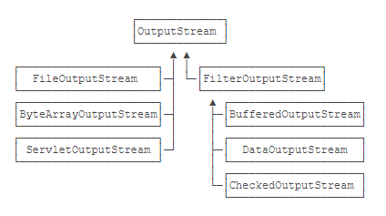
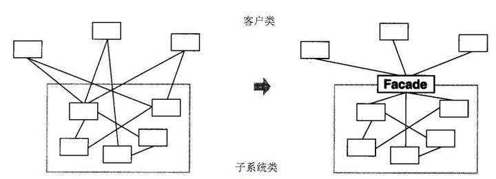

# 一、创建型模式

- 单例（`Singleton`）模式：某个类只能生成一个实例，该类提供了一个全局访问点供外部获取该实例，其拓展是有限多例模式。
- 原型（`Prototype`）模式：将一个对象作为原型，通过对其进行复制而克隆出多个和原型类似的新实例。
- 工厂方法（`FactoryMethod`）模式：定义一个用于创建产品的接口，由子类决定生产什么产品。
- 抽象工厂（`AbstractFactory`）模式：提供一个创建产品族的接口，其每个子类可以生产一系列相关的产品。
- 建造者（Builder）模式：将一个复杂对象分解成多个相对简单的部分，然后根据不同需要分别创建它们，最后构建成该复杂对象。


## 1 工厂模式

### 1.1 简单工厂模式

#### 1) 概念

​		提供一个工厂类, 让使用者在调用工厂内产品时不需要了解内部的调用关系、结构等, 只需要给出需要调用的参数, 工厂类即可返回相应结果。

**举例**

​       举个例子，直接 new 对象的方式相当于当我们需要一个苹果时，我们需要知道苹果的构造方法，需要一个梨子时，需要知道梨子的构造方法。更好的实现方式是有一个水果工厂，我们告诉工厂需要什么种类的水果，水果工厂将我们需要的水果制造出来给我们就可以了。这样我们就无需知道苹果、梨子是怎么种出来的，只用和水果工厂打交道即可。

#### 2) 代码

- **Bean 类**

  ```java
  public class Apple implements FruitInterface{
      @Override
      public void getFruitName() {
          System.out.println("I'm apple!");
      }
  }
  
  public class Banana implements FruitInterface {
      @Override
      public void getFruitName() {
          System.out.println("I'm banana!");
      }
  }
  
  public class Orange  implements FruitInterface {
      @Override
      public void getFruitName() {
          System.out.println("I'm orange!");
      }
  }
  ```

- **接口**

  ```java
  public interface FruitInterface {
      void getFruitName();
  }
  ```

- **工厂**

  ```java
  public class Factory {
      //实现获取水果名称的方法
      public FruitInterface getFruit(String name){
          switch (name){
              case "apple":
                  Apple apple = new Apple();
                  apple.getFruitName();
                  return apple;
              case "banana":
                  Banana banana = new Banana();
                  banana.getFruitName();
                  return banana;
              case "orange":
                  Orange orange = new Orange();
                  orange.getFruitName();
                  return orange;
              default:
                  break;
          }
          return null;
      }
  }
  ```

- **测试**

  ```java
  public class test {
      public static void main(String[] args) {
          Factory factory = new Factory();
          factory.getFruit("apple");
      }
  }
  ```

- **运行结果**

  ```
  I'm apple!
  ```

  

#### 3) 弊端

总而言之，简单工厂模式就是让一个工厂类承担构建所有对象的职责。调用者需要什么产品，让工厂生产出来即可。它的弊端也显而易见：

- 一是如果需要生产的产品过多，此模式会导致工厂类过于庞大，承担过多的职责，变成超级类。当苹果生产过程需要修改时，要来修改此工厂。梨子生产过程需要修改时，也要来修改此工厂。也就是说这个类不止一个引起修改的原因。违背了单一职责原则。
- 二是当要生产新的产品时，必须在工厂类中添加新的分支。而开闭原则告诉我们：类应该对修改封闭。我们希望在添加新功能时，只需增加新的类，而不是修改既有的类，所以这就违背了开闭原则。

---


### 1.2 工厂方法模式

#### 1) 概念

​        为了解决简单工厂模式的这两个弊端，工厂方法模式应运而生，它规定每个产品都有一个专属工厂。比如苹果有专属的苹果工厂，梨子有专属的梨子工厂。

#### 2) 代码java

- **Bean类**

  ```java
  public class Apple extends Fruit{
      public Apple(String name) {
          this.name = name;
      }
  }
  
  public class Banana extends Fruit{
      public Banana(String name) {
          this.name = name;
      }
  }
  
  public class Orange extends Fruit {
      public Orange(String name) {
          this.name = name;
      }
  }
  
  public class Fruit implements FruitInterface {
      String name;
  
      @Override
      public void getFruitName() {
          System.out.println(this.name);
      }
  }
  ```

- **接口**

  ```java
  public interface FruitInterface {
      void getFruitName();
  }
  ```

- **factory 类**

  ```java
  public class AppleFactory extends Fruit {
      public Fruit creat(String name){
          System.out.println("Apple Create");
          return new Apple(name);
      }
  }
  
  public class BananaFactory extends Fruit {
      public Fruit creat(String name){
          System.out.println("Banana Create");
          return new Banana(name);
      }
  }
  
  public class OrangeFactory extends Fruit {
      public Fruit creat(String name){
          System.out.println("Orange Create");
          return new Orange(name);
      }
  }
  ```

- **测试类**

  ```java
  public class test {
      public static void main(String[] args) {
          AppleFactory appleFactory = new AppleFactory();
          Fruit apple = appleFactory.creat("apple");
          apple.getFruitName();
      }
  }
  ```

- **运行结果**

  ```
  Apple Create
  apple
  ```

  

#### 3) 总结

有读者可能会开喷了，这样和直接 new 出苹果和梨子有什么区别？上文说工厂是为了减少类与类之间的耦合，让调用者尽可能少的和其他类打交道。用简单工厂模式，我们只需要知道 `FruitFactory`，无需知道 `Apple` 、`Pear` 类，很容易看出耦合度降低了。但用工厂方法模式，调用者虽然不需要和 `Apple` 、`Pear` 类打交道了，但却需要和 `AppleFactory`、`PearFactory` 类打交道。有几种水果就需要知道几个工厂类，耦合度完全没有下降啊，甚至还增加了代码量！

这位读者请先放下手中的大刀，仔细想一想，工厂模式的第二个优点在工厂方法模式中还是存在的。当构建过程相当复杂时，工厂将构建过程封装起来，调用者可以很方便的直接使用，同样以苹果生产为例：

```java
public class AppleFactory {
    public Fruit create(){
        AppleSeed appleSeed = new AppleSeed();
        Sunlight sunlight = new Sunlight();
        Water water = new Water();
        return new Apple(appleSeed, sunlight, water);
    }
}
```

调用者无需知道苹果的生产细节，当生产过程需要修改时也无需更改调用端。同时，工厂方法模式解决了简单工厂模式的两个弊端。

- 当生产的产品种类越来越多时，工厂类不会变成超级类。工厂类会越来越多，保持灵活。不会越来越大、变得臃肿。如果苹果的生产过程需要修改时，只需修改苹果工厂。梨子的生产过程需要修改时，只需修改梨子工厂。符合单一职责原则。
- 当需要生产新的产品时，无需更改既有的工厂，只需要添加新的工厂即可。保持了面向对象的可扩展性，符合开闭原则。

---


### 1.3 抽象工厂模式

#### 1) 概念

工厂方法模式可以进一步优化，提取出工厂接口。我们在创建时指定了具体的工厂类后，在使用时就无需再关心是哪个工厂类，只需要将此工厂当作抽象的 `IFactory` 接口使用即可。这种经过抽象的工厂方法模式被称作抽象工厂模式。

由于客户端只和 `IFactory` 打交道了，调用的是接口中的方法，使用时根本不需要知道是在哪个具体工厂中实现的这些方法，这就使得替换工厂变得非常容易。

实质上就是在工厂模式的基础上对 工厂类 进行了进一步封装, 这样调用者只需要考虑 `IFactory` 接口类进行调用即可, 而不必记住每个工厂的名字。

#### 2) 代码

- **Bean类**

  ```java
  public class Apple extends Fruit{
      public Apple(String name) {
          this.name = name;
      }
  }
  
  public class Banana extends Fruit{
      public Banana(String name) {
          this.name = name;
      }
  }
  
  public class Orange extends Fruit {
      public Orange(String name) {
          this.name = name;
      }
  }
  
  public class Fruit implements FruitInterface {
      String name;
  
      @Override
      public void getFruitName() {
          System.out.println(this.name);
      }
  }
  ```

- **接口**

  ```java
  public interface FruitInterface {
      void getFruitName();
  }
  
  public interface IFactory {
      Fruit create(String name);
  }
  ```

- **Factory 类**

  ```java
  @Override
  public Fruit create(String name) {
      System.out.println("Apple Create");
      return new Apple(name);
  }
  
  @Override
  public Fruit create(String name) {
      System.out.println("Banana Create");
      return new Banana(name);
  }
  
  @Override
  public Fruit create(String name) {
      System.out.println("Orange Create");
      return new Orange(name);
  }
  ```

- **Test 类**

  ```java
  public static void main(String[] args) {
      IFactory factory = new AppleFactory();
      Fruit apple = factory.create("apple");
      apple.getFruitName();
  }
  ```

- **运行结果**

  ```
  Apple Create
  apple
  ```

  

#### 3) 总结

`IFactory` 中只有一个抽象方法时，或许还看不出抽象工厂模式的威力。实际上抽象工厂模式主要用于替换一系列方法。例如将程序中的 SQL Server 数据库整个替换为 `Access` 数据库，使用抽象方法模式的话，只需在 `IFactory` 接口中定义好增删改查四个方法，让 `SQLFactory` 和 `AccessFactory` 实现此接口，调用时直接使用 `IFactory` 中的抽象方法即可，调用者无需知道使用的什么数据库，我们就可以非常方便的整个替换程序的数据库，并且让客户端毫不知情。

抽象工厂模式很好的发挥了开闭原则、依赖倒置原则，但缺点是抽象工厂模式太重了，如果 `IFactory` 接口需要新增功能，则会影响到所有的具体工厂类。使用抽象工厂模式，替换具体工厂时只需更改一行代码，但要新增抽象方法则需要修改所有的具体工厂类。所以抽象工厂模式适用于增加同类工厂这样的横向扩展需求，不适合新增功能这样的纵向扩展。

---


## 2 单例模式

**概念**

单例模式非常常见，某个对象全局只需要一个实例时，就可以使用单例模式。它的优点也显而易见：

- 它能够避免对象重复创建，节约空间并提升效率
- 避免由于操作不同实例导致的逻辑错误

单例模式有两种实现方式：饿汉式和懒汉式。

### 2.1 饿汉式

#### 1) 概念

饿汉式：变量在声明时便初始化。

可以看到，我们将构造方法定义为 `private`，这就保证了其他类无法实例化此类，必须通过 `getInstance` 方法才能获取到唯一的 `instance` 实例，非常直观。但饿汉式有一个弊端，那就是即使这个单例不需要使用，它也会在类加载之后立即创建出来，占用一块内存，并增加类初始化时间。就好比一个电工在修理灯泡时，先把所有工具拿出来，不管是不是所有的工具都用得上。就像一个饥不择食的饿汉，所以称之为饿汉式。

#### 2) 代码

- **Hunger 类**

  ```java
  public class Hunger {
      private static Hunger instance = new Hunger();
  
      private Hunger() {
      }
  
      public static Hunger getInstance() {
          return instance;
      }
  }
  ```

- **Test 类**

  ```java
  public class test {
      Hunger hunger = new Hunger();	//报错, HUnger()为 private,拒绝访问
      Hunger hunger1 = Hunger.getInstance();
  }
  ```


#### 3) 总结

​		显然, 根据 test 类的内容来看。 饿汉式的实现, 在变量声明时就完成了初始化, 并且声明构造方法为 `private` 类型, 使得外部访问仅可通过 `getInstance()` 方法进行访问, 而其返回值是预先被初始化好的 `instance` 变量, 这就保证了同时只会存在一个类对象的需求。

---


### 2.2 懒汉式

#### 1) 概念

懒汉式：先声明一个空变量，需要用时才初始化。

我们先声明了一个初始值为 null 的 instance 变量，当需要使用时判断此变量是否已被初始化，没有初始化的话才 new 一个实例出来。就好比电工在修理灯泡时，开始比较偷懒，什么工具都不拿，当发现需要使用螺丝刀时，才把螺丝刀拿出来。当需要用钳子时，再把钳子拿出来。就像一个不到万不得已不会行动的懒汉，所以称之为懒汉式。

#### 2) 代码

- **`LazyMan` 类**

  ```java
  public class LazyMan {
      private static LazyMan instance = null;
  
      private LazyMan() {
      }
  
      public static LazyMan getInstance(){
          if (instance == null) {
              instance = new LazyMan();
          }
          return instance;
      }
  }
  ```

- **`test` 类**

  ```java
  public static void main(String[] args) {
      //LazyMan lazyMan = new LazyMan();
      LazyMan hunger1 = LazyMan.getInstance();
  }
  ```

- **运行结果**

  ```
  初始化完成!
  ```


#### 3) 总结

懒汉式解决了饿汉式的弊端，好处是按需加载，避免了内存浪费，减少了类初始化时间。

上述代码的懒汉式单例乍一看没什么问题，但其实它不是线程安全的。如果有多个线程同一时间调用 `getInstance` 方法，`instance` 变量可能会被实例化多次。为了保证线程安全，我们需要给判空过程加上锁：

```java
public class Singleton {

    private static Singleton instance = null;

    private Singleton() {
    }

    public static Singleton getInstance() {
        synchronized (Singleton.class) {
            if (instance == null) {
                instance = new Singleton();
            }
        }
        return instance;
    }
}
```

这样就能保证多个线程调用 getInstance 时，一次最多只有一个线程能够执行判空并 new 出实例的操作，所以 instance 只会实例化一次。但这样的写法仍然有问题，当多个线程调用 getInstance 时，每次都需要执行 synchronized 同步化方法，这样会严重影响程序的执行效率。所以更好的做法是在同步化之前，再加上一层检查：

```java
public class Singleton {
    
    private static Singleton instance = null;

    private Singleton() {
    }

    public static Singleton getInstance() {
        if (instance == null) {
            synchronized (Singleton.class) {
                if (instance == null) {
                    instance = new Singleton();
                }
            }
        }
        return instance;
    }
}
```

这样增加一种检查方式后，如果 instance 已经被实例化，则不会执行同步化操作，大大提升了程序效率。上面这种写法也就是我们平时较常用的双检锁方式实现的线程安全的单例模式。

除了双检锁方式外，还有一种比较常见的静态内部类方式保证懒汉式单例的线程安全：

**常用**

```java
public class Singleton {
    
    private static class SingletonHolder {
        public static Singleton instance = new Singleton();
    }

    private Singleton() {
    }

    public static Singleton getInstance() {
        return SingletonHolder.instance;
    }
}
```

虽然我们经常使用这种静态内部类的懒加载方式，但其中的原理不一定每个人都清楚。接下来我们便来分析其原理，搞清楚两个问题：

- 静态内部类方式是怎么实现懒加载的
- 静态内部类方式是怎么保证线程安全的

Java 类的加载过程包括：加载、验证、准备、解析、初始化。初始化阶段即执行类的 `clinit` 方法（`clinit` = class + initialize），包括为类的静态变量赋初始值和执行静态代码块中的内容。但不会立即加载内部类，内部类会在使用时才加载。所以当此 Singleton 类加载时，`SingletonHolder` 并不会被立即加载，所以不会像饿汉式那样占用内存。

另外，Java 虚拟机规定，当访问一个类的静态字段时，如果该类尚未初始化，则立即初始化此类。当调用Singleton 的 `getInstance` 方法时，由于其使用了 `SingletonHolder` 的静态变量 `instance`，所以这时才会去初始化 `SingletonHolder`，在 `SingletonHolder` 中 new 出 Singleton 对象。这就实现了懒加载。

第二个问题的答案是 Java 虚拟机的设计是非常稳定的，早已经考虑到了多线程并发执行的情况。虚拟机在加载类的 `clinit` 方法时，会保证 `clinit` 在多线程中被正确的加锁、同步。即使有多个线程同时去初始化一个类，一次也只有一个线程可以执行 `clinit` 方法，其他线程都需要阻塞等待，从而保证了线程安全。

懒加载方式在平时非常常见，比如打开我们常用的美团、饿了么、支付宝 app，应用首页会立刻刷新出来，但其他标签页在我们点击到时才会刷新。这样就减少了流量消耗，并缩短了程序启动时间。再比如游戏中的某些模块，当我们点击到时才会去下载资源，而不是事先将所有资源都先下载下来，这也属于懒加载方式，避免了内存浪费。

但懒汉式的缺点就是将程序加载时间从启动时延后到了运行时，虽然启动时间缩短了，但我们浏览页面时就会看到数据的 loading 过程。如果用饿汉式将页面提前加载好，我们浏览时就会特别的顺畅，也不失为一个好的用户体验。比如我们常用的 QQ、微信 app，作为即时通讯的工具软件，它们会在启动时立即刷新所有的数据，保证用户看到最新最全的内容。著名的软件大师 Martin 在《代码整洁之道》一书中也说到：不提倡使用懒加载方式，因为程序应该将构建与使用分离，达到解耦。饿汉式在声明时直接初始化变量的方式也更直观易懂。所以在使用饿汉式还是懒汉式时，需要权衡利弊。

一般的建议是：对于构建不复杂，加载完成后会立即使用的单例对象，推荐使用饿汉式。对于构建过程耗时较长，并不是所有使用此类都会用到的单例对象，推荐使用懒汉式。


## 3 建造者模式

### 1) 概念

**意图**: 将一个复杂的构建与其表示相分离，使得同样的构建过程可以创建不同的表示。

建造型模式用于创建过程稳定，但配置多变的对象。在《设计模式》一书中的定义是：**将一个复杂的构建与其表示相分离，使得同样的构建过程可以创建不同的表示。**

经典的「建造者-指挥者」模式现在已经不太常用了，现在建造者模式主要用来通过链式调用生成不同的配置。比如我们要制作一杯珍珠奶茶。它的制作过程是稳定的，除了必须要知道奶茶的种类和规格外，是否加珍珠和是否加冰是可选的。


### 2) 代码

- `MilkTea` 类

  ```java
  public class MilkTea {
      private final String type;    //奶茶类型
      private final String size;    //杯型
      private final boolean pearl;  //珍珠
      private final boolean ice;    //加冰
  
      private MilkTea(Builder builder){
          this.type = builder.type;
          this.size = builder.size;
          this.pearl = builder.pearl;
          this.ice = builder.ice;
      }
  
      @Override
      public String toString() {
          return "MilkTea{" +
                  "type='" + type + '\'' +
                  ", size='" + size + '\'' +
                  ", pearl=" + pearl +
                  ", ice=" + ice +
                  '}';
      }
  
      public static class Builder {
          private final String type;
          private String size = "中杯";
          private boolean pearl = true;
          private boolean ice = false;
  
          public Builder(String type) {
              this.type = type;
          }
  
          public Builder size(String size) {
              this.size = size;
              return this;
          }
  
          public Builder pearl(boolean pearl) {
              this.pearl = pearl;
              return this;
          }
  
          public Builder ice(boolean cold) {
              this.ice = cold;
              return this;
          }
  
          public MilkTea build() {
              return new MilkTea(this);
          }
      }
  }
  ```

- **test 类**

  ```java
  public static void main(String[] args) {
      MilkTea milkTea = new MilkTea.Builder("原味").ice(false).pearl(true).build();
      System.out.println(milkTea.toString());
      milkTea = new MilkTea.Builder("卡布奇诺").ice(true).pearl(true).build();
      System.out.println(milkTea.toString());
  }
  ```

- **打印结果**

  ```
  MilkTea{type='原味', size='中杯', pearl=true, ice=false}
  MilkTea{type='卡布奇诺', size='中杯', pearl=true, ice=true}
  ```


### 3) 总结

使用建造者模式的好处是不用担心忘了指定某个配置，保证了构建过程是稳定的。在 `OkHttp`、Retrofit 等著名框架的源码中都使用到了建造者模式。要解决在软件系统中，有时候面临着"一个复杂对象"的创建工作，其通常由各个部分的子对象用一定的算法构成；由于需求的变化，这个复杂对象的各个部分经常面临着剧烈的变化，但是将它们组合在一起的算法却相对稳定。


## 4 原型模式

### 1)概念

**原型模式**

用原型实例指定创建对象的种类，并且通过拷贝这些原型创建新的对象。利用已有的一个原型对象，快速地生成和原型对象一样的实例。实质上就是通过克隆来拷贝 n 份指定对象。


### 2)代码

- **Cloth 类**

  ```java
  public class Cloth {
      private String type;
      private String size;
  
      public Cloth clone(){
          Cloth cloth = new Cloth();
          cloth.type = this.type;
          cloth.size = this.size;
          return cloth;
      }
  
      @Override
      public String toString() {
          return "Cloth{" +
                  "type='" + type + '\'' +
                  ", size='" + size + '\'' +
                  '}';
      }
  
      public String getType() {
          return type;
      }
  
      public void setType(String type) {
          this.type = type;
      }
  
      public String getSize() {
          return size;
      }
  
      public void setSize(String size) {
          this.size = size;
      }
  }
  ```

- **test 测试**

  ```java
  public class test {
      public static void main(String[] args) {
          //下 定制衣服 订单
          Cloth finalCloth = new Cloth();
          finalCloth.setType("大衣");
          finalCloth.setSize("XL");
          System.out.println(finalCloth.toString());
  
          //根据定制的衣服,克隆 n 份
          Cloth simpleCloth = finalCloth.clone();
          System.out.println(simpleCloth.toString());
      }
  }
  ```

  

### 3)总结

与通过对一个类进行实例化来构造新对象不同的是，原型模式是通过拷贝一个现有对象生成新对象的。浅拷贝实现 Cloneable，重写，深拷贝是通过实现 Serializable 读取二进制流。

#### 附例

举个例子，比如有一天，周杰伦到奶茶店点了一份不加冰的原味奶茶，你说我是周杰伦的忠实粉，我也要一份跟周杰伦一样的。用程序表示如下：

奶茶类：

```java
public class MilkTea {
    public String type;
    public boolean ice;
}
```

下单：

```java
private void order(){
    MilkTea milkTeaOfJay = new MilkTea();
    milkTeaOfJay.type = "原味";
    milkTeaOfJay.ice = false;
    
    MilkTea yourMilkTea = milkTeaOfJay;
}
```

好像没什么问题，将周杰伦的奶茶直接赋值到你的奶茶上就行了，看起来我们并不需要 clone 方法。但是这样真的是复制了一份奶茶吗？

当然不是，Java 的赋值只是传递地址。这样赋值之后，yourMilkTea 仍然指向的周杰伦的奶茶，并不会多一份一样的奶茶。

那么我们要怎么做才能点一份一样的奶茶呢？将程序修改如下就可以了：

```java
private void order(){
    MilkTea milkTeaOfJay = new MilkTea();
    milkTeaOfJay.type = "原味";
    milkTeaOfJay.ice = false;
    
    MilkTea yourMilkTea = new MilkTea();
    yourMilkTea.type = "原味";
    yourMilkTea.ice = false;
}
```

只有这样，yourMilkTea 才是 new 出来的一份全新的奶茶。我们设想一下，如果有一千个粉丝都需要点和周杰伦一样的奶茶的话，按照现在的写法就需要 new 一千次，并为每一个新的对象赋值一千次，造成大量的重复。

更糟糕的是，如果周杰伦临时决定加个冰，那么粉丝们的奶茶配置也要跟着修改：

```java
private void order(){
    MilkTea milkTeaOfJay = new MilkTea();
    milkTeaOfJay.type = "原味";
    milkTeaOfJay.ice = true;
    
    MilkTea yourMilkTea = new MilkTea();
    yourMilkTea.type = "原味";
    yourMilkTea.ice = true;
    
    // 将一千个粉丝的 ice 都修改为 true
    ...
}
```

大批量的修改无疑是非常丑陋的做法，这就是我们需要 clone 方法的理由！

运用原型模式，在 `MilkTea` 中新增 clone 方法：

```java
public class MilkTea{
    public String type;
    public boolean ice;

    public MilkTea clone(){
        MilkTea milkTea = new MilkTea();
        milkTea.type = this.type;
        milkTea.ice = this.ice;
        return milkTea;
    }
}
```

下单：

```java
private void order(){
    MilkTea milkTeaOfJay = new MilkTea();
    milkTeaOfJay.type = "原味";
    milkTeaOfJay.ice = false;
    
    MilkTea yourMilkTea = milkTeaOfJay.clone();
    
    // 一千位粉丝都调用 milkTeaOfJay 的 clone 方法即可
    ...
}
```

这就是原型模式，Java 中有一个语法糖，让我们并不需要手写 clone 方法。这个语法糖就是 Cloneable 接口，我们只要让需要拷贝的类实现此接口即可。

```java
public class MilkTea implements Cloneable{
    public String type;
    public boolean ice;

    @NonNull
    @Override
    protected MilkTea clone() throws CloneNotSupportedException {
        return (MilkTea) super.clone();
    }
}
```

值得注意的是，Java 自带的 clone 方法是浅拷贝的。也就是说调用此对象的 clone 方法，只有基本类型的参数会被拷贝一份，非基本类型的对象不会被拷贝一份，而是继续使用传递引用的方式。如果需要实现深拷贝，必须要自己手动修改 clone 方法才行。


# 二 结构式模式

- 代理（`Proxy`）模式：为某对象提供一种代理以控制对该对象的访问。即客户端通过代理间接地访问该对象，从而限制、增强或修改该对象的一些特性。
- 适配器（`Adapter`）模式：将一个类的接口转换成客户希望的另外一个接口，使得原本由于接口不兼容而不能一起工作的那些类能一起工作。
- 桥接（`Bridge`）模式：将抽象与实现分离，使它们可以独立变化。它是用组合关系代替继承关系来实现的，从而降低了抽象和实现这两个可变维度的耦合度。
- 装饰（`Decorator`）模式：动态地给对象增加一些职责，即增加其额外的功能。
- 外观（`Facade`）模式：为多个复杂的子系统提供一个一致的接口，使这些子系统更加容易被访问。
- 享元（`Flyweight`）模式：运用共享技术来有效地支持大量细粒度对象的复用。
- 组合（`Composite`）模式：将对象组合成树状层次结构，使用户对单个对象和组合对象具有一致的访问性。


## 1 适配器模式

### 1)概念

说到适配器，我们最熟悉的莫过于电源适配器了，也就是手机的充电头。它就是适配器模式的一个应用。

试想一下，你有一条连接电脑和手机的 USB 数据线，连接电脑的一端从电脑接口处接收 5V 的电压，连接手机的一端向手机输出 5V 的电压，并且他们工作良好。

中国的家用电压都是 220V，所以 USB 数据线不能直接拿来给手机充电，这时候我们有两种方案：

- 单独制作手机充电器，接收 220V 家用电压，输出 5V 电压。
- 添加一个适配器，将 220V 家庭电压转化为类似电脑接口的 5V 电压，再连接数据线给手机充电。

如果你使用过早期的手机，就会知道以前的手机厂商采用的就是第一种方案：早期的手机充电器都是单独制作的，充电头和充电线是连在一起的。现在的手机都采用了电源适配器加数据线的方案。这是生活中应用适配器模式的一个进步。


> 适配器模式：将一个类的接口转换成客户希望的另外一个接口，使得原本由于接口不兼容而不能一起工作的那些类能一起工作。

适配的意思是适应、匹配。通俗地讲，适配器模式适用于 **有相关性但不兼容的结构**，源接口通过一个中间件转换后才可以适用于目标接口，这个转换过程就是适配，这个中间件就称之为适配器。

家用电源和 USB 数据线有相关性：家用电源输出电压，USB 数据线输入电压。但两个接口无法兼容，因为一个输出 220V，一个输入 5V，通过适配器将输出 220V 转换成输出 5V 之后才可以一起工作。

适配器模式（Adapter）的定义如下：将一个类的接口转换成客户希望的另外一个接口，使得原本由于接口不兼容而不能一起工作的那些类能一起工作。适配器模式分为类结构型模式和对象结构型模式两种，前者类之间的耦合度比后者高，且要求程序员了解现有组件库中的相关组件的内部结构，所以应用相对较少些。


### 2) 代码

- **Bean 类**

  ```java
  //家用电压
  public class HomeBattery implements Service {
      private final int voltage = 220;
  
      @Override
      public int supply() {
          return voltage;     //提供220v电压
      }
  
      @Override
      public void charge(int volt) {
          if(voltage != volt)
              System.out.println("Charge fail, you need input correct voltage:" + voltage +", but now:"+ volt);
          else
              System.out.println("Charging... ... ...");
      }
  }
  
  //充电电压
  public class USBBattery implements Service {
      private final int voltage = 5;
  
      @Override
      public int supply() {
          return 5;
      }
  
      @Override
      public void charge(int volt) {
          if(voltage != volt)
              System.out.println("Charge fail, you need input correct voltage:" + voltage +", but now:"+ volt);
          else
              System.out.println("Charging... ... ...");
      }
  }
  
  //适配器
  public class Adapter {
      //将220v 电压转换为 5v
      int convertVolt(int volt){
          return 5;
      }
  }
  ```

- **接口**

  ```java
  public interface Service {
      int supply();
      void charge(int volt);
  }
  ```

- **测试**

  ```java
  public class test {
      public static void main(String[] args) {
          //家用电压
          HomeBattery homeBattery = new HomeBattery();
          homeBattery.charge(220);
          homeBattery.charge(5);
          //USB充电电压
          USBBattery usbBattery = new USBBattery();
          usbBattery.charge(5);
  
          //转化后的电压
          Adapter adapter = new Adapter();
          usbBattery.charge(220);
          usbBattery.charge(adapter.convertVolt(220));
      }
  }
  ```

- **结果输出**

  ```
  Charging... ... ...
  Charge fail, you need input correct voltage:220, but now:5
  Charging... ... ...
  Charge fail, you need input correct voltage:5, but now:220
  Charging... ... ...
  ```

  

### 3) 总结

这就是适配器模式。在我们日常的开发中经常会使用到各种各样的 Adapter，都属于适配器模式的应用。

但适配器模式并不推荐多用。因为未雨绸缪好过亡羊补牢，如果事先能预防接口不同的问题，不匹配问题就不会发生，只有遇到源接口无法改变时，才应该考虑使用适配器。比如现代的电源插口中很多已经增加了专门的充电接口，让我们不需要再使用适配器转换接口，这又是社会的一个进步。

该模式的主要优点如下。

- 客户端通过适配器可以透明地调用目标接口。
- 复用了现存的类，程序员不需要修改原有代码而重用现有的适配者类。
- 将目标类和适配者类解耦，解决了目标类和适配者类接口不一致的问题。
- 在很多业务场景中符合开闭原则。


其缺点是：

- 适配器编写过程需要结合业务场景全面考虑，可能会增加系统的复杂性。
- 增加代码阅读难度，降低代码可读性，过多使用适配器会使系统代码变得凌乱。


## 2 桥接模式

### 1) 概念

桥接模式：将抽象部分与它的实现部分分离，使它们都可以独立地变化。它是一种对象结构型模式，又称为柄体模式或接口模式。

官方定义非常精准、简练，但却有点不易理解。通俗地说，如果一个对象有两种或者多种分类方式，并且两种分类方式都容易变化，比如本例中的形状和颜色。这时使用继承很容易造成子类越来越多，所以更好的做法是把这种分类方式分离出来，让他们独立变化，使用时将不同的分类进行组合即可。

说到这里，不得不提一个设计原则：合成 / 聚合复用原则。虽然它没有被划分到六大设计原则中，但它在面向对象的设计中也非常的重要。

> 合成 / 聚合复用原则：优先使用合成 / 聚合，而不是类继承。

继承虽然是面向对象的三大特性之一，但继承会导致子类与父类有非常紧密的依赖关系，它会限制子类的灵活性和子类的复用性。而使用合成 / 聚合，也就是使用接口实现的方式，就不存在依赖问题，一个类可以实现多个接口，可以很方便地拓展功能。

实质上也就相当于生物上的嫁接, 它将两个不同类别的类进行桥接, 使得一个类具有了另一个类的特性。 如下例中的:  三角形具有了颜色。 同样我们可以根据属性地不同继续进行嫁接操作, 比如给三角形添加 填充类型(全填充、半透明填充) 等属性。


### 2) 代码

- **Color 类**

  ```java
  public class Blue implements IColor {
      @Override
      public String getColor() {
          return "Blue";
      }
  }
  
  public class Red implements IColor {
      @Override
      public String getColor() {
          return "Red";
      }
  }
  ```

- **Shape 类**

  ```java
  public class Circle implements IShape {
      private IColor color;
      @Override
      public void setColor(IColor color) {
          this.color = color;
      }
  
      @Override
      public void draw() {
          System.out.println("绘制"+color.getColor()+"色的矩形!");
      }
  }
  
  public class Trangle implements IShape {
      private IColor color;
  
      @Override
      public void setColor(IColor color) {
          this.color = color;
      }
  
      @Override
      public void draw() {
          System.out.println("绘制"+color.getColor()+"色的三角形!");
      }
  }
  ```

- **Interface**

  ```java
  public interface IColor {
      String getColor();
  }
  
  public interface IShape {
      void setColor(IColor color);
      void draw();
  }
  ```

- **test**

  ```java
  public class test {
      public static void main(String[] args) {
          IColor color = new Red();
          Trangle trangle = new Trangle();
          trangle.setColor(color);
          trangle.draw();
  
          Circle circle = new Circle();
          circle.setColor(color);
          circle.draw();;
      }
  }
  ```

- **output**

  ```java
  public class test {
      public static void main(String[] args) {
          IColor color = new Red();
          Trangle trangle = new Trangle();
          trangle.setColor(color);
          trangle.draw();
  
          Circle circle = new Circle();
          circle.setColor(color);
          circle.draw();;
      }
  }
  ```

  

### 3) 总结

这时我们再来回顾一下官方定义：将抽象部分与它的实现部分分离，使它们都可以独立地变化。抽象部分指的是父类，对应本例中的形状类，实现部分指的是不同子类的区别之处。将子类的区别方式 —— 也就是本例中的颜色 —— 分离成接口，通过组合的方式桥接颜色和形状，这就是桥接模式，它主要用于 **两个或多个同等级的接口**。

桥接（Bridge）模式的优点是：

- 抽象与实现分离，扩展能力强
- 符合开闭原则
- 符合合成复用原则
- 其实现细节对客户透明

缺点是：由于聚合关系建立在抽象层，要求开发者针对抽象化进行设计与编程，能正确地识别出系统中两个独立变化的维度，这增加了系统的理解与设计难度。


## 3 组合模式

组合（Composite Pattern）模式的定义：有时又叫作整体-部分（Part-Whole）模式，它是一种将对象组合成树状的层次结构的模式，用来表示“整体-部分”的关系，使用户对单个对象和组合对象具有一致的访问性，属于结构型设计模式。

上文说到，桥接模式用于将同等级的接口互相组合，那么组合模式和桥接模式有什么共同点吗？

事实上组合模式和桥接模式的组合完全不一样。组合模式用于 **整体与部分的结构**，当整体与部分有相似的结构，在操作时可以被一致对待时，就可以使用组合模式。例如：

- 文件夹和子文件夹的关系：文件夹中可以存放文件，也可以新建文件夹，子文件夹也一样。
- 总公司子公司的关系：总公司可以设立部门，也可以设立分公司，子公司也一样。
- 树枝和分树枝的关系：树枝可以长出叶子，也可以长出树枝，分树枝也一样。

在这些关系中，虽然整体包含了部分，但无论整体或部分，都具有一致的行为。

> 组合模式：又叫部分整体模式，是用于把一组相似的对象当作一个单一的对象。组合模式依据树形结构来组合对象，用来表示部分以及整体层次。这种类型的设计模式属于结构型模式，它创建了对象组的树形结构。

考虑这样一个实际应用：设计一个公司的人员分布结构，结构如下图所示。


我们注意到人员结构中有两种结构，一是管理者，如老板，PM，CFO，CTO，二是职员。其中有的管理者不仅仅要管理职员，还会管理其他的管理者。这就是一个典型的整体与部分的结构。


### 3.1 透明方式

#### 1) 概念

**透明方式**：在 Component 中声明所有管理子对象的方法，包括 add 、remove 等，这样继承自 Component 的子类都具备了 add、remove 方法。对于外界来说叶节点和枝节点是透明的，它们具备完全一致的接口。也即,不区分结点职责的不同, 将所有结点一视同仁。 在接口/抽象类中实现所有方法,只在自结点实现时置没有操作权限的方法为空。


#### 2) 代码

- **Bean 类**

  ```java
  public class Employee extends People{
  
      public Employee(String position, String job) {
          super(position, job);
      }
  
      @Override
      void addEmployee(People people) {
          System.out.println("您的职位是"+this.position +",权限不足!");
      }
  
      @Override
      void delEmployee(People people) {
          System.out.println("您的职位是"+this.position +",权限不足!");
      }
  
      @Override
      void check() {
          work();
      }
  }
  
  
  public class Manager extends People {
      // 管理的人员列表
      private List<People> people = new ArrayList<>();
  
      public Manager(String position, String job) {
          super(position, job);
      }
  
      @Override
      void addEmployee(People people) {
          this.people.add(people);
      }
  
      @Override
      void delEmployee(People people) {
          this.people.remove(people);
      }
  
      @Override
      void check() {
          work();
          for (People person : people) {
              person.check();
          }
      }
  }
  ```

- **抽象类**

  ```java
  public abstract class People {
      public String position;    //职位
      public String job;         //工作
  
      public People(String position, String job) {
          this.position = position;
          this.job = job;
      }
  
      //工作
      public void work(){
          System.out.println("我是"+position+",我的工作是"+job);
      }
  
      //管理者才有的权限操作
      abstract void addEmployee(People people);
  
      abstract void delEmployee(People people);
  
      abstract void check();
  }
  ```

- **test**

  ```java
  public class test {
      public static void main(String[] args) {
          People boss = new Manager("老板", "唱怒放的生命");
          People HR = new Employee("人力资源", "聊微信");
          People PM = new Manager("产品经理", "不知道干啥");
          People CFO = new Manager("财务主管", "看剧");
          People CTO = new Manager("技术主管", "划水");
          People UI = new Employee("设计师", "画画");
          People operator = new Employee("运营人员", "兼职客服");
          People webProgrammer = new Employee("程序员", "学习设计模式");
          People backgroundProgrammer = new Employee("后台程序员", "CRUD");
          People accountant = new Employee("会计", "背九九乘法表");
          People clerk = new Employee("文员", "给老板递麦克风");
          boss.addEmployee(HR);
          boss.addEmployee(PM);
          boss.addEmployee(CFO);
          PM.addEmployee(UI);
          PM.addEmployee(CTO);
          PM.addEmployee(operator);
          CTO.addEmployee(webProgrammer);
          CTO.addEmployee(backgroundProgrammer);
          CFO.addEmployee(accountant);
          CFO.addEmployee(clerk);
          boss.check();
      }
  }
  ```


#### 3) 总结

读者可能已经注意到了，Employee 类虽然继承了父类的 `addComponent` 和 `removeComponent` 方法，但是仅仅提供了一个空实现，因为 Employee 类是不支持添加和移除组件的。这样是否违背了接口隔离原则呢？

> 接口隔离原则：客户端不应依赖它不需要的接口。如果一个接口在实现时，部分方法由于冗余被客户端空实现，则应该将接口拆分，让实现类只需依赖自己需要的接口方法。

答案是肯定的，这样确实违背了接口隔离原则。这种方式在组合模式中被称作透明方式.

> 透明方式：在 Component 中声明所有管理子对象的方法，包括 add 、remove 等，这样继承自 Component 的子类都具备了 add、remove 方法。对于外界来说叶节点和枝节点是透明的，它们具备完全一致的接口。

这种方式有它的优点：让 Manager 类和 Employee 类具备完全一致的行为接口，调用者可以一致对待它们。

但它的缺点也显而易见：Employee 类并不支持管理子对象，不仅违背了接口隔离原则，而且客户端可以用 Employee 类调用 `addComponent` 和 `removeComponent` 方法，导致程序出错，所以这种方式是不安全的。

那么我们可不可以将 `addComponent` 和 `removeComponent` 方法移到 Manager 子类中去单独实现，让 `Employee` 不再实现这两个方法呢？

在该方式中，由于抽象构件声明了所有子类中的全部方法，所以客户端无须区别树叶对象和树枝对象，对客户端来说是透明的。但其缺点是：树叶构件本来没有 `Add()`、`Remove()` 及 `GetChild()` 方法，却要实现它们（空实现或抛异常），这样会带来一些安全性问题。

### 

### 3.2 安全方式

#### 1) 概念

**安全方式**：在 Component 中不声明 add 和 remove 等管理子对象的方法，这样叶节点就无需实现它，只需在枝节点中实现管理子对象的方法即可。

在该方式中，将管理子构件的方法移到树枝构件中，抽象构件和树叶构件没有对子对象的管理方法，这样就避免了上一种方式的安全性问题，但由于叶子和分支有不同的接口，客户端在调用时要知道树叶对象和树枝对象的存在，所以失去了透明性。


#### 2) 代码

- **Bean 类**

  ```java
  public class Employee extends People {
      public Employee(String position, String job) {
          super(position, job);
      }
  
      @Override
      void check() {
          work();
      }
  }
  
  public class Manager extends People {
      // 管理的人员列表
      private List<People> people = new ArrayList<>();
  
      public Manager(String position, String job) {
          super(position, job);
      }
  
      public void addEmployee(People people) {
          this.people.add(people);
      }
  
      public void delEmployee(People people) {
          this.people.remove(people);
      }
  
      public void check() {
          for (People person : people) {
              person.work();
          }
      }
  }
  ```

- **抽象类**

  ```java
  public abstract class People {
      public String position;    //职位
      public String job;         //工作
  
      public People(String position, String job) {
          this.position = position;
          this.job = job;
      }
  
      //工作
      public void work(){
          System.out.println("我是"+position+",我的工作是"+job);
      }
  
      abstract void check();
  }
  ```

- **测试**

  ```java
  public class test {
      public static void main(String[] args) {
          Manager boss = new Manager("老板", "唱怒放的生命");
          Employee HR = new Employee("人力资源", "聊微信");
          Manager PM = new Manager("产品经理", "不知道干啥");
          Manager CFO = new Manager("财务主管", "看剧");
          Manager CTO = new Manager("技术主管", "划水");
          Employee UI = new Employee("设计师", "画画");
          Employee operator = new Employee("运营人员", "兼职客服");
          Employee webProgrammer = new Employee("程序员", "学习设计模式");
          Employee backgroundProgrammer = new Employee("后台程序员", "CRUD");
          Employee accountant = new Employee("会计", "背九九乘法表");
          Employee clerk = new Employee("文员", "给老板递麦克风");
          boss.addEmployee(HR);
          boss.addEmployee(PM);
          boss.addEmployee(CFO);
          PM.addEmployee(UI);
          PM.addEmployee(CTO);
          PM.addEmployee(operator);
          CTO.addEmployee(webProgrammer);
          CTO.addEmployee(backgroundProgrammer);
          CFO.addEmployee(accountant);
          CFO.addEmployee(clerk);
  
          boss.check();
          PM.check();
          CTO.check();
          CFO.check();
      }
  }
  ```


#### 3) 总结

运行程序，输出结果与之前一模一样。

这种方式在组合模式中称之为安全方式。

> 安全方式：在 Component 中不声明 add 和 remove 等管理子对象的方法，这样叶节点就无需实现它，只需在枝节点中实现管理子对象的方法即可。

安全方式遵循了接口隔离原则，但由于不够透明，Manager 和 Employee 类不具有相同的接口，在客户端中，我们无法将 Manager 和 Employee 统一声明为 Component 类了，必须要区别对待，带来了使用上的不方便。

安全方式和透明方式各有好处，在使用组合模式时，需要根据实际情况决定。但大多数使用组合模式的场景都是采用的透明方式，虽然它有点不安全，但是客户端无需做任何判断来区分是叶子结点还是枝节点，用起来是真香。


## 4 装饰模式

**装饰模式**：动态地给一个对象增加一些额外的职责，就增加对象功能来说，装饰模式比生成子类实现更为灵活。其别名也可以称为包装器，与适配器模式的别名相同，但它们适用于不同的场合。根据翻译的不同，装饰模式也有人称之为“油漆工模式”。

提到装饰，我们先来想一下生活中有哪些装饰：

- **女生的首饰**：戒指、耳环、项链等装饰品
- **家居装饰品**：粘钩、镜子、壁画、盆栽等

我们为什么需要这些装饰品呢？很容易想到是为了美，戒指、耳环、项链、壁画、盆栽等都是为了提高颜值或增加美观度。但粘钩、镜子不一样，它们是为了方便我们挂东西、洗漱。所以我们可以总结出装饰品共有两种功能：

- **增强原有的特性**：我们本身就是有一定颜值的，添加装饰品提高了我们的颜值。同样，房屋本身就有一定的美观度，家居装饰提高了房屋的美观度。
- **添加新的特性**：在墙上挂上粘钩，让墙壁有了挂东西的功能。在洗漱台装上镜子，让洗漱台有了照镜子的功能。

并且，我们发现装饰品并不会改变物品本身，只是起到一个锦上添花的作用。装饰模式也一样，它的主要作用就是：

- **增强一个类原有的功能**
- **为一个类添加新的功能**

并且 **装饰模式也不会改变原有的类**。


### 4.1 用于增强功能的装饰模式

#### 1) 概念

**增强原有的特性**：我们本身就是有一定颜值的，添加装饰品提高了我们的颜值。同样，房屋本身就有一定的美观度，家居装饰提高了房屋的美观度。


#### 2) 代码

- **Bean**

  ```java
  public class Me implements IBeauty {
      private int value = 100;        //每个人的初始颜值为100
  
      @Override
      public int getBeauty() {
          return value;
      }
  }
  ```

- **Interface**

  ```java
  public interface IBeauty {
      int getBeauty();
  }
  ```

- **Decorator**

  ```java
  public class RingDecorator implements IBeauty{
      private final IBeauty me;
      private static int enhance = 20;
  
  
      public RingDecorator(IBeauty me) {
          this.me = me;
      }
  
  
      @Override
      public int getBeauty() {
          return me.getBeauty() + enhance;
      }
  }
  
  public class EarringDecorator implements IBeauty{
      private final IBeauty me;
      private static int enhance = 40;
  
      public EarringDecorator(IBeauty me) {
          this.me = me;
      }
  
      @Override
      public int getBeauty() {
          return me.getBeauty() + enhance;
      }
  }
  ```

- **test**

  ```java
  public class test {
      public static void main(String[] args) {
          IBeauty iBeauty = new Me();
          System.out.println("当前魅力值: " + iBeauty.getBeauty());
  
          //为没有戴戒指的我, 装饰上戒指
          IBeauty ringDecorator = new RingDecorator(iBeauty);
          System.out.println("当前魅力值: " + ringDecorator.getBeauty());
  
          //为没有戴耳环的我, 装饰上戒指
          IBeauty earringDecorator = new EarringDecorator(iBeauty);
          System.out.println("当前魅力值: " + earringDecorator.getBeauty());
      }
  }
  ```

- **打印结果**

  ```java
  当前魅力值: 100
  当前魅力值: 120
  当前魅力值: 140
  ```

  

#### 3) 总结

可以看到，装饰器也实现了 `IBeauty` 接口，并且没有添加新的方法，也就是说这里的装饰器**仅用于增强功能**，**并不会改变 Me 原有的功能**，这种装饰模式称之为 **透明装饰模式**，由于没有改变接口，也没有新增方法，所以**透明装饰模式可以无限装饰**。

装饰模式是 **继承** 的一种替代方案。本例如果不使用装饰模式，而是改用继承实现的话，戴着戒指的 Me 需要派生一个子类、戴着项链的 Me 需要派生一个子类、戴着耳环的 Me 需要派生一个子类、戴着戒指 + 项链的需要派生一个子类......各种各样的排列组合会造成类爆炸。而采用了装饰模式就只需要为每个装饰品生成一个装饰类即可，所以说就 **增加对象功能** 来说，**装饰模式比生成子类实现更为灵活**。


### 4.2 用于添加功能的装饰模式

#### 1) 概念

用于添加功能。

#### 2) 代码

- **Bean**

  ```java
  public class House implements IHouse{
      @Override
      public void live() {
          System.out.println("房屋原有的功能：居住功能");
      }
  }
  ```

- **Interface**

  ```java
  public interface ICooking extends IHouse{
      void cooking();
  }
  
  public interface IHouse {
      void live();
  }
  
  ```

- **Decorator**

  ```java
  public class CookingDecorator implements ICooking{
      private final IHouse house;
  
  
      public CookingDecorator(IHouse house) {
          this.house = house;
      }
  
      @Override
      public void cooking() {
          System.out.println("添加的煮饭功能!");
      }
  
      @Override
      public void live() {
          house.live();
      }
  }
  ```

- **test**

  ```java
  public class test {
      public static void main(String[] args) {
          IHouse house = new House();
          house.live();
  
          //显然经过装饰器的包装, 房子具有了 煮饭 这一新的功能
          CookingDecorator cookingDecorator = new CookingDecorator(house);
          cookingDecorator.cooking();
          cookingDecorator.live();
      }
  }
  ```

- **打印结果**

  ```java
  房屋原有的功能：居住功能
  添加的煮饭功能!
  房屋原有的功能：居住功能
  ```

  

#### 3) 总结

这就是用于 **新增功能** 的装饰模式。我们在接口中新增了方法：`cooking()` ，然后在装饰器中将 House 类包装起来，之前 House 中的方法仍然调用 house 去执行，也就是说我们并没有修改原有的功能，只是扩展了新的功能，这种模式在装饰模式中称之为 **半透明装饰模式**。

为什么叫半透明呢？由于新的接口 `ICooking` 拥有之前 `IHouse` 不具有的方法，所以我们如果要使用装饰器中添加的功能，就不得不区别对待 **装饰前的对象和装饰后的对象**。也就是说客户端要使用新方法，必须知道具体的装饰类 `CookingDecorator`，所以这个装饰类对客户端来说是可见的、不透明的。而被装饰者不一定要是 `House`，它可以是实现了 `IHouse` 接口的任意对象，所以被装饰者对客户端是不可见的、透明的。由于一半透明，一半不透明，所以称之为半透明装饰模式。

现在我们仿照 **透明装饰模式** 的写法，同时添加粘钩和镜子装饰试一试：

```java
public class Client {
    @Test
    public void show() {
        IHouse house = new House();
        house.live();

        IStickyHookHouse stickyHookHouse = new StickyHookDecorator(house);
        IMirrorHouse houseWithStickyHookMirror = new MirrorDecorator(stickyHookHouse);
        houseWithStickyHookMirror.live();
        houseWithStickyHookMirror.hangThings(); // 这里会报错，找不到 hangThings 方法
        houseWithStickyHookMirror.lookMirror();
    }
}
```

我们会发现，第二次装饰时，无法获得上一次装饰添加的方法。原因很明显，当我们用 IMirrorHouse 装饰器后，接口变为了 IMirrorHouse，这个接口中并没有 hangThings 方法。

那么我们能否让 IMirrorHouse 继承自 IStickyHookHouse，以实现新增两个功能呢？

可以，但那样做的话两个装饰类之间有了依赖关系，那就不是装饰模式了。装饰类不应该存在依赖关系，而应该在原本的类上进行装饰。这就意味着，**半透明装饰模式中**，**我们无法多次装饰**。

有的同学会问了，既增强了功能，又添加了新功能的装饰模式叫什么呢？

—— 举一反三，肯定是叫全不透明装饰模式！

—— 并不是！只要添加了新功能的装饰模式都称之为 **半透明装饰模式**，他们都具有不可以多次装饰的特点。仔细理解上文半透明名称的由来就知道了，“透明”指的是我们无需知道被装饰者具体的类，既增强了功能，又添加了新功能的装饰模式仍然具有半透明特性。

看了这两个简单的例子，是不是发现装饰模式很简单呢？恭喜你学会了 1 + 1 = 2，现在你已经掌握了算数的基本思想，接下来我们来做一道微积分题练习一下。


### 4.3 I/O 中的装饰模式

I/O 指的是 Input/Output，即输入、输出。我们以 Input 为例。先在 `src` 文件夹下新建一个文件 `readme.text`，随便写点文字：

```text
禁止套娃
禁止禁止套娃
禁止禁止禁止套娃
```

然后用 Java 的 InputStream 读取，代码一般长这样：

```java
public void io() throws IOException {
    InputStream in = new BufferedInputStream(new FileInputStream("src/readme.txt"));
    byte[] buffer = new byte[1024];
    while (in.read(buffer) != -1) {
        System.out.println(new String(buffer));
    }
    in.close();
}
```

这样写有一个问题，如果读取过程中出现了 IO 异常，InputStream 就不能正确关闭，所以我们要用`try...finally`来保证 InputStream 正确关闭：

```java
public void io() throws IOException {
    InputStream in = null;
    try {
        in = new BufferedInputStream(new FileInputStream("src/readme.txt"));
        byte[] buffer = new byte[1024];
        while (in.read(buffer) != -1) {
            System.out.println(new String(buffer));
        }
    } finally {
        if (in != null) {
            in.close();
        }
    }
}
```

这种写法实在是太丑了，而 IO 操作又必须这么写，显然 Java 也意识到了这个问题，所以 Java 7 中引入了`try(resource)`语法糖，IO 的代码就可以简化如下：

```java
public void io() throws IOException {
    try (InputStream in = new BufferedInputStream(new FileInputStream("src/readme.txt"))) {
        byte[] buffer = new byte[1024];
        while (in.read(buffer) != -1) {
            System.out.println(new String(buffer));
        }
    }
}
```

这种写法和上一种逻辑是一样的，运行程序，显示如下：

```text
禁止套娃
禁止禁止套娃
禁止禁止禁止套娃
```

观察获取 InputStream 这句代码：

```java
InputStream in = new BufferedInputStream(new FileInputStream("src/readme.txt"));
```

是不是和我们之前多次装饰的代码非常相似：

```java
// 多次装饰
IBeauty meWithManyDecorators = new NecklaceDecorator(new RingDecorator(new EarringDecorator(me)));
```

事实上，查看 I/O 的源码可知，Java I/O 的设计框架便是使用的 **装饰者模式**，InputStream 的继承关系如下：


其中，InputStream 是一个抽象类，对应上文例子中的 IHouse，其中最重要的方法是 read 方法，这是一个抽象方法：

```java
public abstract class InputStream implements Closeable {
    
    public abstract int read() throws IOException;
    
    // ...
}
```

这个方法会读取输入流的下一个字节，并返回字节表示的 int 值（0~255），返回 -1 表示已读到末尾。由于它是抽象方法，所以具体的逻辑交由子类实现。

上图中，左边的三个类 FileInputStream、ByteArrayInputStream、ServletInputStream 是 InputStream 的三个子类，对应上文例子中实现了 IHouse 接口的 House。

右下角的三个类 BufferedInputStream、DataInputStream、CheckedInputStream 是三个具体的装饰者类，他们都为 InputStream 增强了原有功能或添加了新功能。

FilterInputStream 是所有装饰类的父类，它没有实现具体的功能，仅用来包装了一下 InputStream：

```java
public class FilterInputStream extends InputStream {
    protected volatile InputStream in;
    
    protected FilterInputStream(InputStream in) {
        this.in = in;
    }

    public int read() throws IOException {
        return in.read();
    }
    
    //...
}
```

我们以 BufferedInputStream 为例。原有的 InputStream 读取文件时，是一个字节一个字节读取的，这种方式的执行效率并不高，所以我们可以设立一个缓冲区，先将内容读取到缓冲区中，缓冲区读满后，将内容从缓冲区中取出来，这样就变成了一段一段读取，用内存换取效率。BufferedInputStream 就是用来做这个的。它继承自 FilterInputStream：

```java
public class BufferedInputStream extends FilterInputStream {
    private static final int DEFAULT_BUFFER_SIZE = 8192;
    protected volatile byte buf[];

    public BufferedInputStream(InputStream in) {
        this(in, DEFAULT_BUFFER_SIZE);
    }

    public BufferedInputStream(InputStream in, int size) {
        super(in);
        if (size <= 0) {
            throw new IllegalArgumentException("Buffer size <= 0");
        }
        buf = new byte[size];
    }
    
    //...
}
```

我们先来看它的构造方法，在构造方法中，新建了一个 byte[] 作为缓冲区，从源码中我们看到，Java 默认设置的缓冲区大小为 8192 byte，也就是 8 KB。

然后我们来查看 read 方法：

```java
public class BufferedInputStream extends FilterInputStream {
    //...

    public synchronized int read() throws IOException {
        if (pos >= count) {
            fill();
            if (pos >= count)
                return -1;
        }
        return getBufIfOpen()[pos++] & 0xff;
    }

    private void fill() throws IOException {
        // 往缓冲区内填充读取内容的过程
        //...
    }
}
```

在 read 方法中，调用了 fill 方法，fill 方法的作用就是往缓冲区中填充读取的内容。这样就实现了增强原有的功能。

在源码中我们发现，BufferedInputStream 没有添加 InputStream 中没有的方法，所以 BufferedInputStream 使用的是 **透明的装饰模式**。

DataInputStream 用于更加方便地读取 int、double 等内容，观察 DataInputStream 的源码可以发现，DataInputStream 中新增了 readInt、readLong 等方法，所以 DataInputStream 使用的是 **半透明装饰模式**。

理解了 InputStream 后，再看一下 OutputStream 的继承关系，相信大家一眼就能看出各个类的作用了：



这就是装饰模式，注意不要和适配器模式混淆了。两者在使用时都是包装一个类，但两者的区别其实也很明显：

- 纯粹的适配器模式 **仅用于改变接口**，不改变其功能，部分情况下我们需要改变一点功能以适配新接口。但使用适配器模式时，接口一定会有一个 **回炉重造** 的过程。
- 装饰模式 **不改变原有的接口**，仅用于增强原有功能或添加新功能，强调的是 **锦上添花**。

掌握了装饰者模式之后，理解 Java I/O 的框架设计就非常容易了。但对于不理解装饰模式的人来说，各种各样相似的 `InputStream` 非常容易让开发者感到困惑。这一点正是装饰模式的缺点：**容易造成程序中有大量相似的类**。虽然这更像是开发者的缺点，我们应该做的是提高自己的技术，掌握了这个设计模式之后它就是我们的一把利器。现在我们再看到 I/O 不同的 `InputStream` 装饰类，只需要关注它增强了什么功能或添加了什么功能即可。


## 5 外观模式

### 1) 概念

**外观模式**：外部与一个子系统的通信必须通过一个统一的外观对象进行，为子系统中的一组接口提供一个一致的界面，外观模式定义了一个高层接口，这个接口使得这一子系统更加容易使用。外观模式又称为门面模式。



举个例子，比如我们每天打开电脑时，都需要做三件事：

- 打开浏览器
- 打开 IDE
- 打开微信

每天下班时，关机前需要做三件事：

- 关闭浏览器
- 关闭 IDE
- 关闭微信

用程序模拟如下：

新建浏览器类：

```java
public class Browser {
    public static void open() {
        System.out.println("打开浏览器");
    }

    public static void close() {
        System.out.println("关闭浏览器");
    }
}
```

新建 IDE 类：

```java
public class IDE {
    public static void open() {
        System.out.println("打开 IDE");
    }

    public static void close() {
        System.out.println("关闭 IDE");
    }
}
```

新建微信类：

```java
public class Wechat {
    public static void open() {
        System.out.println("打开微信");
    }

    public static void close() {
        System.out.println("关闭微信");
    }
}
```

客户端调用：

```java
public class Client {
    @Test
    public void test() {
        System.out.println("上班:");
        Browser.open();
        IDE.open();
        Wechat.open();

        System.out.println("下班:");
        Browser.close();
        IDE.close();
        Wechat.close();
    }
}
```

运行程序，输出如下：

```java
上班:
打开浏览器
打开 IDE
打开微信
下班:
关闭浏览器
关闭 IDE
关闭微信
```

由于我们每天都要做这几件事，所以我们可以使用 **外观模式**，将这几个子系统封装起来，提供更简洁的接口：

```java
public class Facade {
    public void open() {
        Browser.open();
        IDE.open();
        Wechat.open();
    }

    public void close() {
        Browser.close();
        IDE.close();
        Wechat.close();
    }
}
```

客户端就可以简化代码，只和这个外观类打交道：

```java
public class Client {
    @Test
    public void test() {
        Facade facade = new Facade();
        System.out.println("上班:");
        facade.open();

        System.out.println("下班:");
        facade.close();
    }
}
```

运行程序，输出与之前一样。

外观模式就是这么简单，它使得两种不同的类不用直接交互，而是通过一个中间件——也就是外观类——间接交互。外观类中只需要暴露简洁的接口，隐藏内部的细节，所以说白了就是封装的思想。

外观模式非常常用，（当然了！写代码哪有不封装的！）尤其是在第三方库的设计中，我们应该提供尽量简洁的接口供别人调用。另外，在 MVC 架构中，C 层（Controller）就可以看作是外观类，Model 和 View 层通过 Controller 交互，减少了耦合。


### 2) 代码

- **Bean**

  ```java
  public class Brush {
      void start(){
          System.out.println("刷牙开始<<<");
      }
  
      void end(){
          System.out.println("刷牙结束>>>");
      }
  }
  
  public class Wash {
      void start(){
          System.out.println("洗脸开始<<<");
      }
  
      void end(){
          System.out.println("洗脸结束>>>");
      }
  }
  ```

- **Appearance Supply**

  提供刷牙洗脸的接口 API

  ```java
  public class AppearanceSupply {
      void daily(){
          Brush brush = new Brush();
          brush.start();
          brush.end();
  
          Wash wash = new Wash();
          wash.start();;
          wash.end();
      }
  }
  ```

- **test**

  ```java
  public class test {
      public static void main(String[] args) {
          //daily 方法封装了每天必须做的 刷牙洗脸 起床一次,睡觉一次
          AppearanceSupply appearanceSupply = new AppearanceSupply();
          appearanceSupply.daily();
          System.out.println("----------------");
          appearanceSupply.daily();
      }
  }
  ```

- **打印结果**

  ```java
  刷牙开始<<<
  刷牙结束>>>
  洗脸开始<<<
  洗脸结束>>>
  ----------------
  刷牙开始<<<
  刷牙结束>>>
  洗脸开始<<<
  洗脸结束>>>
  ```

  

### 3) 总结

**外观（Facade）模式**又叫作**门面模式**，是一种通过为多个复杂的子系统提供一个一致的接口，而使这些子系统更加容易被访问的模式。该模式对外有一个统一接口，外部应用程序不用关心内部子系统的具体细节，这样会大大降低应用程序的复杂度，提高了程序的可维护性。

在日常编码工作中，我们都在有意无意的大量使用外观模式。只要是高层模块需要调度多个子系统（2个以上的类对象），我们都会自觉地创建一个新的类封装这些子系统，提供精简的接口，让高层模块可以更加容易地间接调用这些子系统的功能。尤其是现阶段各种第三方SDK、开源类库，很大概率都会使用外观模式。

外观（Facade）模式是“迪米特法则”的典型应用，它有以下主要优点。

> 降低了子系统与客户端之间的耦合度，使得子系统的变化不会影响调用它的客户类。
>
> 对客户屏蔽了子系统组件，减少了客户处理的对象数目，并使得子系统使用起来更加容易。
>
> 降低了大型软件系统中的编译依赖性，简化了系统在不同平台之间的移植过程，因为编译一个子系统不会影响其他的子系统，也不会影响外观对象。


外观（Facade）模式的主要缺点如下。

> 不能很好地限制客户使用子系统类，很容易带来未知风险。
>
> 增加新的子系统可能需要修改外观类或客户端的源代码，违背了“开闭原则”。


## 6 享元模式

### 1) 概念

享元模式体现的是 **程序可复用** 的特点，为了节约宝贵的内存，程序应该尽可能地复用，就像《极限编程》作者 Kent 在书里说到的那样：Don't repeat yourself. 简单来说 **享元模式就是共享对象**，提高复用性，官方的定义倒是显得文绉绉的：

> **享元模式**：运用共享技术有效地支持大量细粒度对象的复用。系统只使用少量的对象，而这些对象都很相似，状态变化很小，可以实现对象的多次复用。由于享元模式要求能够共享的对象必须是细粒度对象，因此它又称为轻量级模式。

有个细节值得注意：有些对象本身不一样，但通过一点点变化后就可以复用，我们编程时可能稍不注意就会忘记复用这些对象。比如说伟大的《超级玛丽》，谁能想到草和云更改一下颜色就可以实现复用呢？

还有里面的三种乌龟，换一个颜色、加一个装饰就变成了不同的怪：


在《超级玛丽》中，这样的细节还有很多，正是这些精湛的复用使得这一款红遍全球的游戏仅有 40KB 大小。正是印证了那句名言：神在细节之中。


## 7 代理模式

**代理模式**：给某一个对象提供一个代理，并由代理对象控制对原对象的引用。


### 7.1 静态代理

#### 1) 概念

现在我们有一个 `人` 类，他整天就只负责吃饭、睡觉：

`人`类的接口

```java
public interface IPerson {
    void eat();
    void sleep();
}
```

`人` 类：

```java
public class Person implements IPerson{

    @Override
    public void eat() {
        System.out.println("我在吃饭");
    }

    @Override
    public void sleep() {
        System.out.println("我在睡觉");
    }
}
```

客户端测试：

```java
public class Client {
    @Test
    public void test() {
        Person person = new Person();
        person.eat();
        person.sleep();
    }
}
```

运行程序，输出如下：

```text
我在吃饭
我在睡觉
```

我们可以把这个类包装到另一个类中，实现完全一样的行为：

```java
public class PersonProxy implements IPerson {

    private final Person person;

    public PersonProxy(Person person) {
        this.person = person;
    }

    @Override
    public void eat() {
        person.eat();
    }

    @Override
    public void sleep() {
        person.sleep();
    }
}
```

将客户端修改为调用这个新的类：

```java
public class Client {
    @Test
    public void test() {
        Person person = new Person();
        PersonProxy proxy = new PersonProxy(person);
        proxy.eat();
        proxy.sleep();
    }
}
```

运行程序，输出如下：

```text
我在吃饭
我在睡觉
```

这就是代理模式。

笔者尽量用最简洁的代码讲解此模式，只要理解了上述这个简单的例子，你就知道代理模式是怎么一回事了。我们在客户端和 Person 类之间新增了一个中间件 `PersonProxy`，这个类就叫做代理类，他实现了和 Person 类一模一样的行为。

这时有人说这样的代理有什么意义? 显然在上述的场景下应用是没有具体含义的。 但是假如我们换一个场景, 假如你是学校的辅导员, 你要求在上课时哪些学生在睡觉, 我们要求打印出正在睡觉人的个人信息, 那么显然代理模式就有了其具体的意义。 也即 Person 本身具有 eat() 、sleep() 两个方法和姓名、年龄、性别等属性, 这时我们对 Person 进行代理来处理打印个人信息的需求, 也即当 person1 在睡觉时, 要求打印它的个人信息。


#### 2) 代码

- **Bean**

  ```java
  public class Person implements IPerson{
      private String name;
      private String sex;
  
      public Person(String name, String sex) {
          this.name = name;
          this.sex = sex;
      }
  
      public Person() {
      }
  
      public int getStatus(){
          return 0;
      }
  
      @Override
      public String toString() {
          return "Person{" +
                  "name='" + name + '\'' +
                  ", sex='" + sex + '\'' +
                  '}';
      }
  
      @Override
      public void eat() {
          System.out.println("吃饭中!!!");
      }
  
      @Override
      public void sleep() {
          System.out.println("睡觉中!!!");
      }
  }
  
  ```

- **Proxy**

  ```java
  public class PersonProxy implements IPerson{
      private final  Person person;
  
      public PersonProxy(Person person) {
          this.person = person;
      }
  
  
      @Override
      public void eat() {
          person.eat();
          System.out.println(person.toString());
      }
  
      @Override
      public void sleep() {
          person.sleep();
          System.out.println(person.toString());
      }
  }
  ```

- **Interface**

  ```java
  public interface IPerson {
      void eat();
      void sleep();
  }
  ```

- **test**

  ```java
  public class test {
      public static void main(String[] args) {
          Person person = new Person("张三","男");
          PersonProxy personProxy = new PersonProxy(person);
          //模拟观察 0 吃饭 1 睡觉
          int status = person.getStatus();
          if(status == 0)
              personProxy.eat();
          else
              personProxy.sleep();
      }
  }
  ```


#### 3) 总结

现在这个代理类还看不出任何意义，我们来模拟一下工作中的需求。在实际工作中，我们可能会遇到这样的需求：在网络请求前后，分别打印将要发送的数据和接收到数据作为日志信息。此时我们就可以新建一个网络请求的代理类，让它代为处理网络请求，并在代理类中打印这些日志信息。

新建网络请求接口：

```java
public interface IHttp {
    void request(String sendData);

    void onSuccess(String receivedData);
}
```

新建 Http 请求工具类：

```java
public class HttpUtil implements IHttp {
    @Override
    public void request(String sendData) {
        System.out.println("网络请求中...");
    }

    @Override
    public void onSuccess(String receivedData) {
        System.out.println("网络请求完成。");
    }
}
```

新建 Http 代理类：

```java
public class HttpProxy implements IHttp {
    private final HttpUtil httpUtil;

    public HttpProxy(HttpUtil httpUtil) {
        this.httpUtil = httpUtil;
    }

    @Override
    public void request(String sendData) {
        httpUtil.request(sendData);
    }

    @Override
    public void onSuccess(String receivedData) {
        httpUtil.onSuccess(receivedData);
    }
}
```

到这里，和我们上述吃饭睡觉的代码是一模一样的，现在我们在 HttpProxy 中新增打印日志信息：

```java
public class HttpProxy implements IHttp {
    private final HttpUtil httpUtil;

    public HttpProxy(HttpUtil httpUtil) {
        this.httpUtil = httpUtil;
    }

    @Override
    public void request(String sendData) {
        System.out.println("发送数据:" + sendData);
        httpUtil.request(sendData);
    }

    @Override
    public void onSuccess(String receivedData) {
        System.out.println("收到数据:" + receivedData);
        httpUtil.onSuccess(receivedData);
    }
}
```

客户端验证：

```java
public class Client {
    @Test
    public void test() {
        HttpUtil httpUtil = new HttpUtil();
        HttpProxy proxy = new HttpProxy(httpUtil);
        proxy.request("request data");
        proxy.onSuccess("received result");
    }
}
```

运行程序，输出如下：

```text
发送数据:request data
网络请求中...
收到数据:received result
网络请求完成。
```

这就是代理模式的一个应用，除了 **打印日志**，它还可以用来做**权限管理**。读者看到这里可能已经发现了，这个代理类看起来和装饰模式的 `FilterInputStream` 一模一样，但两者的目的不同，装饰模式是为了 **增强功能或添加功能**，代理模式主要是为了**加以控制**。


### 7.2 动态代理

#### 1) 概念

上例中的代理被称之为静态代理，动态代理与静态代理的原理一模一样，只是换了一种写法。使用动态代理，需要把一个类传入，然后根据它正在调用的方法名判断是否需要加以控制。


#### 2) 代码

```java
public class HttpProxy {
    private final HttpUtil httpUtil;

    public HttpProxy(HttpUtil httpUtil) {
        this.httpUtil = httpUtil;
    }

    // 假设调用 httpUtil 的任意方法时，都要通过这个方法间接调用, methodName 表示方法名，args 表示方法中传入的参数
    public visit(String methodName, Object[] args) {
        if (methodName.equals("request")) {
            // 如果方法名是 request，打印日志，并调用 request 方法，args 的第一个值就是传入的参数
            System.out.println("发送数据:" + args[0]);
            httpUtil.request(args[0].toString());
        } else if (methodName.equals("onSuccess")) {
            // 如果方法名是 onSuccess，打印日志，并调用 onSuccess 方法，args 的第一个值就是传入的参数
            System.out.println("收到数据:" + args[0]);
            httpUtil.onSuccess(args[0].toString());
        }
    }
}
```

伪代码看起来还是很简单的，实现起来唯一的难点就是 **怎么让 httpUtil 调用任意方法时**，**都通过一个方法间接调用**。这里需要用到反射技术，不了解反射技术也没有关系，不妨把它记做固定的写法。实际的动态代理类代码如下：

```java
public class HttpProxy implements InvocationHandler {
    private HttpUtil httpUtil;

    public IHttp getInstance(HttpUtil httpUtil) {
        this.httpUtil = httpUtil;
        return (IHttp) Proxy.newProxyInstance(httpUtil.getClass().getClassLoader(), httpUtil.getClass().getInterfaces(), this);
    }

    // 调用 httpUtil 的任意方法时，都要通过这个方法调用
    @Override
    public Object invoke(Object proxy, Method method, Object[] args) throws Throwable {
        Object result = null;
        if (method.getName().equals("request")) {
            // 如果方法名是 request，打印日志，并调用 request 方法
            System.out.println("发送数据:" + args[0]);
            result = method.invoke(httpUtil, args);
        } else if (method.getName().equals("onSuccess")) {
            // 如果方法名是 onSuccess，打印日志，并调用 onSuccess 方法
            System.out.println("收到数据:" + args[0]);
            result = method.invoke(httpUtil, args);
        }
        return result;
    }
}
```

先看 getInstance 方法，Proxy.newProxyInstance 方法是 Java 系统提供的方法，专门用于动态代理。其中传入的第一个参数是被代理的类的 ClassLoader，第二个参数是被代理类的 Interfaces，这两个参数都是 Object 中的，每个类都有，这里就是固定写法。我们只要知道系统需要这两个参数才能让我们实现我们的目的：**调用被代理类的任意方法时**，**都通过一个方法间接调用**。现在我们给系统提供了这两个参数，系统就会在第三个参数中帮我们实现这个目的。

第三个参数是 InvocationHandler 接口，这个接口中只有一个方法：

```java
public Object invoke(Object proxy, Method method, Object[] args) throws Throwable;
```

那么不用猜就知道，现在我们调用被代理类 httpUtil 的任意方法时，都会通过这个 invoke 方法调用了。invoke 方法中，第一个参数我们暂时用不上，第二个参数 method 就是调用的方法，使用 method.getName() 可以获取到方法名，第三个参数是调用 method 方法需要传入的参数。本例中无论 request 还是 onSuccess 都只有一个 String 类型的参数，对应到这里就是 args[0]。返回的 Object 是 method 方法的返回值，本例中都是无返回值的。

我们在 invoke 方法中判断了当前调用方法的方法名，如果现在调用的方法是 request，那么打印请求参数，并使用这一行代码继续执行当前方法：

```java
result = method.invoke(httpUtil, args);
```

这就是 **反射调用函数** 的写法，如果不了解可以记做固定写法，想要了解的同学可以看之前的这篇文章：**[详解面试中常考的 Java 反射机制](https://zhuanlan.zhihu.com/p/86293659)**。虽然这个函数没有返回值，但我们还是将 result 返回，这是标准做法。

如果现在调用的方法是 `onSuccess`，那么打印接收到的数据，并反射继续执行当前方法。

修改客户端验证一下：

```java
public class Client {
    @Test
    public void test() {
        HttpUtil httpUtil = new HttpUtil();
        IHttp proxy = new HttpProxy().getInstance(httpUtil);
        proxy.request("request data");
        proxy.onSuccess("received result");
    }
}
```

运行程序，输出与之前一样：

```text
发送数据:request data
网络请求中...
收到数据:received result
网络请求完成。
```


#### 3) 总结

动态代理本质上与静态代理没有区别，它的好处是 **节省代码量**。比如被代理类有 20 个方法，而我们只需要控制其中的两个方法，就可以用动态代理通过方法名对被代理类进行动态的控制，而如果用静态方法，我们就需要将另外的 18 个方法也写出来，非常繁琐。这就是动态代理的优势所在。

实质上的动态代理就是将某些需要监管的方法进行抽取代理, 而不需要繁琐而冗余实现全部代理方法的技术。 以上我们所说的动态代理通过反射技术, 将类当前执行的方法进行映射, 如果得到了我们想代理执行的方法名和参数, 我们就执行代理步骤, 完成功能; 如果不是想要代理的方法, 我们就不去理会。


# 三 行为型模式

1)概念


2)代码


3)总结


1)概念


2)代码


3)总结


