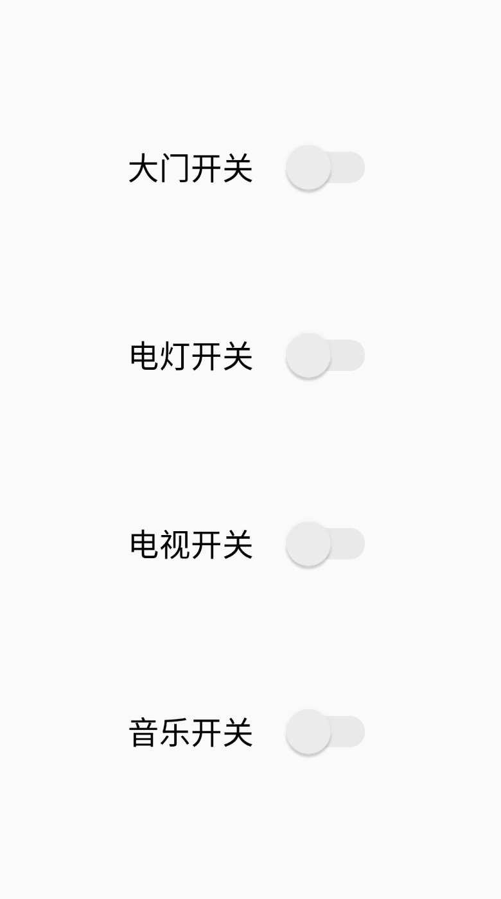
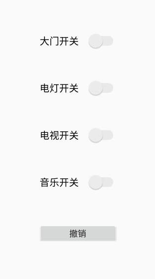
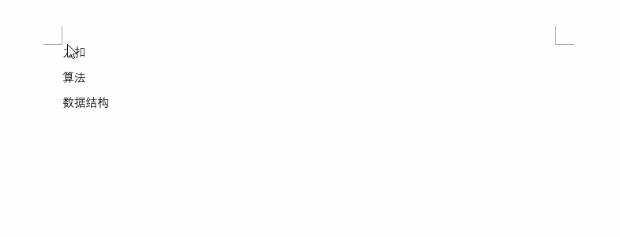
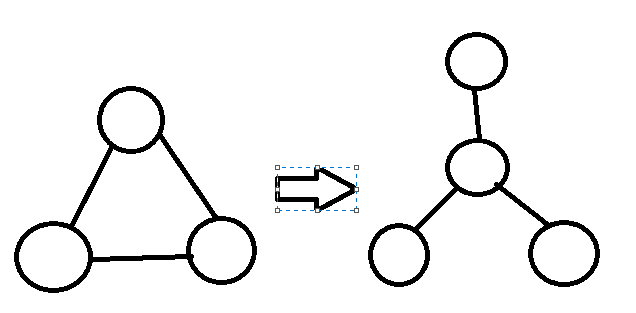
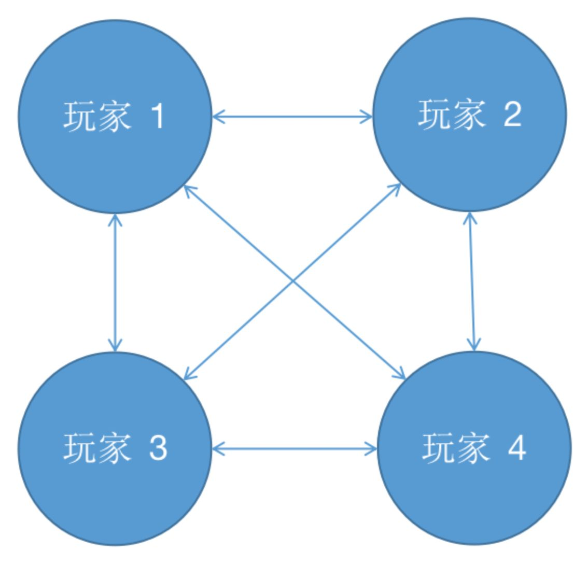
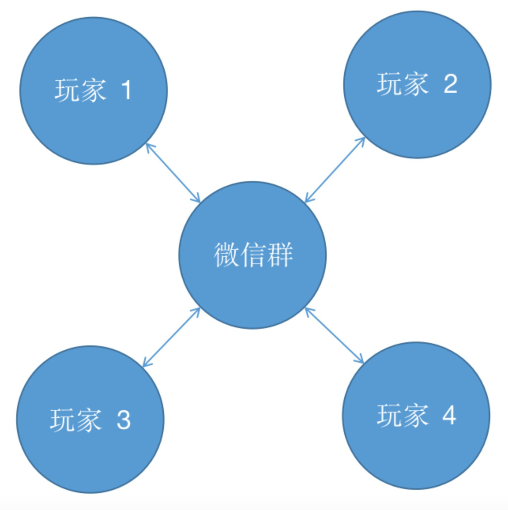

参考知乎回答 :  https://www.zhihu.com/question/308850392/answer/1324509357

源码实现 :  https://gitee.com/bignoob/design-patterns


# 一、创建型模式

- 单例（`Singleton`）模式：某个类只能生成一个实例，该类提供了一个全局访问点供外部获取该实例，其拓展是有限多例模式。
- 原型（`Prototype`）模式：将一个对象作为原型，通过对其进行复制而克隆出多个和原型类似的新实例。
- 工厂方法（`FactoryMethod`）模式：定义一个用于创建产品的接口，由子类决定生产什么产品。
- 抽象工厂（`AbstractFactory`）模式：提供一个创建产品族的接口，其每个子类可以生产一系列相关的产品。
- 建造者（Builder）模式：将一个复杂对象分解成多个相对简单的部分，然后根据不同需要分别创建它们，最后构建成该复杂对象。


## 1 工厂模式

### 1.1 简单工厂模式

#### 1) 概念

​		提供一个工厂类, 让使用者在调用工厂内产品时不需要了解内部的调用关系、结构等, 只需要给出需要调用的参数, 工厂类即可返回相应结果。

**举例**

​       举个例子，直接 new 对象的方式相当于当我们需要一个苹果时，我们需要知道苹果的构造方法，需要一个梨子时，需要知道梨子的构造方法。更好的实现方式是有一个水果工厂，我们告诉工厂需要什么种类的水果，水果工厂将我们需要的水果制造出来给我们就可以了。这样我们就无需知道苹果、梨子是怎么种出来的，只用和水果工厂打交道即可。

#### 2) 代码

- **Bean 类**

  ```java
  public class Apple implements FruitInterface{
      @Override
      public void getFruitName() {
          System.out.println("I'm apple!");
      }
  }
  
  public class Banana implements FruitInterface {
      @Override
      public void getFruitName() {
          System.out.println("I'm banana!");
      }
  }
  
  public class Orange  implements FruitInterface {
      @Override
      public void getFruitName() {
          System.out.println("I'm orange!");
      }
  }
  ```

- **接口**

  ```java
  public interface FruitInterface {
      void getFruitName();
  }
  ```

- **工厂**

  ```java
  public class Factory {
      //实现获取水果名称的方法
      public FruitInterface getFruit(String name){
          switch (name){
              case "apple":
                  Apple apple = new Apple();
                  apple.getFruitName();
                  return apple;
              case "banana":
                  Banana banana = new Banana();
                  banana.getFruitName();
                  return banana;
              case "orange":
                  Orange orange = new Orange();
                  orange.getFruitName();
                  return orange;
              default:
                  break;
          }
          return null;
      }
  }
  ```

- **测试**

  ```java
  public class test {
      public static void main(String[] args) {
          Factory factory = new Factory();
          factory.getFruit("apple");
      }
  }
  ```

- **运行结果**

  ```
  I'm apple!
  ```

  

#### 3) 弊端

总而言之，简单工厂模式就是让一个工厂类承担构建所有对象的职责。调用者需要什么产品，让工厂生产出来即可。它的弊端也显而易见：

- 一是如果需要生产的产品过多，此模式会导致工厂类过于庞大，承担过多的职责，变成超级类。当苹果生产过程需要修改时，要来修改此工厂。梨子生产过程需要修改时，也要来修改此工厂。也就是说这个类不止一个引起修改的原因。违背了单一职责原则。
- 二是当要生产新的产品时，必须在工厂类中添加新的分支。而开闭原则告诉我们：类应该对修改封闭。我们希望在添加新功能时，只需增加新的类，而不是修改既有的类，所以这就违背了开闭原则。

---


### 1.2 工厂方法模式

#### 1) 概念

​        为了解决简单工厂模式的这两个弊端，工厂方法模式应运而生，它规定每个产品都有一个专属工厂。比如苹果有专属的苹果工厂，梨子有专属的梨子工厂。

#### 2) 代码java

- **Bean类**

  ```java
  public class Apple extends Fruit{
      public Apple(String name) {
          this.name = name;
      }
  }
  
  public class Banana extends Fruit{
      public Banana(String name) {
          this.name = name;
      }
  }
  
  public class Orange extends Fruit {
      public Orange(String name) {
          this.name = name;
      }
  }
  
  public class Fruit implements FruitInterface {
      String name;
  
      @Override
      public void getFruitName() {
          System.out.println(this.name);
      }
  }
  ```

- **接口**

  ```java
  public interface FruitInterface {
      void getFruitName();
  }
  ```

- **factory 类**

  ```java
  public class AppleFactory extends Fruit {
      public Fruit creat(String name){
          System.out.println("Apple Create");
          return new Apple(name);
      }
  }
  
  public class BananaFactory extends Fruit {
      public Fruit creat(String name){
          System.out.println("Banana Create");
          return new Banana(name);
      }
  }
  
  public class OrangeFactory extends Fruit {
      public Fruit creat(String name){
          System.out.println("Orange Create");
          return new Orange(name);
      }
  }
  ```

- **测试类**

  ```java
  public class test {
      public static void main(String[] args) {
          AppleFactory appleFactory = new AppleFactory();
          Fruit apple = appleFactory.creat("apple");
          apple.getFruitName();
      }
  }
  ```

- **运行结果**

  ```
  Apple Create
  apple
  ```

  

#### 3) 总结

有读者可能会开喷了，这样和直接 new 出苹果和梨子有什么区别？上文说工厂是为了减少类与类之间的耦合，让调用者尽可能少的和其他类打交道。用简单工厂模式，我们只需要知道 `FruitFactory`，无需知道 `Apple` 、`Pear` 类，很容易看出耦合度降低了。但用工厂方法模式，调用者虽然不需要和 `Apple` 、`Pear` 类打交道了，但却需要和 `AppleFactory`、`PearFactory` 类打交道。有几种水果就需要知道几个工厂类，耦合度完全没有下降啊，甚至还增加了代码量！

这位读者请先放下手中的大刀，仔细想一想，工厂模式的第二个优点在工厂方法模式中还是存在的。当构建过程相当复杂时，工厂将构建过程封装起来，调用者可以很方便的直接使用，同样以苹果生产为例：

```java
public class AppleFactory {
    public Fruit create(){
        AppleSeed appleSeed = new AppleSeed();
        Sunlight sunlight = new Sunlight();
        Water water = new Water();
        return new Apple(appleSeed, sunlight, water);
    }
}
```

调用者无需知道苹果的生产细节，当生产过程需要修改时也无需更改调用端。同时，工厂方法模式解决了简单工厂模式的两个弊端。

- 当生产的产品种类越来越多时，工厂类不会变成超级类。工厂类会越来越多，保持灵活。不会越来越大、变得臃肿。如果苹果的生产过程需要修改时，只需修改苹果工厂。梨子的生产过程需要修改时，只需修改梨子工厂。符合单一职责原则。
- 当需要生产新的产品时，无需更改既有的工厂，只需要添加新的工厂即可。保持了面向对象的可扩展性，符合开闭原则。

---


### 1.3 抽象工厂模式

#### 1) 概念

工厂方法模式可以进一步优化，提取出工厂接口。我们在创建时指定了具体的工厂类后，在使用时就无需再关心是哪个工厂类，只需要将此工厂当作抽象的 `IFactory` 接口使用即可。这种经过抽象的工厂方法模式被称作抽象工厂模式。

由于客户端只和 `IFactory` 打交道了，调用的是接口中的方法，使用时根本不需要知道是在哪个具体工厂中实现的这些方法，这就使得替换工厂变得非常容易。

实质上就是在工厂模式的基础上对 工厂类 进行了进一步封装, 这样调用者只需要考虑 `IFactory` 接口类进行调用即可, 而不必记住每个工厂的名字。

#### 2) 代码

- **Bean类**

  ```java
  public class Apple extends Fruit{
      public Apple(String name) {
          this.name = name;
      }
  }
  
  public class Banana extends Fruit{
      public Banana(String name) {
          this.name = name;
      }
  }
  
  public class Orange extends Fruit {
      public Orange(String name) {
          this.name = name;
      }
  }
  
  public class Fruit implements FruitInterface {
      String name;
  
      @Override
      public void getFruitName() {
          System.out.println(this.name);
      }
  }
  ```

- **接口**

  ```java
  public interface FruitInterface {
      void getFruitName();
  }
  
  public interface IFactory {
      Fruit create(String name);
  }
  ```

- **Factory 类**

  ```java
  @Override
  public Fruit create(String name) {
      System.out.println("Apple Create");
      return new Apple(name);
  }
  
  @Override
  public Fruit create(String name) {
      System.out.println("Banana Create");
      return new Banana(name);
  }
  
  @Override
  public Fruit create(String name) {
      System.out.println("Orange Create");
      return new Orange(name);
  }
  ```

- **Test 类**

  ```java
  public static void main(String[] args) {
      IFactory factory = new AppleFactory();
      Fruit apple = factory.create("apple");
      apple.getFruitName();
  }
  ```

- **运行结果**

  ```
  Apple Create
  apple
  ```

  

#### 3) 总结

`IFactory` 中只有一个抽象方法时，或许还看不出抽象工厂模式的威力。实际上抽象工厂模式主要用于替换一系列方法。例如将程序中的 SQL Server 数据库整个替换为 `Access` 数据库，使用抽象方法模式的话，只需在 `IFactory` 接口中定义好增删改查四个方法，让 `SQLFactory` 和 `AccessFactory` 实现此接口，调用时直接使用 `IFactory` 中的抽象方法即可，调用者无需知道使用的什么数据库，我们就可以非常方便的整个替换程序的数据库，并且让客户端毫不知情。

抽象工厂模式很好的发挥了开闭原则、依赖倒置原则，但缺点是抽象工厂模式太重了，如果 `IFactory` 接口需要新增功能，则会影响到所有的具体工厂类。使用抽象工厂模式，替换具体工厂时只需更改一行代码，但要新增抽象方法则需要修改所有的具体工厂类。所以抽象工厂模式适用于增加同类工厂这样的横向扩展需求，不适合新增功能这样的纵向扩展。

---


## 2 单例模式

**概念**

单例模式非常常见，某个对象全局只需要一个实例时，就可以使用单例模式。它的优点也显而易见：

- 它能够避免对象重复创建，节约空间并提升效率
- 避免由于操作不同实例导致的逻辑错误

单例模式有两种实现方式：饿汉式和懒汉式。

### 2.1 饿汉式

#### 1) 概念

饿汉式：变量在声明时便初始化。

可以看到，我们将构造方法定义为 `private`，这就保证了其他类无法实例化此类，必须通过 `getInstance` 方法才能获取到唯一的 `instance` 实例，非常直观。但饿汉式有一个弊端，那就是即使这个单例不需要使用，它也会在类加载之后立即创建出来，占用一块内存，并增加类初始化时间。就好比一个电工在修理灯泡时，先把所有工具拿出来，不管是不是所有的工具都用得上。就像一个饥不择食的饿汉，所以称之为饿汉式。

#### 2) 代码

- **Hunger 类**

  ```java
  public class Hunger {
      private static Hunger instance = new Hunger();
  
      private Hunger() {
      }
  
      public static Hunger getInstance() {
          return instance;
      }
  }
  ```

- **Test 类**

  ```java
  public class test {
      Hunger hunger = new Hunger();	//报错, HUnger()为 private,拒绝访问
      Hunger hunger1 = Hunger.getInstance();
  }
  ```


#### 3) 总结

​		显然, 根据 test 类的内容来看。 饿汉式的实现, 在变量声明时就完成了初始化, 并且声明构造方法为 `private` 类型, 使得外部访问仅可通过 `getInstance()` 方法进行访问, 而其返回值是预先被初始化好的 `instance` 变量, 这就保证了同时只会存在一个类对象的需求。

---


### 2.2 懒汉式

#### 1) 概念

懒汉式：先声明一个空变量，需要用时才初始化。

我们先声明了一个初始值为 null 的 instance 变量，当需要使用时判断此变量是否已被初始化，没有初始化的话才 new 一个实例出来。就好比电工在修理灯泡时，开始比较偷懒，什么工具都不拿，当发现需要使用螺丝刀时，才把螺丝刀拿出来。当需要用钳子时，再把钳子拿出来。就像一个不到万不得已不会行动的懒汉，所以称之为懒汉式。

#### 2) 代码

- **`LazyMan` 类**

  ```java
  public class LazyMan {
      private static LazyMan instance = null;
  
      private LazyMan() {
      }
  
      public static LazyMan getInstance(){
          if (instance == null) {
              instance = new LazyMan();
          }
          return instance;
      }
  }
  ```

- **`test` 类**

  ```java
  public static void main(String[] args) {
      //LazyMan lazyMan = new LazyMan();
      LazyMan hunger1 = LazyMan.getInstance();
  }
  ```

- **运行结果**

  ```
  初始化完成!
  ```


#### 3) 总结

懒汉式解决了饿汉式的弊端，好处是按需加载，避免了内存浪费，减少了类初始化时间。

上述代码的懒汉式单例乍一看没什么问题，但其实它不是线程安全的。如果有多个线程同一时间调用 `getInstance` 方法，`instance` 变量可能会被实例化多次。为了保证线程安全，我们需要给判空过程加上锁：

```java
public class Singleton {

    private static Singleton instance = null;

    private Singleton() {
    }

    public static Singleton getInstance() {
        synchronized (Singleton.class) {
            if (instance == null) {
                instance = new Singleton();
            }
        }
        return instance;
    }
}
```

这样就能保证多个线程调用 getInstance 时，一次最多只有一个线程能够执行判空并 new 出实例的操作，所以 instance 只会实例化一次。但这样的写法仍然有问题，当多个线程调用 getInstance 时，每次都需要执行 synchronized 同步化方法，这样会严重影响程序的执行效率。所以更好的做法是在同步化之前，再加上一层检查：

```java
public class Singleton {
    
    private static Singleton instance = null;

    private Singleton() {
    }

    public static Singleton getInstance() {
        if (instance == null) {
            synchronized (Singleton.class) {
                if (instance == null) {
                    instance = new Singleton();
                }
            }
        }
        return instance;
    }
}
```

这样增加一种检查方式后，如果 instance 已经被实例化，则不会执行同步化操作，大大提升了程序效率。上面这种写法也就是我们平时较常用的双检锁方式实现的线程安全的单例模式。

除了双检锁方式外，还有一种比较常见的静态内部类方式保证懒汉式单例的线程安全：

**常用**

```java
public class Singleton {
    
    private static class SingletonHolder {
        public static Singleton instance = new Singleton();
    }

    private Singleton() {
    }

    public static Singleton getInstance() {
        return SingletonHolder.instance;
    }
}
```

虽然我们经常使用这种静态内部类的懒加载方式，但其中的原理不一定每个人都清楚。接下来我们便来分析其原理，搞清楚两个问题：

- 静态内部类方式是怎么实现懒加载的
- 静态内部类方式是怎么保证线程安全的

Java 类的加载过程包括：加载、验证、准备、解析、初始化。初始化阶段即执行类的 `clinit` 方法（`clinit` = class + initialize），包括为类的静态变量赋初始值和执行静态代码块中的内容。但不会立即加载内部类，内部类会在使用时才加载。所以当此 Singleton 类加载时，`SingletonHolder` 并不会被立即加载，所以不会像饿汉式那样占用内存。

另外，Java 虚拟机规定，当访问一个类的静态字段时，如果该类尚未初始化，则立即初始化此类。当调用Singleton 的 `getInstance` 方法时，由于其使用了 `SingletonHolder` 的静态变量 `instance`，所以这时才会去初始化 `SingletonHolder`，在 `SingletonHolder` 中 new 出 Singleton 对象。这就实现了懒加载。

第二个问题的答案是 Java 虚拟机的设计是非常稳定的，早已经考虑到了多线程并发执行的情况。虚拟机在加载类的 `clinit` 方法时，会保证 `clinit` 在多线程中被正确的加锁、同步。即使有多个线程同时去初始化一个类，一次也只有一个线程可以执行 `clinit` 方法，其他线程都需要阻塞等待，从而保证了线程安全。

懒加载方式在平时非常常见，比如打开我们常用的美团、饿了么、支付宝 app，应用首页会立刻刷新出来，但其他标签页在我们点击到时才会刷新。这样就减少了流量消耗，并缩短了程序启动时间。再比如游戏中的某些模块，当我们点击到时才会去下载资源，而不是事先将所有资源都先下载下来，这也属于懒加载方式，避免了内存浪费。

但懒汉式的缺点就是将程序加载时间从启动时延后到了运行时，虽然启动时间缩短了，但我们浏览页面时就会看到数据的 loading 过程。如果用饿汉式将页面提前加载好，我们浏览时就会特别的顺畅，也不失为一个好的用户体验。比如我们常用的 QQ、微信 app，作为即时通讯的工具软件，它们会在启动时立即刷新所有的数据，保证用户看到最新最全的内容。著名的软件大师 Martin 在《代码整洁之道》一书中也说到：不提倡使用懒加载方式，因为程序应该将构建与使用分离，达到解耦。饿汉式在声明时直接初始化变量的方式也更直观易懂。所以在使用饿汉式还是懒汉式时，需要权衡利弊。

一般的建议是：对于构建不复杂，加载完成后会立即使用的单例对象，推荐使用饿汉式。对于构建过程耗时较长，并不是所有使用此类都会用到的单例对象，推荐使用懒汉式。


## 3 建造者模式

### 1) 概念

**意图**: 将一个复杂的构建与其表示相分离，使得同样的构建过程可以创建不同的表示。

建造型模式用于创建过程稳定，但配置多变的对象。在《设计模式》一书中的定义是：**将一个复杂的构建与其表示相分离，使得同样的构建过程可以创建不同的表示。**

经典的「建造者-指挥者」模式现在已经不太常用了，现在建造者模式主要用来通过链式调用生成不同的配置。比如我们要制作一杯珍珠奶茶。它的制作过程是稳定的，除了必须要知道奶茶的种类和规格外，是否加珍珠和是否加冰是可选的。


### 2) 代码

- `MilkTea` 类

  ```java
  public class MilkTea {
      private final String type;    //奶茶类型
      private final String size;    //杯型
      private final boolean pearl;  //珍珠
      private final boolean ice;    //加冰
  
      private MilkTea(Builder builder){
          this.type = builder.type;
          this.size = builder.size;
          this.pearl = builder.pearl;
          this.ice = builder.ice;
      }
  
      @Override
      public String toString() {
          return "MilkTea{" +
                  "type='" + type + '\'' +
                  ", size='" + size + '\'' +
                  ", pearl=" + pearl +
                  ", ice=" + ice +
                  '}';
      }
  
      public static class Builder {
          private final String type;
          private String size = "中杯";
          private boolean pearl = true;
          private boolean ice = false;
  
          public Builder(String type) {
              this.type = type;
          }
  
          public Builder size(String size) {
              this.size = size;
              return this;
          }
  
          public Builder pearl(boolean pearl) {
              this.pearl = pearl;
              return this;
          }
  
          public Builder ice(boolean cold) {
              this.ice = cold;
              return this;
          }
  
          public MilkTea build() {
              return new MilkTea(this);
          }
      }
  }
  ```

- **test 类**

  ```java
  public static void main(String[] args) {
      MilkTea milkTea = new MilkTea.Builder("原味").ice(false).pearl(true).build();
      System.out.println(milkTea.toString());
      milkTea = new MilkTea.Builder("卡布奇诺").ice(true).pearl(true).build();
      System.out.println(milkTea.toString());
  }
  ```

- **打印结果**

  ```
  MilkTea{type='原味', size='中杯', pearl=true, ice=false}
  MilkTea{type='卡布奇诺', size='中杯', pearl=true, ice=true}
  ```


### 3) 总结

使用建造者模式的好处是不用担心忘了指定某个配置，保证了构建过程是稳定的。在 `OkHttp`、Retrofit 等著名框架的源码中都使用到了建造者模式。要解决在软件系统中，有时候面临着"一个复杂对象"的创建工作，其通常由各个部分的子对象用一定的算法构成；由于需求的变化，这个复杂对象的各个部分经常面临着剧烈的变化，但是将它们组合在一起的算法却相对稳定。


## 4 原型模式

### 1)概念

**原型模式**

用原型实例指定创建对象的种类，并且通过拷贝这些原型创建新的对象。利用已有的一个原型对象，快速地生成和原型对象一样的实例。实质上就是通过克隆来拷贝 n 份指定对象。


### 2)代码

- **Cloth 类**

  ```java
  public class Cloth {
      private String type;
      private String size;
  
      public Cloth clone(){
          Cloth cloth = new Cloth();
          cloth.type = this.type;
          cloth.size = this.size;
          return cloth;
      }
  
      @Override
      public String toString() {
          return "Cloth{" +
                  "type='" + type + '\'' +
                  ", size='" + size + '\'' +
                  '}';
      }
  
      public String getType() {
          return type;
      }
  
      public void setType(String type) {
          this.type = type;
      }
  
      public String getSize() {
          return size;
      }
  
      public void setSize(String size) {
          this.size = size;
      }
  }
  ```

- **test 测试**

  ```java
  public class test {
      public static void main(String[] args) {
          //下 定制衣服 订单
          Cloth finalCloth = new Cloth();
          finalCloth.setType("大衣");
          finalCloth.setSize("XL");
          System.out.println(finalCloth.toString());
  
          //根据定制的衣服,克隆 n 份
          Cloth simpleCloth = finalCloth.clone();
          System.out.println(simpleCloth.toString());
      }
  }
  ```

  

### 3)总结

与通过对一个类进行实例化来构造新对象不同的是，原型模式是通过拷贝一个现有对象生成新对象的。浅拷贝实现 Cloneable，重写，深拷贝是通过实现 Serializable 读取二进制流。

#### 附例

举个例子，比如有一天，周杰伦到奶茶店点了一份不加冰的原味奶茶，你说我是周杰伦的忠实粉，我也要一份跟周杰伦一样的。用程序表示如下：

奶茶类：

```java
public class MilkTea {
    public String type;
    public boolean ice;
}
```

下单：

```java
private void order(){
    MilkTea milkTeaOfJay = new MilkTea();
    milkTeaOfJay.type = "原味";
    milkTeaOfJay.ice = false;
    
    MilkTea yourMilkTea = milkTeaOfJay;
}
```

好像没什么问题，将周杰伦的奶茶直接赋值到你的奶茶上就行了，看起来我们并不需要 clone 方法。但是这样真的是复制了一份奶茶吗？

当然不是，Java 的赋值只是传递地址。这样赋值之后，yourMilkTea 仍然指向的周杰伦的奶茶，并不会多一份一样的奶茶。

那么我们要怎么做才能点一份一样的奶茶呢？将程序修改如下就可以了：

```java
private void order(){
    MilkTea milkTeaOfJay = new MilkTea();
    milkTeaOfJay.type = "原味";
    milkTeaOfJay.ice = false;
    
    MilkTea yourMilkTea = new MilkTea();
    yourMilkTea.type = "原味";
    yourMilkTea.ice = false;
}
```

只有这样，yourMilkTea 才是 new 出来的一份全新的奶茶。我们设想一下，如果有一千个粉丝都需要点和周杰伦一样的奶茶的话，按照现在的写法就需要 new 一千次，并为每一个新的对象赋值一千次，造成大量的重复。

更糟糕的是，如果周杰伦临时决定加个冰，那么粉丝们的奶茶配置也要跟着修改：

```java
private void order(){
    MilkTea milkTeaOfJay = new MilkTea();
    milkTeaOfJay.type = "原味";
    milkTeaOfJay.ice = true;
    
    MilkTea yourMilkTea = new MilkTea();
    yourMilkTea.type = "原味";
    yourMilkTea.ice = true;
    
    // 将一千个粉丝的 ice 都修改为 true
    ...
}
```

大批量的修改无疑是非常丑陋的做法，这就是我们需要 clone 方法的理由！

运用原型模式，在 `MilkTea` 中新增 clone 方法：

```java
public class MilkTea{
    public String type;
    public boolean ice;

    public MilkTea clone(){
        MilkTea milkTea = new MilkTea();
        milkTea.type = this.type;
        milkTea.ice = this.ice;
        return milkTea;
    }
}
```

下单：

```java
private void order(){
    MilkTea milkTeaOfJay = new MilkTea();
    milkTeaOfJay.type = "原味";
    milkTeaOfJay.ice = false;
    
    MilkTea yourMilkTea = milkTeaOfJay.clone();
    
    // 一千位粉丝都调用 milkTeaOfJay 的 clone 方法即可
    ...
}
```

这就是原型模式，Java 中有一个语法糖，让我们并不需要手写 clone 方法。这个语法糖就是 Cloneable 接口，我们只要让需要拷贝的类实现此接口即可。

```java
public class MilkTea implements Cloneable{
    public String type;
    public boolean ice;

    @NonNull
    @Override
    protected MilkTea clone() throws CloneNotSupportedException {
        return (MilkTea) super.clone();
    }
}
```

值得注意的是，Java 自带的 clone 方法是浅拷贝的。也就是说调用此对象的 clone 方法，只有基本类型的参数会被拷贝一份，非基本类型的对象不会被拷贝一份，而是继续使用传递引用的方式。如果需要实现深拷贝，必须要自己手动修改 clone 方法才行。


# 二 结构式模式

- 代理（`Proxy`）模式：为某对象提供一种代理以控制对该对象的访问。即客户端通过代理间接地访问该对象，从而限制、增强或修改该对象的一些特性。
- 适配器（`Adapter`）模式：将一个类的接口转换成客户希望的另外一个接口，使得原本由于接口不兼容而不能一起工作的那些类能一起工作。
- 桥接（`Bridge`）模式：将抽象与实现分离，使它们可以独立变化。它是用组合关系代替继承关系来实现的，从而降低了抽象和实现这两个可变维度的耦合度。
- 装饰（`Decorator`）模式：动态地给对象增加一些职责，即增加其额外的功能。
- 外观（`Facade`）模式：为多个复杂的子系统提供一个一致的接口，使这些子系统更加容易被访问。
- 享元（`Flyweight`）模式：运用共享技术来有效地支持大量细粒度对象的复用。
- 组合（`Composite`）模式：将对象组合成树状层次结构，使用户对单个对象和组合对象具有一致的访问性。


## 1 适配器模式

### 1)概念

说到适配器，我们最熟悉的莫过于电源适配器了，也就是手机的充电头。它就是适配器模式的一个应用。

试想一下，你有一条连接电脑和手机的 USB 数据线，连接电脑的一端从电脑接口处接收 5V 的电压，连接手机的一端向手机输出 5V 的电压，并且他们工作良好。

中国的家用电压都是 220V，所以 USB 数据线不能直接拿来给手机充电，这时候我们有两种方案：

- 单独制作手机充电器，接收 220V 家用电压，输出 5V 电压。
- 添加一个适配器，将 220V 家庭电压转化为类似电脑接口的 5V 电压，再连接数据线给手机充电。

如果你使用过早期的手机，就会知道以前的手机厂商采用的就是第一种方案：早期的手机充电器都是单独制作的，充电头和充电线是连在一起的。现在的手机都采用了电源适配器加数据线的方案。这是生活中应用适配器模式的一个进步。


> 适配器模式：将一个类的接口转换成客户希望的另外一个接口，使得原本由于接口不兼容而不能一起工作的那些类能一起工作。

适配的意思是适应、匹配。通俗地讲，适配器模式适用于 **有相关性但不兼容的结构**，源接口通过一个中间件转换后才可以适用于目标接口，这个转换过程就是适配，这个中间件就称之为适配器。

家用电源和 USB 数据线有相关性：家用电源输出电压，USB 数据线输入电压。但两个接口无法兼容，因为一个输出 220V，一个输入 5V，通过适配器将输出 220V 转换成输出 5V 之后才可以一起工作。

适配器模式（Adapter）的定义如下：将一个类的接口转换成客户希望的另外一个接口，使得原本由于接口不兼容而不能一起工作的那些类能一起工作。适配器模式分为类结构型模式和对象结构型模式两种，前者类之间的耦合度比后者高，且要求程序员了解现有组件库中的相关组件的内部结构，所以应用相对较少些。


### 2) 代码

- **Bean 类**

  ```java
  //家用电压
  public class HomeBattery implements Service {
      private final int voltage = 220;
  
      @Override
      public int supply() {
          return voltage;     //提供220v电压
      }
  
      @Override
      public void charge(int volt) {
          if(voltage != volt)
              System.out.println("Charge fail, you need input correct voltage:" + voltage +", but now:"+ volt);
          else
              System.out.println("Charging... ... ...");
      }
  }
  
  //充电电压
  public class USBBattery implements Service {
      private final int voltage = 5;
  
      @Override
      public int supply() {
          return 5;
      }
  
      @Override
      public void charge(int volt) {
          if(voltage != volt)
              System.out.println("Charge fail, you need input correct voltage:" + voltage +", but now:"+ volt);
          else
              System.out.println("Charging... ... ...");
      }
  }
  
  //适配器
  public class Adapter {
      //将220v 电压转换为 5v
      int convertVolt(int volt){
          return 5;
      }
  }
  ```

- **接口**

  ```java
  public interface Service {
      int supply();
      void charge(int volt);
  }
  ```

- **测试**

  ```java
  public class test {
      public static void main(String[] args) {
          //家用电压
          HomeBattery homeBattery = new HomeBattery();
          homeBattery.charge(220);
          homeBattery.charge(5);
          //USB充电电压
          USBBattery usbBattery = new USBBattery();
          usbBattery.charge(5);
  
          //转化后的电压
          Adapter adapter = new Adapter();
          usbBattery.charge(220);
          usbBattery.charge(adapter.convertVolt(220));
      }
  }
  ```

- **结果输出**

  ```
  Charging... ... ...
  Charge fail, you need input correct voltage:220, but now:5
  Charging... ... ...
  Charge fail, you need input correct voltage:5, but now:220
  Charging... ... ...
  ```

  

### 3) 总结

这就是适配器模式。在我们日常的开发中经常会使用到各种各样的 Adapter，都属于适配器模式的应用。

但适配器模式并不推荐多用。因为未雨绸缪好过亡羊补牢，如果事先能预防接口不同的问题，不匹配问题就不会发生，只有遇到源接口无法改变时，才应该考虑使用适配器。比如现代的电源插口中很多已经增加了专门的充电接口，让我们不需要再使用适配器转换接口，这又是社会的一个进步。

该模式的主要优点如下。

- 客户端通过适配器可以透明地调用目标接口。
- 复用了现存的类，程序员不需要修改原有代码而重用现有的适配者类。
- 将目标类和适配者类解耦，解决了目标类和适配者类接口不一致的问题。
- 在很多业务场景中符合开闭原则。


其缺点是：

- 适配器编写过程需要结合业务场景全面考虑，可能会增加系统的复杂性。
- 增加代码阅读难度，降低代码可读性，过多使用适配器会使系统代码变得凌乱。


## 2 桥接模式

### 1) 概念

桥接模式：将抽象部分与它的实现部分分离，使它们都可以独立地变化。它是一种对象结构型模式，又称为柄体模式或接口模式。

官方定义非常精准、简练，但却有点不易理解。通俗地说，如果一个对象有两种或者多种分类方式，并且两种分类方式都容易变化，比如本例中的形状和颜色。这时使用继承很容易造成子类越来越多，所以更好的做法是把这种分类方式分离出来，让他们独立变化，使用时将不同的分类进行组合即可。

说到这里，不得不提一个设计原则：合成 / 聚合复用原则。虽然它没有被划分到六大设计原则中，但它在面向对象的设计中也非常的重要。

> 合成 / 聚合复用原则：优先使用合成 / 聚合，而不是类继承。

继承虽然是面向对象的三大特性之一，但继承会导致子类与父类有非常紧密的依赖关系，它会限制子类的灵活性和子类的复用性。而使用合成 / 聚合，也就是使用接口实现的方式，就不存在依赖问题，一个类可以实现多个接口，可以很方便地拓展功能。

实质上也就相当于生物上的嫁接, 它将两个不同类别的类进行桥接, 使得一个类具有了另一个类的特性。 如下例中的:  三角形具有了颜色。 同样我们可以根据属性地不同继续进行嫁接操作, 比如给三角形添加 填充类型(全填充、半透明填充) 等属性。


### 2) 代码

- **Color 类**

  ```java
  public class Blue implements IColor {
      @Override
      public String getColor() {
          return "Blue";
      }
  }
  
  public class Red implements IColor {
      @Override
      public String getColor() {
          return "Red";
      }
  }
  ```

- **Shape 类**

  ```java
  public class Circle implements IShape {
      private IColor color;
      @Override
      public void setColor(IColor color) {
          this.color = color;
      }
  
      @Override
      public void draw() {
          System.out.println("绘制"+color.getColor()+"色的矩形!");
      }
  }
  
  public class Trangle implements IShape {
      private IColor color;
  
      @Override
      public void setColor(IColor color) {
          this.color = color;
      }
  
      @Override
      public void draw() {
          System.out.println("绘制"+color.getColor()+"色的三角形!");
      }
  }
  ```

- **Interface**

  ```java
  public interface IColor {
      String getColor();
  }
  
  public interface IShape {
      void setColor(IColor color);
      void draw();
  }
  ```

- **test**

  ```java
  public class test {
      public static void main(String[] args) {
          IColor color = new Red();
          Trangle trangle = new Trangle();
          trangle.setColor(color);
          trangle.draw();
  
          Circle circle = new Circle();
          circle.setColor(color);
          circle.draw();;
      }
  }
  ```

- **output**

  ```java
  public class test {
      public static void main(String[] args) {
          IColor color = new Red();
          Trangle trangle = new Trangle();
          trangle.setColor(color);
          trangle.draw();
  
          Circle circle = new Circle();
          circle.setColor(color);
          circle.draw();;
      }
  }
  ```

  

### 3) 总结

这时我们再来回顾一下官方定义：将抽象部分与它的实现部分分离，使它们都可以独立地变化。抽象部分指的是父类，对应本例中的形状类，实现部分指的是不同子类的区别之处。将子类的区别方式 —— 也就是本例中的颜色 —— 分离成接口，通过组合的方式桥接颜色和形状，这就是桥接模式，它主要用于 **两个或多个同等级的接口**。

桥接（Bridge）模式的优点是：

- 抽象与实现分离，扩展能力强
- 符合开闭原则
- 符合合成复用原则
- 其实现细节对客户透明

缺点是：由于聚合关系建立在抽象层，要求开发者针对抽象化进行设计与编程，能正确地识别出系统中两个独立变化的维度，这增加了系统的理解与设计难度。


## 3 组合模式

组合（Composite Pattern）模式的定义：有时又叫作整体-部分（Part-Whole）模式，它是一种将对象组合成树状的层次结构的模式，用来表示“整体-部分”的关系，使用户对单个对象和组合对象具有一致的访问性，属于结构型设计模式。

上文说到，桥接模式用于将同等级的接口互相组合，那么组合模式和桥接模式有什么共同点吗？

事实上组合模式和桥接模式的组合完全不一样。组合模式用于 **整体与部分的结构**，当整体与部分有相似的结构，在操作时可以被一致对待时，就可以使用组合模式。例如：

- 文件夹和子文件夹的关系：文件夹中可以存放文件，也可以新建文件夹，子文件夹也一样。
- 总公司子公司的关系：总公司可以设立部门，也可以设立分公司，子公司也一样。
- 树枝和分树枝的关系：树枝可以长出叶子，也可以长出树枝，分树枝也一样。

在这些关系中，虽然整体包含了部分，但无论整体或部分，都具有一致的行为。

> 组合模式：又叫部分整体模式，是用于把一组相似的对象当作一个单一的对象。组合模式依据树形结构来组合对象，用来表示部分以及整体层次。这种类型的设计模式属于结构型模式，它创建了对象组的树形结构。

考虑这样一个实际应用：设计一个公司的人员分布结构，结构如下图所示。


我们注意到人员结构中有两种结构，一是管理者，如老板，PM，CFO，CTO，二是职员。其中有的管理者不仅仅要管理职员，还会管理其他的管理者。这就是一个典型的整体与部分的结构。


### 3.1 透明方式

#### 1) 概念

**透明方式**：在 Component 中声明所有管理子对象的方法，包括 add 、remove 等，这样继承自 Component 的子类都具备了 add、remove 方法。对于外界来说叶节点和枝节点是透明的，它们具备完全一致的接口。也即,不区分结点职责的不同, 将所有结点一视同仁。 在接口/抽象类中实现所有方法,只在自结点实现时置没有操作权限的方法为空。


#### 2) 代码

- **Bean 类**

  ```java
  public class Employee extends People{
  
      public Employee(String position, String job) {
          super(position, job);
      }
  
      @Override
      void addEmployee(People people) {
          System.out.println("您的职位是"+this.position +",权限不足!");
      }
  
      @Override
      void delEmployee(People people) {
          System.out.println("您的职位是"+this.position +",权限不足!");
      }
  
      @Override
      void check() {
          work();
      }
  }
  
  
  public class Manager extends People {
      // 管理的人员列表
      private List<People> people = new ArrayList<>();
  
      public Manager(String position, String job) {
          super(position, job);
      }
  
      @Override
      void addEmployee(People people) {
          this.people.add(people);
      }
  
      @Override
      void delEmployee(People people) {
          this.people.remove(people);
      }
  
      @Override
      void check() {
          work();
          for (People person : people) {
              person.check();
          }
      }
  }
  ```

- **抽象类**

  ```java
  public abstract class People {
      public String position;    //职位
      public String job;         //工作
  
      public People(String position, String job) {
          this.position = position;
          this.job = job;
      }
  
      //工作
      public void work(){
          System.out.println("我是"+position+",我的工作是"+job);
      }
  
      //管理者才有的权限操作
      abstract void addEmployee(People people);
  
      abstract void delEmployee(People people);
  
      abstract void check();
  }
  ```

- **test**

  ```java
  public class test {
      public static void main(String[] args) {
          People boss = new Manager("老板", "唱怒放的生命");
          People HR = new Employee("人力资源", "聊微信");
          People PM = new Manager("产品经理", "不知道干啥");
          People CFO = new Manager("财务主管", "看剧");
          People CTO = new Manager("技术主管", "划水");
          People UI = new Employee("设计师", "画画");
          People operator = new Employee("运营人员", "兼职客服");
          People webProgrammer = new Employee("程序员", "学习设计模式");
          People backgroundProgrammer = new Employee("后台程序员", "CRUD");
          People accountant = new Employee("会计", "背九九乘法表");
          People clerk = new Employee("文员", "给老板递麦克风");
          boss.addEmployee(HR);
          boss.addEmployee(PM);
          boss.addEmployee(CFO);
          PM.addEmployee(UI);
          PM.addEmployee(CTO);
          PM.addEmployee(operator);
          CTO.addEmployee(webProgrammer);
          CTO.addEmployee(backgroundProgrammer);
          CFO.addEmployee(accountant);
          CFO.addEmployee(clerk);
          boss.check();
      }
  }
  ```


#### 3) 总结

读者可能已经注意到了，Employee 类虽然继承了父类的 `addComponent` 和 `removeComponent` 方法，但是仅仅提供了一个空实现，因为 Employee 类是不支持添加和移除组件的。这样是否违背了接口隔离原则呢？

> 接口隔离原则：客户端不应依赖它不需要的接口。如果一个接口在实现时，部分方法由于冗余被客户端空实现，则应该将接口拆分，让实现类只需依赖自己需要的接口方法。

答案是肯定的，这样确实违背了接口隔离原则。这种方式在组合模式中被称作透明方式.

> 透明方式：在 Component 中声明所有管理子对象的方法，包括 add 、remove 等，这样继承自 Component 的子类都具备了 add、remove 方法。对于外界来说叶节点和枝节点是透明的，它们具备完全一致的接口。

这种方式有它的优点：让 Manager 类和 Employee 类具备完全一致的行为接口，调用者可以一致对待它们。

但它的缺点也显而易见：Employee 类并不支持管理子对象，不仅违背了接口隔离原则，而且客户端可以用 Employee 类调用 `addComponent` 和 `removeComponent` 方法，导致程序出错，所以这种方式是不安全的。

那么我们可不可以将 `addComponent` 和 `removeComponent` 方法移到 Manager 子类中去单独实现，让 `Employee` 不再实现这两个方法呢？

在该方式中，由于抽象构件声明了所有子类中的全部方法，所以客户端无须区别树叶对象和树枝对象，对客户端来说是透明的。但其缺点是：树叶构件本来没有 `Add()`、`Remove()` 及 `GetChild()` 方法，却要实现它们（空实现或抛异常），这样会带来一些安全性问题。

### 

### 3.2 安全方式

#### 1) 概念

**安全方式**：在 Component 中不声明 add 和 remove 等管理子对象的方法，这样叶节点就无需实现它，只需在枝节点中实现管理子对象的方法即可。

在该方式中，将管理子构件的方法移到树枝构件中，抽象构件和树叶构件没有对子对象的管理方法，这样就避免了上一种方式的安全性问题，但由于叶子和分支有不同的接口，客户端在调用时要知道树叶对象和树枝对象的存在，所以失去了透明性。


#### 2) 代码

- **Bean 类**

  ```java
  public class Employee extends People {
      public Employee(String position, String job) {
          super(position, job);
      }
  
      @Override
      void check() {
          work();
      }
  }
  
  public class Manager extends People {
      // 管理的人员列表
      private List<People> people = new ArrayList<>();
  
      public Manager(String position, String job) {
          super(position, job);
      }
  
      public void addEmployee(People people) {
          this.people.add(people);
      }
  
      public void delEmployee(People people) {
          this.people.remove(people);
      }
  
      public void check() {
          for (People person : people) {
              person.work();
          }
      }
  }
  ```

- **抽象类**

  ```java
  public abstract class People {
      public String position;    //职位
      public String job;         //工作
  
      public People(String position, String job) {
          this.position = position;
          this.job = job;
      }
  
      //工作
      public void work(){
          System.out.println("我是"+position+",我的工作是"+job);
      }
  
      abstract void check();
  }
  ```

- **测试**

  ```java
  public class test {
      public static void main(String[] args) {
          Manager boss = new Manager("老板", "唱怒放的生命");
          Employee HR = new Employee("人力资源", "聊微信");
          Manager PM = new Manager("产品经理", "不知道干啥");
          Manager CFO = new Manager("财务主管", "看剧");
          Manager CTO = new Manager("技术主管", "划水");
          Employee UI = new Employee("设计师", "画画");
          Employee operator = new Employee("运营人员", "兼职客服");
          Employee webProgrammer = new Employee("程序员", "学习设计模式");
          Employee backgroundProgrammer = new Employee("后台程序员", "CRUD");
          Employee accountant = new Employee("会计", "背九九乘法表");
          Employee clerk = new Employee("文员", "给老板递麦克风");
          boss.addEmployee(HR);
          boss.addEmployee(PM);
          boss.addEmployee(CFO);
          PM.addEmployee(UI);
          PM.addEmployee(CTO);
          PM.addEmployee(operator);
          CTO.addEmployee(webProgrammer);
          CTO.addEmployee(backgroundProgrammer);
          CFO.addEmployee(accountant);
          CFO.addEmployee(clerk);
  
          boss.check();
          PM.check();
          CTO.check();
          CFO.check();
      }
  }
  ```


#### 3) 总结

运行程序，输出结果与之前一模一样。

这种方式在组合模式中称之为安全方式。

> 安全方式：在 Component 中不声明 add 和 remove 等管理子对象的方法，这样叶节点就无需实现它，只需在枝节点中实现管理子对象的方法即可。

安全方式遵循了接口隔离原则，但由于不够透明，Manager 和 Employee 类不具有相同的接口，在客户端中，我们无法将 Manager 和 Employee 统一声明为 Component 类了，必须要区别对待，带来了使用上的不方便。

安全方式和透明方式各有好处，在使用组合模式时，需要根据实际情况决定。但大多数使用组合模式的场景都是采用的透明方式，虽然它有点不安全，但是客户端无需做任何判断来区分是叶子结点还是枝节点，用起来是真香。


## 4 装饰模式

**装饰模式**：动态地给一个对象增加一些额外的职责，就增加对象功能来说，装饰模式比生成子类实现更为灵活。其别名也可以称为包装器，与适配器模式的别名相同，但它们适用于不同的场合。根据翻译的不同，装饰模式也有人称之为“油漆工模式”。

提到装饰，我们先来想一下生活中有哪些装饰：

- **女生的首饰**：戒指、耳环、项链等装饰品
- **家居装饰品**：粘钩、镜子、壁画、盆栽等

我们为什么需要这些装饰品呢？很容易想到是为了美，戒指、耳环、项链、壁画、盆栽等都是为了提高颜值或增加美观度。但粘钩、镜子不一样，它们是为了方便我们挂东西、洗漱。所以我们可以总结出装饰品共有两种功能：

- **增强原有的特性**：我们本身就是有一定颜值的，添加装饰品提高了我们的颜值。同样，房屋本身就有一定的美观度，家居装饰提高了房屋的美观度。
- **添加新的特性**：在墙上挂上粘钩，让墙壁有了挂东西的功能。在洗漱台装上镜子，让洗漱台有了照镜子的功能。

并且，我们发现装饰品并不会改变物品本身，只是起到一个锦上添花的作用。装饰模式也一样，它的主要作用就是：

- **增强一个类原有的功能**
- **为一个类添加新的功能**

并且 **装饰模式也不会改变原有的类**。


### 4.1 用于增强功能的装饰模式

#### 1) 概念

**增强原有的特性**：我们本身就是有一定颜值的，添加装饰品提高了我们的颜值。同样，房屋本身就有一定的美观度，家居装饰提高了房屋的美观度。


#### 2) 代码

- **Bean**

  ```java
  public class Me implements IBeauty {
      private int value = 100;        //每个人的初始颜值为100
  
      @Override
      public int getBeauty() {
          return value;
      }
  }
  ```

- **Interface**

  ```java
  public interface IBeauty {
      int getBeauty();
  }
  ```

- **Decorator**

  ```java
  public class RingDecorator implements IBeauty{
      private final IBeauty me;
      private static int enhance = 20;
  
  
      public RingDecorator(IBeauty me) {
          this.me = me;
      }
  
  
      @Override
      public int getBeauty() {
          return me.getBeauty() + enhance;
      }
  }
  
  public class EarringDecorator implements IBeauty{
      private final IBeauty me;
      private static int enhance = 40;
  
      public EarringDecorator(IBeauty me) {
          this.me = me;
      }
  
      @Override
      public int getBeauty() {
          return me.getBeauty() + enhance;
      }
  }
  ```

- **test**

  ```java
  public class test {
      public static void main(String[] args) {
          IBeauty iBeauty = new Me();
          System.out.println("当前魅力值: " + iBeauty.getBeauty());
  
          //为没有戴戒指的我, 装饰上戒指
          IBeauty ringDecorator = new RingDecorator(iBeauty);
          System.out.println("当前魅力值: " + ringDecorator.getBeauty());
  
          //为没有戴耳环的我, 装饰上戒指
          IBeauty earringDecorator = new EarringDecorator(iBeauty);
          System.out.println("当前魅力值: " + earringDecorator.getBeauty());
      }
  }
  ```

- **打印结果**

  ```java
  当前魅力值: 100
  当前魅力值: 120
  当前魅力值: 140
  ```

  

#### 3) 总结

可以看到，装饰器也实现了 `IBeauty` 接口，并且没有添加新的方法，也就是说这里的装饰器**仅用于增强功能**，**并不会改变 Me 原有的功能**，这种装饰模式称之为 **透明装饰模式**，由于没有改变接口，也没有新增方法，所以**透明装饰模式可以无限装饰**。

装饰模式是 **继承** 的一种替代方案。本例如果不使用装饰模式，而是改用继承实现的话，戴着戒指的 Me 需要派生一个子类、戴着项链的 Me 需要派生一个子类、戴着耳环的 Me 需要派生一个子类、戴着戒指 + 项链的需要派生一个子类......各种各样的排列组合会造成类爆炸。而采用了装饰模式就只需要为每个装饰品生成一个装饰类即可，所以说就 **增加对象功能** 来说，**装饰模式比生成子类实现更为灵活**。


### 4.2 用于添加功能的装饰模式

#### 1) 概念

用于添加功能。

#### 2) 代码

- **Bean**

  ```java
  public class House implements IHouse{
      @Override
      public void live() {
          System.out.println("房屋原有的功能：居住功能");
      }
  }
  ```

- **Interface**

  ```java
  public interface ICooking extends IHouse{
      void cooking();
  }
  
  public interface IHouse {
      void live();
  }
  
  ```

- **Decorator**

  ```java
  public class CookingDecorator implements ICooking{
      private final IHouse house;
  
  
      public CookingDecorator(IHouse house) {
          this.house = house;
      }
  
      @Override
      public void cooking() {
          System.out.println("添加的煮饭功能!");
      }
  
      @Override
      public void live() {
          house.live();
      }
  }
  ```

- **test**

  ```java
  public class test {
      public static void main(String[] args) {
          IHouse house = new House();
          house.live();
  
          //显然经过装饰器的包装, 房子具有了 煮饭 这一新的功能
          CookingDecorator cookingDecorator = new CookingDecorator(house);
          cookingDecorator.cooking();
          cookingDecorator.live();
      }
  }
  ```

- **打印结果**

  ```java
  房屋原有的功能：居住功能
  添加的煮饭功能!
  房屋原有的功能：居住功能
  ```

  

#### 3) 总结

这就是用于 **新增功能** 的装饰模式。我们在接口中新增了方法：`cooking()` ，然后在装饰器中将 House 类包装起来，之前 House 中的方法仍然调用 house 去执行，也就是说我们并没有修改原有的功能，只是扩展了新的功能，这种模式在装饰模式中称之为 **半透明装饰模式**。

为什么叫半透明呢？由于新的接口 `ICooking` 拥有之前 `IHouse` 不具有的方法，所以我们如果要使用装饰器中添加的功能，就不得不区别对待 **装饰前的对象和装饰后的对象**。也就是说客户端要使用新方法，必须知道具体的装饰类 `CookingDecorator`，所以这个装饰类对客户端来说是可见的、不透明的。而被装饰者不一定要是 `House`，它可以是实现了 `IHouse` 接口的任意对象，所以被装饰者对客户端是不可见的、透明的。由于一半透明，一半不透明，所以称之为半透明装饰模式。

现在我们仿照 **透明装饰模式** 的写法，同时添加粘钩和镜子装饰试一试：

```java
public class Client {
    @Test
    public void show() {
        IHouse house = new House();
        house.live();

        IStickyHookHouse stickyHookHouse = new StickyHookDecorator(house);
        IMirrorHouse houseWithStickyHookMirror = new MirrorDecorator(stickyHookHouse);
        houseWithStickyHookMirror.live();
        houseWithStickyHookMirror.hangThings(); // 这里会报错，找不到 hangThings 方法
        houseWithStickyHookMirror.lookMirror();
    }
}
```

我们会发现，第二次装饰时，无法获得上一次装饰添加的方法。原因很明显，当我们用 IMirrorHouse 装饰器后，接口变为了 IMirrorHouse，这个接口中并没有 hangThings 方法。

那么我们能否让 IMirrorHouse 继承自 IStickyHookHouse，以实现新增两个功能呢？

可以，但那样做的话两个装饰类之间有了依赖关系，那就不是装饰模式了。装饰类不应该存在依赖关系，而应该在原本的类上进行装饰。这就意味着，**半透明装饰模式中**，**我们无法多次装饰**。

有的同学会问了，既增强了功能，又添加了新功能的装饰模式叫什么呢？

—— 举一反三，肯定是叫全不透明装饰模式！

—— 并不是！只要添加了新功能的装饰模式都称之为 **半透明装饰模式**，他们都具有不可以多次装饰的特点。仔细理解上文半透明名称的由来就知道了，“透明”指的是我们无需知道被装饰者具体的类，既增强了功能，又添加了新功能的装饰模式仍然具有半透明特性。

看了这两个简单的例子，是不是发现装饰模式很简单呢？恭喜你学会了 1 + 1 = 2，现在你已经掌握了算数的基本思想，接下来我们来做一道微积分题练习一下。


### 4.3 I/O 中的装饰模式

I/O 指的是 Input/Output，即输入、输出。我们以 Input 为例。先在 `src` 文件夹下新建一个文件 `readme.text`，随便写点文字：

```text
禁止套娃
禁止禁止套娃
禁止禁止禁止套娃
```

然后用 Java 的 InputStream 读取，代码一般长这样：

```java
public void io() throws IOException {
    InputStream in = new BufferedInputStream(new FileInputStream("src/readme.txt"));
    byte[] buffer = new byte[1024];
    while (in.read(buffer) != -1) {
        System.out.println(new String(buffer));
    }
    in.close();
}
```

这样写有一个问题，如果读取过程中出现了 IO 异常，InputStream 就不能正确关闭，所以我们要用`try...finally`来保证 InputStream 正确关闭：

```java
public void io() throws IOException {
    InputStream in = null;
    try {
        in = new BufferedInputStream(new FileInputStream("src/readme.txt"));
        byte[] buffer = new byte[1024];
        while (in.read(buffer) != -1) {
            System.out.println(new String(buffer));
        }
    } finally {
        if (in != null) {
            in.close();
        }
    }
}
```

这种写法实在是太丑了，而 IO 操作又必须这么写，显然 Java 也意识到了这个问题，所以 Java 7 中引入了`try(resource)`语法糖，IO 的代码就可以简化如下：

```java
public void io() throws IOException {
    try (InputStream in = new BufferedInputStream(new FileInputStream("src/readme.txt"))) {
        byte[] buffer = new byte[1024];
        while (in.read(buffer) != -1) {
            System.out.println(new String(buffer));
        }
    }
}
```

这种写法和上一种逻辑是一样的，运行程序，显示如下：

```text
禁止套娃
禁止禁止套娃
禁止禁止禁止套娃
```

观察获取 InputStream 这句代码：

```java
InputStream in = new BufferedInputStream(new FileInputStream("src/readme.txt"));
```

是不是和我们之前多次装饰的代码非常相似：

```java
// 多次装饰
IBeauty meWithManyDecorators = new NecklaceDecorator(new RingDecorator(new EarringDecorator(me)));
```

事实上，查看 I/O 的源码可知，Java I/O 的设计框架便是使用的 **装饰者模式**，InputStream 的继承关系如下：


其中，InputStream 是一个抽象类，对应上文例子中的 IHouse，其中最重要的方法是 read 方法，这是一个抽象方法：

```java
public abstract class InputStream implements Closeable {
    
    public abstract int read() throws IOException;
    
    // ...
}
```

这个方法会读取输入流的下一个字节，并返回字节表示的 int 值（0~255），返回 -1 表示已读到末尾。由于它是抽象方法，所以具体的逻辑交由子类实现。

上图中，左边的三个类 FileInputStream、ByteArrayInputStream、ServletInputStream 是 InputStream 的三个子类，对应上文例子中实现了 IHouse 接口的 House。

右下角的三个类 BufferedInputStream、DataInputStream、CheckedInputStream 是三个具体的装饰者类，他们都为 InputStream 增强了原有功能或添加了新功能。

FilterInputStream 是所有装饰类的父类，它没有实现具体的功能，仅用来包装了一下 InputStream：

```java
public class FilterInputStream extends InputStream {
    protected volatile InputStream in;
    
    protected FilterInputStream(InputStream in) {
        this.in = in;
    }

    public int read() throws IOException {
        return in.read();
    }
    
    //...
}
```

我们以 BufferedInputStream 为例。原有的 InputStream 读取文件时，是一个字节一个字节读取的，这种方式的执行效率并不高，所以我们可以设立一个缓冲区，先将内容读取到缓冲区中，缓冲区读满后，将内容从缓冲区中取出来，这样就变成了一段一段读取，用内存换取效率。BufferedInputStream 就是用来做这个的。它继承自 FilterInputStream：

```java
public class BufferedInputStream extends FilterInputStream {
    private static final int DEFAULT_BUFFER_SIZE = 8192;
    protected volatile byte buf[];

    public BufferedInputStream(InputStream in) {
        this(in, DEFAULT_BUFFER_SIZE);
    }

    public BufferedInputStream(InputStream in, int size) {
        super(in);
        if (size <= 0) {
            throw new IllegalArgumentException("Buffer size <= 0");
        }
        buf = new byte[size];
    }
    
    //...
}
```

我们先来看它的构造方法，在构造方法中，新建了一个 byte[] 作为缓冲区，从源码中我们看到，Java 默认设置的缓冲区大小为 8192 byte，也就是 8 KB。

然后我们来查看 read 方法：

```java
public class BufferedInputStream extends FilterInputStream {
    //...

    public synchronized int read() throws IOException {
        if (pos >= count) {
            fill();
            if (pos >= count)
                return -1;
        }
        return getBufIfOpen()[pos++] & 0xff;
    }

    private void fill() throws IOException {
        // 往缓冲区内填充读取内容的过程
        //...
    }
}
```

在 read 方法中，调用了 fill 方法，fill 方法的作用就是往缓冲区中填充读取的内容。这样就实现了增强原有的功能。

在源码中我们发现，BufferedInputStream 没有添加 InputStream 中没有的方法，所以 BufferedInputStream 使用的是 **透明的装饰模式**。

DataInputStream 用于更加方便地读取 int、double 等内容，观察 DataInputStream 的源码可以发现，DataInputStream 中新增了 readInt、readLong 等方法，所以 DataInputStream 使用的是 **半透明装饰模式**。

理解了 InputStream 后，再看一下 OutputStream 的继承关系，相信大家一眼就能看出各个类的作用了：


这就是装饰模式，注意不要和适配器模式混淆了。两者在使用时都是包装一个类，但两者的区别其实也很明显：

- 纯粹的适配器模式 **仅用于改变接口**，不改变其功能，部分情况下我们需要改变一点功能以适配新接口。但使用适配器模式时，接口一定会有一个 **回炉重造** 的过程。
- 装饰模式 **不改变原有的接口**，仅用于增强原有功能或添加新功能，强调的是 **锦上添花**。

掌握了装饰者模式之后，理解 Java I/O 的框架设计就非常容易了。但对于不理解装饰模式的人来说，各种各样相似的 `InputStream` 非常容易让开发者感到困惑。这一点正是装饰模式的缺点：**容易造成程序中有大量相似的类**。虽然这更像是开发者的缺点，我们应该做的是提高自己的技术，掌握了这个设计模式之后它就是我们的一把利器。现在我们再看到 I/O 不同的 `InputStream` 装饰类，只需要关注它增强了什么功能或添加了什么功能即可。


## 5 外观模式

### 1) 概念

**外观模式**：外部与一个子系统的通信必须通过一个统一的外观对象进行，为子系统中的一组接口提供一个一致的界面，外观模式定义了一个高层接口，这个接口使得这一子系统更加容易使用。外观模式又称为门面模式。


举个例子，比如我们每天打开电脑时，都需要做三件事：

- 打开浏览器
- 打开 IDE
- 打开微信

每天下班时，关机前需要做三件事：

- 关闭浏览器
- 关闭 IDE
- 关闭微信

用程序模拟如下：

新建浏览器类：

```java
public class Browser {
    public static void open() {
        System.out.println("打开浏览器");
    }

    public static void close() {
        System.out.println("关闭浏览器");
    }
}
```

新建 IDE 类：

```java
public class IDE {
    public static void open() {
        System.out.println("打开 IDE");
    }

    public static void close() {
        System.out.println("关闭 IDE");
    }
}
```

新建微信类：

```java
public class Wechat {
    public static void open() {
        System.out.println("打开微信");
    }

    public static void close() {
        System.out.println("关闭微信");
    }
}
```

客户端调用：

```java
public class Client {
    @Test
    public void test() {
        System.out.println("上班:");
        Browser.open();
        IDE.open();
        Wechat.open();

        System.out.println("下班:");
        Browser.close();
        IDE.close();
        Wechat.close();
    }
}
```

运行程序，输出如下：

```java
上班:
打开浏览器
打开 IDE
打开微信
下班:
关闭浏览器
关闭 IDE
关闭微信
```

由于我们每天都要做这几件事，所以我们可以使用 **外观模式**，将这几个子系统封装起来，提供更简洁的接口：

```java
public class Facade {
    public void open() {
        Browser.open();
        IDE.open();
        Wechat.open();
    }

    public void close() {
        Browser.close();
        IDE.close();
        Wechat.close();
    }
}
```

客户端就可以简化代码，只和这个外观类打交道：

```java
public class Client {
    @Test
    public void test() {
        Facade facade = new Facade();
        System.out.println("上班:");
        facade.open();

        System.out.println("下班:");
        facade.close();
    }
}
```

运行程序，输出与之前一样。

外观模式就是这么简单，它使得两种不同的类不用直接交互，而是通过一个中间件——也就是外观类——间接交互。外观类中只需要暴露简洁的接口，隐藏内部的细节，所以说白了就是封装的思想。

外观模式非常常用，（当然了！写代码哪有不封装的！）尤其是在第三方库的设计中，我们应该提供尽量简洁的接口供别人调用。另外，在 MVC 架构中，C 层（Controller）就可以看作是外观类，Model 和 View 层通过 Controller 交互，减少了耦合。


### 2) 代码

- **Bean**

  ```java
  public class Brush {
      void start(){
          System.out.println("刷牙开始<<<");
      }
  
      void end(){
          System.out.println("刷牙结束>>>");
      }
  }
  
  public class Wash {
      void start(){
          System.out.println("洗脸开始<<<");
      }
  
      void end(){
          System.out.println("洗脸结束>>>");
      }
  }
  ```

- **Appearance Supply**

  提供刷牙洗脸的接口 API

  ```java
  public class AppearanceSupply {
      void daily(){
          Brush brush = new Brush();
          brush.start();
          brush.end();
  
          Wash wash = new Wash();
          wash.start();;
          wash.end();
      }
  }
  ```

- **test**

  ```java
  public class test {
      public static void main(String[] args) {
          //daily 方法封装了每天必须做的 刷牙洗脸 起床一次,睡觉一次
          AppearanceSupply appearanceSupply = new AppearanceSupply();
          appearanceSupply.daily();
          System.out.println("----------------");
          appearanceSupply.daily();
      }
  }
  ```

- **打印结果**

  ```java
  刷牙开始<<<
  刷牙结束>>>
  洗脸开始<<<
  洗脸结束>>>
  ----------------
  刷牙开始<<<
  刷牙结束>>>
  洗脸开始<<<
  洗脸结束>>>
  ```

  

### 3) 总结

**外观（Facade）模式**又叫作**门面模式**，是一种通过为多个复杂的子系统提供一个一致的接口，而使这些子系统更加容易被访问的模式。该模式对外有一个统一接口，外部应用程序不用关心内部子系统的具体细节，这样会大大降低应用程序的复杂度，提高了程序的可维护性。

在日常编码工作中，我们都在有意无意的大量使用外观模式。只要是高层模块需要调度多个子系统（2个以上的类对象），我们都会自觉地创建一个新的类封装这些子系统，提供精简的接口，让高层模块可以更加容易地间接调用这些子系统的功能。尤其是现阶段各种第三方SDK、开源类库，很大概率都会使用外观模式。

外观（Facade）模式是“迪米特法则”的典型应用，它有以下主要优点。

> 降低了子系统与客户端之间的耦合度，使得子系统的变化不会影响调用它的客户类。
>
> 对客户屏蔽了子系统组件，减少了客户处理的对象数目，并使得子系统使用起来更加容易。
>
> 降低了大型软件系统中的编译依赖性，简化了系统在不同平台之间的移植过程，因为编译一个子系统不会影响其他的子系统，也不会影响外观对象。


外观（Facade）模式的主要缺点如下。

> 不能很好地限制客户使用子系统类，很容易带来未知风险。
>
> 增加新的子系统可能需要修改外观类或客户端的源代码，违背了“开闭原则”。


## 6 享元模式

### 1) 概念

享元模式体现的是 **程序可复用** 的特点，为了节约宝贵的内存，程序应该尽可能地复用，就像《极限编程》作者 Kent 在书里说到的那样：Don't repeat yourself. 简单来说 **享元模式就是共享对象**，提高复用性，官方的定义倒是显得文绉绉的：

> **享元模式**：运用共享技术有效地支持大量细粒度对象的复用。系统只使用少量的对象，而这些对象都很相似，状态变化很小，可以实现对象的多次复用。由于享元模式要求能够共享的对象必须是细粒度对象，因此它又称为轻量级模式。

有个细节值得注意：有些对象本身不一样，但通过一点点变化后就可以复用，我们编程时可能稍不注意就会忘记复用这些对象。比如说伟大的《超级玛丽》，谁能想到草和云更改一下颜色就可以实现复用呢？

还有里面的三种乌龟，换一个颜色、加一个装饰就变成了不同的怪：


在《超级玛丽》中，这样的细节还有很多，正是这些精湛的复用使得这一款红遍全球的游戏仅有 40KB 大小。正是印证了那句名言：神在细节之中。


## 7 代理模式

**代理模式**：给某一个对象提供一个代理，并由代理对象控制对原对象的引用。


### 7.1 静态代理

#### 1) 概念

现在我们有一个 `人` 类，他整天就只负责吃饭、睡觉：

`人`类的接口

```java
public interface IPerson {
    void eat();
    void sleep();
}
```

`人` 类：

```java
public class Person implements IPerson{

    @Override
    public void eat() {
        System.out.println("我在吃饭");
    }

    @Override
    public void sleep() {
        System.out.println("我在睡觉");
    }
}
```

客户端测试：

```java
public class Client {
    @Test
    public void test() {
        Person person = new Person();
        person.eat();
        person.sleep();
    }
}
```

运行程序，输出如下：

```text
我在吃饭
我在睡觉
```

我们可以把这个类包装到另一个类中，实现完全一样的行为：

```java
public class PersonProxy implements IPerson {

    private final Person person;

    public PersonProxy(Person person) {
        this.person = person;
    }

    @Override
    public void eat() {
        person.eat();
    }

    @Override
    public void sleep() {
        person.sleep();
    }
}
```

将客户端修改为调用这个新的类：

```java
public class Client {
    @Test
    public void test() {
        Person person = new Person();
        PersonProxy proxy = new PersonProxy(person);
        proxy.eat();
        proxy.sleep();
    }
}
```

运行程序，输出如下：

```text
我在吃饭
我在睡觉
```

这就是代理模式。

笔者尽量用最简洁的代码讲解此模式，只要理解了上述这个简单的例子，你就知道代理模式是怎么一回事了。我们在客户端和 Person 类之间新增了一个中间件 `PersonProxy`，这个类就叫做代理类，他实现了和 Person 类一模一样的行为。

这时有人说这样的代理有什么意义? 显然在上述的场景下应用是没有具体含义的。 但是假如我们换一个场景, 假如你是学校的辅导员, 你要求在上课时哪些学生在睡觉, 我们要求打印出正在睡觉人的个人信息, 那么显然代理模式就有了其具体的意义。 也即 Person 本身具有 eat() 、sleep() 两个方法和姓名、年龄、性别等属性, 这时我们对 Person 进行代理来处理打印个人信息的需求, 也即当 person1 在睡觉时, 要求打印它的个人信息。


#### 2) 代码

- **Bean**

  ```java
  public class Person implements IPerson{
      private String name;
      private String sex;
  
      public Person(String name, String sex) {
          this.name = name;
          this.sex = sex;
      }
  
      public Person() {
      }
  
      public int getStatus(){
          return 0;
      }
  
      @Override
      public String toString() {
          return "Person{" +
                  "name='" + name + '\'' +
                  ", sex='" + sex + '\'' +
                  '}';
      }
  
      @Override
      public void eat() {
          System.out.println("吃饭中!!!");
      }
  
      @Override
      public void sleep() {
          System.out.println("睡觉中!!!");
      }
  }
  
  ```

- **Proxy**

  ```java
  public class PersonProxy implements IPerson{
      private final  Person person;
  
      public PersonProxy(Person person) {
          this.person = person;
      }
  
  
      @Override
      public void eat() {
          person.eat();
          System.out.println(person.toString());
      }
  
      @Override
      public void sleep() {
          person.sleep();
          System.out.println(person.toString());
      }
  }
  ```

- **Interface**

  ```java
  public interface IPerson {
      void eat();
      void sleep();
  }
  ```

- **test**

  ```java
  public class test {
      public static void main(String[] args) {
          Person person = new Person("张三","男");
          PersonProxy personProxy = new PersonProxy(person);
          //模拟观察 0 吃饭 1 睡觉
          int status = person.getStatus();
          if(status == 0)
              personProxy.eat();
          else
              personProxy.sleep();
      }
  }
  ```


#### 3) 总结

现在这个代理类还看不出任何意义，我们来模拟一下工作中的需求。在实际工作中，我们可能会遇到这样的需求：在网络请求前后，分别打印将要发送的数据和接收到数据作为日志信息。此时我们就可以新建一个网络请求的代理类，让它代为处理网络请求，并在代理类中打印这些日志信息。

新建网络请求接口：

```java
public interface IHttp {
    void request(String sendData);

    void onSuccess(String receivedData);
}
```

新建 Http 请求工具类：

```java
public class HttpUtil implements IHttp {
    @Override
    public void request(String sendData) {
        System.out.println("网络请求中...");
    }

    @Override
    public void onSuccess(String receivedData) {
        System.out.println("网络请求完成。");
    }
}
```

新建 Http 代理类：

```java
public class HttpProxy implements IHttp {
    private final HttpUtil httpUtil;

    public HttpProxy(HttpUtil httpUtil) {
        this.httpUtil = httpUtil;
    }

    @Override
    public void request(String sendData) {
        httpUtil.request(sendData);
    }

    @Override
    public void onSuccess(String receivedData) {
        httpUtil.onSuccess(receivedData);
    }
}
```

到这里，和我们上述吃饭睡觉的代码是一模一样的，现在我们在 HttpProxy 中新增打印日志信息：

```java
public class HttpProxy implements IHttp {
    private final HttpUtil httpUtil;

    public HttpProxy(HttpUtil httpUtil) {
        this.httpUtil = httpUtil;
    }

    @Override
    public void request(String sendData) {
        System.out.println("发送数据:" + sendData);
        httpUtil.request(sendData);
    }

    @Override
    public void onSuccess(String receivedData) {
        System.out.println("收到数据:" + receivedData);
        httpUtil.onSuccess(receivedData);
    }
}
```

客户端验证：

```java
public class Client {
    @Test
    public void test() {
        HttpUtil httpUtil = new HttpUtil();
        HttpProxy proxy = new HttpProxy(httpUtil);
        proxy.request("request data");
        proxy.onSuccess("received result");
    }
}
```

运行程序，输出如下：

```text
发送数据:request data
网络请求中...
收到数据:received result
网络请求完成。
```

这就是代理模式的一个应用，除了 **打印日志**，它还可以用来做**权限管理**。读者看到这里可能已经发现了，这个代理类看起来和装饰模式的 `FilterInputStream` 一模一样，但两者的目的不同，装饰模式是为了 **增强功能或添加功能**，代理模式主要是为了**加以控制**。


### 7.2 动态代理

#### 1) 概念

上例中的代理被称之为静态代理，动态代理与静态代理的原理一模一样，只是换了一种写法。使用动态代理，需要把一个类传入，然后根据它正在调用的方法名判断是否需要加以控制。


#### 2) 代码

```java
public class HttpProxy {
    private final HttpUtil httpUtil;

    public HttpProxy(HttpUtil httpUtil) {
        this.httpUtil = httpUtil;
    }

    // 假设调用 httpUtil 的任意方法时，都要通过这个方法间接调用, methodName 表示方法名，args 表示方法中传入的参数
    public visit(String methodName, Object[] args) {
        if (methodName.equals("request")) {
            // 如果方法名是 request，打印日志，并调用 request 方法，args 的第一个值就是传入的参数
            System.out.println("发送数据:" + args[0]);
            httpUtil.request(args[0].toString());
        } else if (methodName.equals("onSuccess")) {
            // 如果方法名是 onSuccess，打印日志，并调用 onSuccess 方法，args 的第一个值就是传入的参数
            System.out.println("收到数据:" + args[0]);
            httpUtil.onSuccess(args[0].toString());
        }
    }
}
```

伪代码看起来还是很简单的，实现起来唯一的难点就是 **怎么让 httpUtil 调用任意方法时**，**都通过一个方法间接调用**。这里需要用到反射技术，不了解反射技术也没有关系，不妨把它记做固定的写法。实际的动态代理类代码如下：

```java
public class HttpProxy implements InvocationHandler {
    private HttpUtil httpUtil;

    public IHttp getInstance(HttpUtil httpUtil) {
        this.httpUtil = httpUtil;
        return (IHttp) Proxy.newProxyInstance(httpUtil.getClass().getClassLoader(), httpUtil.getClass().getInterfaces(), this);
    }

    // 调用 httpUtil 的任意方法时，都要通过这个方法调用
    @Override
    public Object invoke(Object proxy, Method method, Object[] args) throws Throwable {
        Object result = null;
        if (method.getName().equals("request")) {
            // 如果方法名是 request，打印日志，并调用 request 方法
            System.out.println("发送数据:" + args[0]);
            result = method.invoke(httpUtil, args);
        } else if (method.getName().equals("onSuccess")) {
            // 如果方法名是 onSuccess，打印日志，并调用 onSuccess 方法
            System.out.println("收到数据:" + args[0]);
            result = method.invoke(httpUtil, args);
        }
        return result;
    }
}
```

先看 getInstance 方法，Proxy.newProxyInstance 方法是 Java 系统提供的方法，专门用于动态代理。其中传入的第一个参数是被代理的类的 ClassLoader，第二个参数是被代理类的 Interfaces，这两个参数都是 Object 中的，每个类都有，这里就是固定写法。我们只要知道系统需要这两个参数才能让我们实现我们的目的：**调用被代理类的任意方法时**，**都通过一个方法间接调用**。现在我们给系统提供了这两个参数，系统就会在第三个参数中帮我们实现这个目的。

第三个参数是 InvocationHandler 接口，这个接口中只有一个方法：

```java
public Object invoke(Object proxy, Method method, Object[] args) throws Throwable;
```

那么不用猜就知道，现在我们调用被代理类 httpUtil 的任意方法时，都会通过这个 invoke 方法调用了。invoke 方法中，第一个参数我们暂时用不上，第二个参数 method 就是调用的方法，使用 method.getName() 可以获取到方法名，第三个参数是调用 method 方法需要传入的参数。本例中无论 request 还是 onSuccess 都只有一个 String 类型的参数，对应到这里就是 args[0]。返回的 Object 是 method 方法的返回值，本例中都是无返回值的。

我们在 invoke 方法中判断了当前调用方法的方法名，如果现在调用的方法是 request，那么打印请求参数，并使用这一行代码继续执行当前方法：

```java
result = method.invoke(httpUtil, args);
```

这就是 **反射调用函数** 的写法，如果不了解可以记做固定写法，想要了解的同学可以看之前的这篇文章：**[详解面试中常考的 Java 反射机制](https://zhuanlan.zhihu.com/p/86293659)**。虽然这个函数没有返回值，但我们还是将 result 返回，这是标准做法。

如果现在调用的方法是 `onSuccess`，那么打印接收到的数据，并反射继续执行当前方法。

修改客户端验证一下：

```java
public class Client {
    @Test
    public void test() {
        HttpUtil httpUtil = new HttpUtil();
        IHttp proxy = new HttpProxy().getInstance(httpUtil);
        proxy.request("request data");
        proxy.onSuccess("received result");
    }
}
```

运行程序，输出与之前一样：

```text
发送数据:request data
网络请求中...
收到数据:received result
网络请求完成。
```


#### 3) 总结

动态代理本质上与静态代理没有区别，它的好处是 **节省代码量**。比如被代理类有 20 个方法，而我们只需要控制其中的两个方法，就可以用动态代理通过方法名对被代理类进行动态的控制，而如果用静态方法，我们就需要将另外的 18 个方法也写出来，非常繁琐。这就是动态代理的优势所在。

实质上的动态代理就是将某些需要监管的方法进行抽取代理, 而不需要繁琐而冗余实现全部代理方法的技术。 以上我们所说的动态代理通过反射技术, 将类当前执行的方法进行映射, 如果得到了我们想代理执行的方法名和参数, 我们就执行代理步骤, 完成功能; 如果不是想要代理的方法, 我们就不去理会。


# 三 行为型模式

从本篇开始我们将学习 **行为型模式**，行为型模式重点关注 **类与类之间的交互与协作**。如同在工作中，每个人的行为都可能影响到其他同事，同时每个人也会受到别人的影响。我们一边接收上级的指令，一边派发任务给下级，在这样的协作中完成一项项伟大的工作。程序在运行时，每个对象都不是孤立的，他们可以通过通信与协作完成种种复杂的功能。

行为型模式共 11 种，分别是：

- 责任链模式
- 命令模式
- 解释器模式
- 迭代器模式
- 中介者模式
- 备忘录模式
- 观察者模式
- 状态模式
- 策略模式
- 模板方法模式
- 访问者模式


## 1 责任链模式

### 1) 概念

我们每个人在工作中都承担着一定的责任，比如程序员承担着开发新功能、修改 bug 的责任，运营人员承担着宣传的责任、HR 承担着招聘新人的责任。我们每个人的责任与这个责任链有什么关系吗？

——答案是并没有太大关系。

（小朋友你是否有很多问号？？？）

咳咳，也不是完全没有关系，主要是因为每个人在不同岗位上的责任是分散的，分散的责任组合在一起更像是一张网，无法组成一条链。

同一个岗位上的责任，就可以组成一条链。举个切身的例子，比如：普通的程序员可以解决中等难度的 bug，优秀程序员可以解决困难的 bug，而菜鸟程序员只能解决简单的 bug。为了将其量化，我们用一个数字来表示 bug 的难度，(0, 20] 表示简单，(20,50] 表示中等， (50,100] 表示困难，我们来模拟一个 bug 解决的流程。


### 2) 代码

- **BUG 1.0**

  新建一个 bug 类：

  ```java
  public class Bug {
      // bug 的难度值
      int value;
  
      public Bug(int value) {
          this.value = value;
      }
  }
  ```

  新建一个程序员类：

  ```java
  public class Programmer {
      // 程序员类型：菜鸟、普通、优秀
      public String type;
  
      public Programmer(String type) {
          this.type = type;
      }
  
      public void solve(Bug bug) {
          System.out.println(type + "程序员解决了一个难度为 " + bug.value + " 的 bug");
      }
  }
  ```

  客户端：

  ```java
  import org.junit.Test;
  
  public class Client {
      @Test
      public void test() {
          Programmer newbie = new Programmer("菜鸟");
          Programmer normal = new Programmer("普通");
          Programmer good = new Programmer("优秀");
  
          Bug easy = new Bug(20);
          Bug middle = new Bug(50);
          Bug hard = new Bug(100);
  
          // 依次尝试解决 bug
          handleBug(newbie, easy);
          handleBug(normal, easy);
          handleBug(good, easy);
  
          handleBug(newbie, middle);
          handleBug(normal, middle);
          handleBug(good, middle);
  
          handleBug(newbie, hard);
          handleBug(normal, hard);
          handleBug(good, hard);
      }
  
      public void handleBug(Programmer programmer, Bug bug) {
          if (programmer.type.equals("菜鸟") && bug.value > 0 && bug.value <= 20) {
              programmer.solve(bug);
          } else if (programmer.type.equals("普通") && bug.value > 20 && bug.value <= 50) {
              programmer.solve(bug);
          } else if (programmer.type.equals("优秀") && bug.value > 50 && bug.value <= 100) {
              programmer.solve(bug);
          }
      }
  }
  ```

  运行程序，输出如下：

  ```text
  菜鸟程序员解决了一个难度为 20 的 bug
  普通程序员解决了一个难度为 50 的 bug
  优秀程序员解决了一个难度为 100 的 bug
  ```

  功能完美实现了，但在这个程序中，我们让每个程序员都尝试处理了每一个 bug，相当于大家围着讨论每个 bug 该由谁解决，这无疑是非常低效的做法。那么我们要怎么才能优化呢？

- **BUG 2.0**

  实际上，许多公司会选择让项目经理来分派任务，项目经理会根据 bug 的难度指派给不同的人解决。

  引入 ProjectManager 类：

  ```java
  public class ProjectManager {
      Programmer newbie = new Programmer("菜鸟");
      Programmer normal = new Programmer("普通");
      Programmer good = new Programmer("优秀");
  
      public void assignBug(Bug bug) {
          if (bug.value > 0 && bug.value <= 20) {
              System.out.println("项目经理将这个简单的 bug 分配给了菜鸟程序员");
              newbie.solve(bug);
          } else if (bug.value > 20 && bug.value <= 50) {
              System.out.println("项目经理将这个中等的 bug 分配给了普通程序员");
              normal.solve(bug);
          } else if (bug.value > 50 && bug.value <= 100) {
              System.out.println("项目经理将这个困难的 bug 分配给了优秀程序员");
              good.solve(bug);
          }
      }
  }
  ```

  我们让项目经理管理所有的程序员，并且根据 bug 的难度指派任务。这样一来，所有的 bug 只需传给项目经理分配即可，修改客户端如下：

  ```java
  import org.junit.Test;
  
  public class Client2 {
      @Test
      public void test() {
          ProjectManager manager = new ProjectManager();
  
          Bug easy = new Bug(20);
          Bug middle = new Bug(50);
          Bug hard = new Bug(100);
  
          manager.assignBug(easy);
          manager.assignBug(middle);
          manager.assignBug(hard);
      }
  }
  ```

  运行程序，输出如下：

  ```text
  项目经理将这个简单的 bug 分配给了菜鸟程序员
  菜鸟程序员解决了一个难度为 20 的 bug
  项目经理将这个中等的 bug 分配给了普通程序员
  普通程序员解决了一个难度为 50 的 bug
  项目经理将这个困难的 bug 分配给了优秀程序员
  优秀程序员解决了一个难度为 100 的 bug
  ```

  看起来很美好，除了项目经理在骂骂咧咧地反驳这个方案。

  在这个经过修改的程序中，项目经理一个人承担了分配所有 bug 这个体力活。程序没有变得简洁，只是把复杂的逻辑从客户端转移到了项目经理类中。

  而且项目经理类承担了过多的职责，如果以后新增一类程序员，必须改动项目经理类，将其处理 bug 的职责插入分支判断语句中。

  所以，我们需要更优的解决方案，那就是——

  

- **BUG 3.0**

  > 责任链模式：使多个对象都有机会处理请求，从而避免请求的发送者和接收者之间的耦合关系。将这些对象连成一条链，并沿着这条链传递该请求，直到有一个对象处理它为止。

  在本例的场景中，每个程序员的责任都是“解决这个 bug”，当测试提出一个 bug 时，可以走这样一条责任链：

  - 先交由菜鸟程序员之手，如果是简单的 bug，菜鸟程序员自己处理掉。如果这个 bug 对于菜鸟程序员来说太难了，交给普通程序员
  - 如果是中等难度的 bug，普通程序员处理掉。如果他也解决不了，交给优秀程序员
  - 优秀程序员处理掉困难的 bug

  有的读者会提出疑问，如果优秀程序员也无法处理这个 bug 呢？

  ——那当然是处理掉这个假冒优秀程序员。

  

  修改客户端如下：

  ```java
  import org.junit.Test;
  
  public class Client3 {
      @Test
      public void test() throws Exception {
          Programmer newbie = new Programmer("菜鸟");
          Programmer normal = new Programmer("普通");
          Programmer good = new Programmer("优秀");
  
          Bug easy = new Bug(20);
          Bug middle = new Bug(50);
          Bug hard = new Bug(100);
  
          // 链式传递责任
          if (!handleBug(newbie, easy)) {
              if (!handleBug(normal, easy)) {
                  if (!handleBug(good, easy)) {
                      throw new Exception("Kill the fake good programmer!");
                  }
              }
          }
  
          if (!handleBug(newbie, middle)) {
              if (!handleBug(normal, middle)) {
                  if (!handleBug(good, middle)) {
                      throw new Exception("Kill the fake good programmer!");
                  }
              }
          }
  
          if (!handleBug(newbie, hard)) {
              if (!handleBug(normal, hard)) {
                  if (!handleBug(good, hard)) {
                      throw new Exception("Kill the fake good programmer!");
                  }
              }
          }
      }
  
      public boolean handleBug(Programmer programmer, Bug bug) {
          if (programmer.type.equals("菜鸟") && bug.value > 0 && bug.value <= 20) {
              programmer.solve(bug);
              return true;
          } else if (programmer.type.equals("普通") && bug.value > 20 && bug.value <= 50) {
              programmer.solve(bug);
              return true;
          } else if (programmer.type.equals("优秀") && bug.value > 50 && bug.value <= 100) {
              programmer.solve(bug);
              return true;
          }
          return false;
      }
  }
  ```

  首先我们将 handleBug 方法的签名改为了返回一个 boolean 值，如果此 bug 被处理了，返回 true；否则返回 false，使得责任沿着`菜鸟-> 普通 -> 优秀`这条链继续传递。

  运行程序，输出如下：

  ```text
  菜鸟程序员解决了一个难度为 20 的 bug
  普通程序员解决了一个难度为 50 的 bug
  优秀程序员解决了一个难度为 100 的 bug
  ```

  熟悉责任链模式的同学应该可以看出，这个责任链模式和我们平时使用的不太一样。事实上，这段代码已经很好地体现了责任链模式的基本思想。我们平时使用的责任链模式只是在面向对象的基础上，将这段代码封装了一下，如 4.0 所示。

- **BUG 4.0**

  新建一个程序员抽象类：

  ```java
  public abstract class Programmer {
      protected Programmer next;
  
      public void setNext(Programmer next) {
          this.next = next;
      }
  
      abstract void handle(Bug bug);
  }
  ```

  在这个抽象类中：

  - next 对象表示如果自己解决不了，需要将责任传递给的下一个人；
  - handle 方法表示自己处理此 bug 的逻辑，在这里判断是自己解决或者继续传递。

  新建菜鸟程序员类：

  ```java
  public class NewbieProgrammer extends Programmer {
  
      @Override
      public void handle(Bug bug) {
          if (bug.value > 0 && bug.value <= 20) {
              solve(bug);
          } else if (next != null) {
              next.handle(bug);
          }
      }
  
      private void solve(Bug bug) {
          System.out.println("菜鸟程序员解决了一个难度为 " + bug.value + " 的 bug");
      }
  }
  ```

  新建普通程序员类：

  ```java
  public class NormalProgrammer extends Programmer {
  
      @Override
      public void handle(Bug bug) {
          if (bug.value > 20 && bug.value <= 50) {
              solve(bug);
          } else if (next != null) {
              next.handle(bug);
          }
      }
  
      private void solve(Bug bug) {
          System.out.println("普通程序员解决了一个难度为 " + bug.value + " 的 bug");
      }
  }
  ```

  新建优秀程序员类：

  ```java
  public class GoodProgrammer extends Programmer {
  
      @Override
      public void handle(Bug bug) {
          if (bug.value > 50 && bug.value <= 100) {
              solve(bug);
          } else if (next != null) {
              next.handle(bug);
          }
      }
  
      private void solve(Bug bug) {
          System.out.println("优秀程序员解决了一个难度为 " + bug.value + " 的 bug");
      }
  }
  ```

  客户端测试：

  ```java
  import org.junit.Test;
  
  public class Client4 {
      @Test
      public void test() {
          NewbieProgrammer newbie = new NewbieProgrammer();
          NormalProgrammer normal = new NormalProgrammer();
          GoodProgrammer good = new GoodProgrammer();
  
          Bug easy = new Bug(20);
          Bug middle = new Bug(50);
          Bug hard = new Bug(100);
  
          // 组成责任链
          newbie.setNext(normal);
          normal.setNext(good);
  
          // 从菜鸟程序员开始，沿着责任链传递
          newbie.handle(easy);
          newbie.handle(middle);
          newbie.handle(hard);
      }
  }
  ```

  在客户端中，我们通过 `setNext()` 方法将三个程序员组成了一条责任链，由菜鸟程序员接收所有的 bug，发现自己不能处理的 bug，就传递给普通程序员，普通程序员收到 bug 后，如果发现自己不能解决，则传递给优秀程序员。

  责任链思想在生活中有很多应用，比如假期审批、加薪申请等，在员工提出申请后，从经理开始，由你的经理决定自己处理或是交由更上一层的经理处理。

  再比如处理客户投诉时，从基层的客服人员开始，决定自己回应或是上报给领导，领导再判断是否继续上报。

  理清了责任链模式，笔者突然回想起，公司的测试组每次提出 bug 后，总是先指派给我！一瞬间仿佛明白了什么了不得的道理，不禁流下了没技术的眼泪。

  

### 3) 总结

​		顾名思义，责任链模式（Chain of Responsibility Pattern）为请求创建了一个接收者对象的链。这种模式给予请求的类型，对请求的发送者和接收者进行解耦。这种类型的设计模式属于行为型模式。

​		在这种模式中，通常每个接收者都包含对另一个接收者的引用。如果一个对象不能处理该请求，那么它会把相同的请求传给下一个接收者，依此类推。

​		实质上, 责任链模式也就是将一个事务的处理过程, 下放到负责人的传递过程。 我们在对 BUG 进行处理时, 依照了 菜鸟->普通->优秀 的链条来进行传递, 如果一个 BUG 的难度超出了处理者的能力范围就根据 chain 向后传递, 以期后面的人能够完美处理问题。


## 2 命令模式

### 1) 概念

近年来，智能家居越来越流行。躺在家中，只需要打开对应的 app，就可以随手控制家电开关。但随之而来一个问题，手机里的 app 实在是太多了，每一个家具公司都想要提供一个 app 给用户，以求增加用户粘性，推广他们的其他产品等。

站在用户的角度来看，有时我们只想打开一下电灯，却要先看到恼人的 “新式电灯上新” 的弹窗通知，让人烦不胜烦。如果能有一个万能遥控器将所有的智能家居开关综合起来，统一控制，一定会方便许多。

说干就干，笔者立马打开 PS，设计了一张草图：




### 2) 代码

- **万能遥控器 V1.0**

  - **MUSIC**

    ```java
    public class Music{
        public String type = "音乐";
    
        public void open(){
            System.out.println("打开" + type);
        }
    
        public void close(){
            System.out.println("关闭" + type);
        }
    }
    ```

  - **TV**

    ```java
    public class Tv{
        public String type = "电视";
    
        public void open(){
            System.out.println("打开" + type);
        }
    
        public void close(){
            System.out.println("关闭" + type);
        }
    }
    ```

  - **SWITCH**

    ```java
    public class Switch {
        boolean check;
    
        boolean getCheck(boolean bool){
            if(bool)
                return bool;
            else
                return false;
        }
    }
    ```

  - **TEST**

    ```java
    public class Test1 {
        public static void main(String[] args) {
            Music music = new Music();
            Tv tv = new Tv();
            //模拟开关一
            Switch switch1 = new Switch();
            if(switch1.getCheck(true)){
                music.open();
            } else if(switch1.getCheck(false)){
                music.close();
            }
    
            //模拟开关二
            Switch switch2 = new Switch();
            if(switch2.getCheck(true)){
                tv.open();
            } else if(switch2.getCheck(false)){
                tv.close();
            }
        }
    }
    ```

- **万能遥控器 V 2.0**

  一般来说，电视遥控器上都有一个回退按钮，用来回到上一个频道。相当于文本编辑器中的 “撤销” 功能，既然别的小朋友都有，那我们也要！

  设计狮本狮马不停蹄地设计了 UI 2.0：

  

  UI 设计倒是简单，底部添加一个按钮即可。代码设计就比较复杂了，我们需要保存上一步操作，并且将其回退。

  初步的想法是设计一个枚举类 Operation，代表每一步的操作：

  ```java
  public enum Operation {
      DOOR_OPEN,
      DOOR_CLOSE,
      LIGHT_ON,
      LIGHT_OFF,
      TV_TURN_ON,
      TV_TURN_OFF,
      MUSIC_PLAY,
      MUSIC_STOP
  }
  ```

  修改了 test 类代码

  **TEST**

  ```java
  public class Test1 {
      public static void main(String[] args) {
          Operation operation = null;
          Music music = new Music();
          Tv tv = new Tv();
          //模拟开关一
          Switch switch1 = new Switch();
          if(switch1.getCheck(true)){
              operation = Operation.MUSIC_PLAY;
              music.open();
          } else if(switch1.getCheck(false)){
              operation = Operation.MUSIC_STOP;
              music.close();
          }
  
          //模拟开关二
          Switch switch2 = new Switch();
          if(switch2.getCheck(true)){
              operation = Operation.TV_TURN_ON;
              tv.open();
          } else if(switch2.getCheck(false)){
              operation = Operation.TV_TURN_OFF;
              tv.close();
          }
  
          //模拟撤销操作 撤销最近一步的操作
          if (operation == null) return;
          // 撤销上一步
          switch (operation) {
              case MUSIC_PLAY:
                  music.close();
                  break;
              case MUSIC_STOP:
                  music.open();
                  break;
              case TV_TURN_ON:
                  tv.close();
                  break;
              case TV_TURN_OFF:
                  tv.open();
                  break;
          }
      }
  }
  ```

- **万能遥控器 V 3.0    -     命令模式** 

  我们期待能有一种设计，让遥控器不需要知道家居的接口。遥控器只需要负责监听用户按下开关，再根据开关状态发出正确的命令，对应的家居在收到命令后做出响应。就可以达到将 “行为请求者” 和 ”行为实现者“ 解耦的目的。

  先定义一个命令接口：

  ```java
  public interface ICommand {
      void execute();
  }
  ```

  接口中只有一个 execute 方法，表示 “执行” 命令。

  定义开门命令，实现此接口：

  ```java
  public class DoorOpenCommand implements ICommand {
      private Door door;
  
      public void setDoor(Door door) {
          this.door = door;
      }
  
      @Override
      public void execute() {
          door.openDoor();
      }
  }
  ```

  关门命令：

  ```java
  public class DoorCloseCommand implements ICommand {
      private Door door;
  
      public void setDoor(Door door) {
          this.door = door;
      }
  
  
      @Override
      public void execute() {
          door.closeDoor();
      }
  }
  ```

  开灯命令：

  ```java
  public class LightOnCommand implements ICommand {
  
      Light light;
  
      public void setLight(Light light) {
          this.light = light;
      }
  
      @Override
      public void execute() {
          light.lightOn();
      }
  }
  ```

  关灯命令：

  ```java
  public class LightOffCommand implements ICommand {
  
      Light light;
  
      public void setLight(Light light) {
          this.light = light;
      }
  
      @Override
      public void execute() {
          light.lightOff();
      }
  }
  ```

  电视、音乐的命令类似。

  可以看到，我们将家居控制的代码转移到了命令类中，当命令执行时，调用对应家具的 API 实现开启或关闭。

  客户端代码：

  ```java
  // 初始化命令
  DoorOpenCommand doorOpenCommand = new DoorOpenCommand();
  DoorCloseCommand doorCloseCommand = new DoorCloseCommand();
  doorOpenCommand.setDoor(door);
  doorCloseCommand.setDoor(door);
  LightOnCommand lightOnCommand = new LightOnCommand();
  LightOffCommand lightOffCommand = new LightOffCommand();
  lightOnCommand.setLight(light);
  lightOffCommand.setLight(light);
  ...电视、音乐类似
  
  // 大门开关遥控
  switchDoor.setOnCheckedChangeListener((view, isChecked) -> {
      if (isChecked) {
          doorOpenCommand.execute();
      } else {
          doorCloseCommand.execute();
      }
  });
  // 电灯开关遥控
  switchLight.setOnCheckedChangeListener((view, isChecked) -> {
      if (isChecked) {
          lightOnCommand.execute();
      } else {
          lightOffCommand.execute();
      }
  });
  ...电视、音乐类似
  ```

  现在，遥控器只知道用户控制开关后，需要执行对应的命令，遥控器并不知道这个命令会执行什么内容，达到了隐藏技术细节的目的。

  与此同时，我们还获得了一个附带的好处。由于每个命令都被抽象成了同一个接口，我们可以将开关代码统一起来。客户端优化如下：

  ```java
  public class Client {
  
      @Test
      protected void test() {
          ...初始化
  
          // 大门开关遥控
          switchDoor.setOnCheckedChangeListener((view, isChecked) -> {
              handleCommand(isChecked, doorOpenCommand, doorCloseCommand);
          });
          // 电灯开关遥控
          switchLight.setOnCheckedChangeListener((view, isChecked) -> {
              handleCommand(isChecked, lightOnCommand, lightOffCommand);
          });
          // 电视开关遥控
          switchTv.setOnCheckedChangeListener((view, isChecked) -> {
              handleCommand(isChecked, turnOnTvCommand, turnOffTvCommand);
          });
          // 音乐开关遥控
          switchMusic.setOnCheckedChangeListener((view, isChecked) -> {
              handleCommand(isChecked, musicPlayCommand, musicStopCommand);
          });
      }
  
      private void handleCommand(boolean isChecked, ICommand openCommand, ICommand closeCommand) { 
          if (isChecked) {
              openCommand.execute();
          } else {
              closeCommand.execute();
          }
      }
  }
  ```

  不知不觉中，我们就写出了命令模式的代码。来看下命令模式的定义：

  > 命令模式：将一个请求封装为一个对象，从而使你可用不同的请求对客户进行参数化，对请求排队或记录请求日志，以及支持可撤销的操作。

  使用命令模式后，要实现撤销功能非常容易。

  首先，在命令接口中，新增 undo 方法：

  ```java
  public interface ICommand {
      
      void execute();
  
      void undo();
  }
  ```

  开门命令中新增 undo：

  ```java
  public class DoorOpenCommand implements ICommand {
      private Door door;
  
      public void setDoor(Door door) {
          this.door = door;
      }
  
      @Override
      public void execute() {
          door.openDoor();
      }
  
      @Override
      public void undo() {
          door.closeDoor();
      }
  }
  ```

  关门命令中新增 undo：

  ```java
  public class DoorCloseCommand implements ICommand {
      private Door door;
  
      public void setDoor(Door door) {
          this.door = door;
      }
  
      @Override
      public void execute() {
          door.closeDoor();
      }
  
      @Override
      public void undo() {
          door.openDoor();
      }
  }
  ```

  开灯命令中新增 undo：

  ```java
  public class LightOnCommand implements ICommand {
  
      Light light;
  
      public void setLight(Light light) {
          this.light = light;
      }
  
      @Override
      public void execute() {
          light.lightOn();
      }
  
      @Override
      public void undo() {
          light.lightOff();
      }
  }
  ```

  关灯命令中新增 undo：

  ```java
  public class LightOffCommand implements ICommand {
  
      Light light;
  
      public void setLight(Light light) {
          this.light = light;
      }
  
      @Override
      public void execute() {
          light.lightOff();
      }
  
      @Override
      public void undo() {
          light.lightOn();
      }
  }
  ```

  电视、音乐命令类似。

  客户端：

  ```java
  public class Client {
  
      // 所有的命令
      Stack<ICommand> commands = new Stack<>();
  
      @Test
      protected void test() {
          ...初始化
  
          // 大门开关遥控
          switchDoor.setOnCheckedChangeListener((view, isChecked) -> {
              handleCommand(isChecked, doorOpenCommand, doorCloseCommand);
          });
          // 电灯开关遥控
          switchLight.setOnCheckedChangeListener((view, isChecked) -> {
              handleCommand(isChecked, lightOnCommand, lightOffCommand);
          });
          // 电视开关遥控
          switchTv.setOnCheckedChangeListener((view, isChecked) -> {
              handleCommand(isChecked, turnOnTvCommand, turnOffTvCommand);
          });
          // 音乐开关遥控
          switchMusic.setOnCheckedChangeListener((view, isChecked) -> {
              handleCommand(isChecked, musicPlayCommand, musicStopCommand);
          });
  
          // 撤销按钮
          btnUndo.setOnClickListener(view -> {
              if (commands.isEmpty()) return;
              // 撤销上一个命令
              ICommand lastCommand = commands.pop();
              lastCommand.undo();
          });
      }
  
      private void handleCommand(boolean isChecked, ICommand openCommand, ICommand closeCommand) {
          if (isChecked) {
              commands.push(openCommand);
              openCommand.execute();
          } else {
              commands.push(closeCommand);
              closeCommand.execute();
          }
      }
  }
  ```

  我们同样使用了一个栈结构，用于存储所有的命令，在每次执行命令前，将命令压入栈中。撤销时，弹出栈顶的命令，执行其 undo 方法即可。

  命令模式使得客户端的职责更加简洁、清晰了，命令执行、撤销的代码都被隐藏到了命令类中。唯一的缺点是多了很多的命令类，因为我们必须针对每一个命令都设计一个命令类，容易导致类爆炸。

  

- #### **宏命令**

  在我们学习宏命令前，先来了解一下宏。在使用 word 时，有时会弹出一个提示：是否启用宏？

  

  

  

  在笔者小的时候（当然现在也没有很老），小小的眼睛里有大大的疑惑：这个 “宏” 是什么意思呢？简简单单一个字，却看起来如此的高大上，一定是一个很难的东西吧。

  其实宏一点也不难，宏（英语：Macro）的意思是 “批量处理”，能够帮我们实现合并多个操作。

  比如，在 word 中，我们需要设置一个文字加粗、斜体和字号 36。通常来说，我们需要三个步骤：

  - 选中文字，设置加粗
  - 选中文字，设置斜体
  - 选中文字，设置字号 36

  如果有一个设置，能一键实现这三个步骤，这个设置就称为一个宏。

  如果我们有大量的文字需要这三个设置，定义一个宏就可以省下许多重复操作。

  听起来是不是很像格式刷，不过宏远比格式刷要强大。比如宏可以实现将一段文字一键加上 `【】`，在 Excel 中的宏还可以一键实现 `居中` + `排序` 等操作。

  比如笔者写的一个宏，效果是运行时给两个汉字自动加上中括号：

  

  这个宏对应的 vba 代码长这样：

  ```text
  Sub Macro1()
  '
  ' Macro1 Macro
  '
  '
      Selection.TypeText Text:=ChrW(12304)
      Selection.MoveRight Unit:=wdCharacter, Count:=2
      Selection.TypeText Text:=ChrW(12305)
  End Sub
  ```

  当然 vba 代码只是秀一秀，不是重点。重点是了解了宏，就不难理解宏命令了。宏命令就是**将多个命令合并起来组成的命令**。

  接下来我们给遥控器添加一个 “睡眠” 按钮，按下时可以一键关闭大门，关闭电灯，关闭电视、打开音乐（听着音乐睡觉，就是这么优雅）。UI...就不看了吧，这时就可以使用宏命令：

  ```java
  public class MacroCommand implements ICommand {
      // 定义一组命令
      List<ICommand> commands;
  
      public MacroCommand(List<ICommand> commands) {
          this.commands = commands;
      }
  
      @Override
      public void execute() {
          // 宏命令执行时，每个命令依次执行
          for (int i = 0; i < commands.size(); i++) {
              commands.get(i).execute();
          }
      }
  
      @Override
      public void undo() {
          // 宏命令撤销时，每个命令依次撤销
          for (int i = 0; i < commands.size(); i++) {
              commands.get(i).undo();
          }
      }
  }
  ```

  客户端代码如下：

  ```java
  // 定义睡眠宏命令
  MacroCommand sleepCommand = new MacroCommand(Arrays.asList(doorCloseCommand, lightOffCommand, turnOffTvCommand, musicPlayCommand));
  // 睡眠按钮
  btnSleep.setOnClickListener(view -> {
      // 将执行的命令保存到栈中，以便撤销
      commands.push(sleepCommand);
      // 执行睡眠命令
      sleepCommand.execute();
  });
  ```

  有了宏命令，我们就可以任意组合多个命令，并且完全不会增加程序结构的复杂度。因为宏命令使用起来和普通的命令一模一样。

  

### 3) 总结

前文的定义中讲到，命令模式还可以用于请求排队。要实现请求排队功能，只需创建一个命令队列，将每个需要执行的命令依次传入队列中，然后工作线程不断地从命令队列取出队列头的命令执行即可。

事实上，安卓 app 的界面就是这么实现的。源码中使用了一个阻塞式死循环 Looper，不断地从 MessageQueue 中取出消息，交给 Handler 处理，用户的每一个操作也会通过 Handler 传递到 MessageQueue 中排队执行。

命令模式可以说将封装发挥得淋漓尽致。在我们平时的程序设计中，最常用的封装是将拥有一类职责的对象封装成类，而命令对象的唯一职责就是通过 execute 去调用一个方法，也就是说它将 “方法调用” 这个步骤封装起来了，使得我们可以对 “方法调用” 进行排队、撤销等处理。

命令模式的主要优点如下：

- 降低系统的耦合度。将 “行为请求者” 和 ”行为实现者“ 解耦。
- 扩展性强。增加或删除命令非常方便，并且不会影响其他类。
- 封装 “方法调用”，方便实现 Undo 和 Redo 操作。
- 灵活性强，可以实现宏命令。

它的主要缺点是：

- 会产生大量命令类。增加了系统的复杂性。

 **实质上命令模式, 就是将对物品的如: 开、关、拿起、放下等操作行为进行封装**

```
openCommand()
closeCommand()
takeCommand()
putCommand()
```

 然后统一进行管理的一种做法, 它使得我们只用考虑命令本身, 而不必考虑复杂而繁琐的调用关系, 降低了耦合度。


## 3、解释器模式

### 1) 概念

解释器模式（Interpreter Pattern）：给定一门语言，定义它的文法的一种表示，并定义一个解释器，该解释器使用该表示来解释语言中的句子。

解释器模式较为晦涩难懂，但本文我们仍然深入浅出，通过一个简单的例子来学习解释器模式：使用中文编写出十以内的加减法公式。比如：

- 输入“一加一”，输出结果 2
- 输入“一加一加一”，输出结果 3
- 输入“二加五减三”，输出结果 4
- 输入“七减五加四减一”，输出结果 5
- 输入“九减五加三减一”，输出结果 6

看到这个需求，我们很容易想到一种写法：将输入的字符串分割成单个字符，把数字字符通过`switch-case`转换为数字，再通过计算符判断是加法还是减法，对应做加、减计算，最后返回结果即可。

计划的确可行，但这实在太面向过程了，众所周知面向过程编程会有耦合度高，不易扩展等缺点。接下来我们尝试按照面向对象的写法来实现这个功能。

按照面向对象的编程思想，我们应该为公式中不同种类的元素建立一个对应的对象。那么我们先分析一下公式中的成员：

- 数字：`零到九` 对应 `0 ~ 9`
- 计算符：`加、减` 对应 `+、-`

公式中仅有这两种元素，其中对于数字的处理比较简单，只需要通过`switch-case`将中文名翻译成阿拉伯数字即可。

计算符怎么处理呢？计算符左右两边可能是单个数字，也可能是另一个计算公式。但无论是数字还是公式，两者都有一个共同点，那就是他们都会返回一个整数：数字返回其本身，公式返回其计算结果。

所以我们可以根据这个共同点提取出一个返回整数的接口，数字和计算符都作为该接口的实现类。在计算时，使用栈结构存储数据，将数字和计算符统一作为此接口的实现类压入栈中计算。

> talk is cheap, show me the code.


### 2) 代码

- **数字和计算符公共的接口**

  数字和计算符都属于表达式的一部分，他们的共同点是都会返回一个整数。从表达式计算出整数的过程，我们称之为`解释`（intercept）。

  ```java
  interface Expression {
      int intercept();
  }
  ```

- **数字类**

  ```java
  public class Number implements Expression {
      int number;
  
      public Number(char word) {
          switch (word) {
              case '零':
                  number = 0;
                  break;
              case '一':
                  number = 1;
                  break;
              case '二':
                  number = 2;
                  break;
              case '三':
                  number = 3;
                  break;
              case '四':
                  number = 4;
                  break;
              case '五':
                  number = 5;
                  break;
              case '六':
                  number = 6;
                  break;
              case '七':
                  number = 7;
                  break;
              case '八':
                  number = 8;
                  break;
              case '九':
                  number = 9;
                  break;
              default:
                  break;
          }
      }
  
      @Override
      public int intercept() {
          return number;
      }
  }
  ```

- **运算符类**

  在 Number 类的构造函数中，先将传入的字符转换为对应的数字。在解释时将转换后的数字返回即可。

  无论是加法还是减法，他们都是对左右两个表达式进行操作，所以我们可以将计算符提取出共同的抽象父类：

  ```java
  abstract class Operator implements Expression {
      Expression left;
      Expression right;
  
      Operator(Expression left, Expression right) {
          this.left = left;
          this.right = right;
      }
  }
  ```

- **加法类**

  在此抽象父类中，我们存入了两个变量，表达计算符左右两边的表达式。

  加法类实现如下：

  ```java
  class Add extends Operator {
  
      Add(Expression left, Expression right) {
          super(left, right);
      }
  
      @Override
      public int intercept() {
          return left.intercept() + right.intercept();
      }
  }
  ```

- **减法类**

  ```java
  class Sub extends Operator {
  
      Sub(Expression left, Expression right) {
          super(left, right);
      }
  
      @Override
      public int intercept() {
          return left.intercept() - right.intercept();
      }
  }
  ```

- **计算类**

  加法类和减法类都继承自 Operator 类，在对他们进行解释时，将左右两边表达式解释出的值相加或相减即可。数字类和计算符内都定义好了，这时我们只需要再编写一个计算类将他们综合起来，统一计算即可。

  某些同学可能对这个计算类的压栈、出栈操作不理解, 我们在这里做一个小小的示例。

  对于  `expression = 一加一加二` 

  ```
  1、 传入 '一', 调用构造方法转为为 '1'  push(1)
  2、 传入 '加', push(new Add(pop(1),new Number('一')))  压入Add对象,也即一个加法表达式 1+1
  3、 传入 '加', push(new Add(pop(new Add),new Number('一')))  
  	压入Add对象,也即一个加法表达式 '(1+1) + 1', 除了第一次压入数字外,其余时刻都压入表达式。
  ```

  **计算类**

  ```java
  class Calculator {
      int calculate(String expression) {
          Stack<Expression> stack = new Stack<>();
          for (int i = 0; i < expression.length(); i++) {
              char word = expression.charAt(i);
              switch (word) {
                  case '加':
                      stack.push(new Add(stack.pop(), new Number(expression.charAt(++i))));
                      break;
                  case '减':
                      stack.push(new Sub(stack.pop(), new Number(expression.charAt(++i))));
                      break;
                  default:
                      stack.push(new Number(word));
                      break;
              }
          }
          return stack.pop().intercept();
      }
  }
  ```

  在计算类中，我们使用栈结构保存每一步操作。遍历 expression 公式：

  - 遇到数字则将其压入栈中；
  - 遇到计算符时，先将栈顶元素 pop 出来，再和下一个数字一起传入计算符的构造函数中，组成一个计算符公式压入栈中。

  需要注意的是，入栈出栈过程并不会执行真正的计算，栈操作只是将表达式组装成一个嵌套的类对象而已。比如：

  - “一加一”表达式，经过入栈出栈操作后，生成的对象是 `new Add(new Number('一'), new Number('一'))`
  - “二加五减三”表达式，经过入栈出栈操作后，生成的对象是 ｀new Sub(new Add(new Number('二'), new Number('五')), new Number('三'))`

  最后一步 `stack.pop().intercept()`，将栈顶的元素弹出，执行 `intercept()` ，这时才会执行真正的计算。计算时会将中文的数字和运算符分别解释成计算机能理解的指令。

- **测试类**

  测试类：

  ```java
  public class Client {
      @Test
      public void test() {
          Calculator calculator = new Calculator();
          String expression1 = "一加一";
          String expression2 = "一加一加一";
          String expression3 = "二加五减三";
          String expression4 = "七减五加四减一";
          String expression5 = "九减五加三减一";
          // 输出： 一加一 等于 2
          System.out.println(expression1 + " 等于 " + calculator.calculate(expression1));
          // 输出： 一加一加一 等于 3
          System.out.println(expression2 + " 等于 " + calculator.calculate(expression2));
          // 输出： 二加五减三 等于 4
          System.out.println(expression3 + " 等于 " + calculator.calculate(expression3));
          // 输出： 七减五加四减一 等于 5
          System.out.println(expression4 + " 等于 " + calculator.calculate(expression4));
          // 输出： 九减五加三减一 等于 6
          System.out.println(expression5 + " 等于 " + calculator.calculate(expression5));
      }
  }
  ```

  这就是解释器模式，我们将一句中文的公式解释给计算机，然后计算机为我们运算出了正确的结果。


### 3) 总结

分析本例中公式的组成，我们可以发现几条显而易见的性质：

- 数字类不可被拆分，属于计算中的最小单元；
- 加法类、减法类可以被拆分成两个数字（或两个公式）加一个计算符，他们不是计算的最小单元。

在解释器模式中，我们将不可拆分的最小单元称之为终结表达式，可以被拆分的表达式称之为非终结表达式。

解释器模式具有一定的拓展性，当需要添加其他计算符时，我们可以通过添加 Operator 的子类来完成。但添加后需要按照运算优先级修改计算规则。可见一个完整的解释器模式是非常复杂的，实际开发中几乎没有需要自定义解释器的情况。

解释器模式有一个常见的应用，在我们平时匹配字符串时，用到的正则表达式就是一个解释器。正则表达式中，表示一个字符的表达式属于终结表达式，除终结表达式外的所有表达式都属于非终结表达式。


## 4、迭代器模式

### 1) 概念

**迭代器模式**（Iterator Pattern）是 Java 和 .Net 编程环境中非常常用的设计模式。这种模式用于顺序访问集合对象的元素，不需要知道集合对象的底层表示。设计的目的在于, 能够提供一种方法顺序访问一个聚合对象中各个元素, 而又无须暴露该对象的内部表示。


### 2) 代码

设想一个场景：我们有一个类中存在一个列表。这个列表需要提供给外部类访问，但我们不希望外部类修改	其中的数据。 我们根据该问题设计基础方式和迭代器方式实现数据的安全性访问。

- **基础方式**

  ```java
  public class MyList {
      private List<String> data = Arrays.asList("a", "b", "c");
  }
  ```

  通常来说，将成员变量提供给外部类访问有两种方式：

  - 将此列表设置为 public 变量；
  - 添加 getData() 方法，返回此列表。

  但这两种方式都有一个致命的缺点，它们无法保证外部类不修改其中的数据。外部类拿到 data 对象后，可以随意修改列表内部的元素，这会造成极大的安全隐患。

  那么有什么更好的方式吗？使得外部类只能读取此列表中的数据，无法修改其中的任何数据，保证其安全性。

  分析可知，我们可以通过提供两个方法实现此效果：

  - 提供一个 `String next()` 方法，使得外部类可以按照次序，一条一条的读取数据；
  - 提供一个 `boolean hasNext()` 方法，告知外部类是否还有下一条数据。

  代码实现如下：

  ```java
  public class MyList {
      private List<String> data = Arrays.asList("a", "b", "c");
      private int index = 0;
  
      public String next() {
          // 返回数据后，将 index 加 1，使得下次访问时返回下一条数据
          return data.get(index++);
      }
  
      public boolean hasNext() {
          return index < data.size();
      }
  }
  ```

  客户端就可以使用一个 while 循环来访问此列表了：

  ```java
  public class Client {
      @Test
      public void test() {
          MyList list = new MyList();
          // 输出：abc
          while (list.hasNext()) {
              System.out.print(list.next());
          }
      }
  }
  ```

  由于没有给外部类暴露 data 成员变量，所以我们可以保证数据是安全的。

  但这样的实现还有一个问题：当遍历完成后，`hasNext()` 方法就会一直返回 false，无法再一次遍历了，所以我们必须在一个合适的地方把 index 重置成 0。

- **迭代器方式**

  实际上，使用 next() 方法和 hasNext() 方法来遍历列表是一个完全通用的方法，我们可以为其创建一个接口，取名为 Iterator，Iterator 的意思是迭代器，迭代的意思是重复反馈，这里是指我们依次遍历列表中的元素。

  ```java
  public interface Iterator {
  
      boolean hasNext();
  
      String next();
  }
  ```

  然后在 MyList 类中，每次遍历时生成一个迭代器，将 index 变量放到迭代器中。由于每个迭代器都是新生成的，所以每次遍历时的 index 自然也就被重置成 0 了。代码如下：

  ```java
  public class MyList {
      private List<String> data = Arrays.asList("a", "b", "c");
  
      // 每次生成一个新的迭代器，用于遍历列表
      public Iterator iterator() {
          return new Itr();
      }
  
      private class Itr implements Iterator {
          private int index = 0;
  
          @Override
          public boolean hasNext() {
              return index < data.size();
          }
  
          @Override
          public String next() {
              return data.get(index++);
          }
      }
  }
  ```

  客户端访问此列表的代码修改如下：

  ```java
  public class Client {
      @Test
      public void test() {
          MyList list = new MyList();
          // 获取迭代器，用于遍历列表
          Iterator iterator = list.iterator();
          // 输出：abc
          while (iterator.hasNext()) {
              System.out.print(iterator.next());
          }
      }
  }
  ```

  

### 3) 总结

迭代器模式的核心就在于定义出 next() 方法和 hasNext() 方法，让外部类使用这两个方法来遍历列表，以达到隐藏列表内部细节的目的。

事实上，Java 已经为我们内置了 Iterator 接口，源码中使用了泛型使得此接口更加的通用：

```java
public interface Iterator<E> {
    boolean hasNext();
    E next();
}
```

并且，本例中使用的迭代器模式是仿照 ArrayList 的源码实现的，ArrayList 源码中使用迭代器模式的部分代码如下：

```java
public class ArrayList<E> {
    ...
    
    public Iterator<E> iterator() {
        return new Itr();
    }
    
    private class Itr implements Iterator<E> {
        protected int limit = ArrayList.this.size;
        int cursor;
        
        public boolean hasNext() {
            return cursor < limit;
        }

        public E next() {
            ...
        }
    }
}
```

我们平时常用的 for-each 循环，也是迭代器模式的一种应用。在 Java 中，只要实现了 Iterable 接口的类，都被视为可迭代访问的。Iterable 中的核心方法只有一个，也就是刚才我们在 MyList 类中实现过的用于获取迭代器的 iterator() 方法：

```java
public interface Iterable<T> {
    Iterator<T> iterator();
}
```

只要我们将 MyList 类修改为继承此接口，便可以使用 for-each 来迭代访问其中的数据了：

```java
public class MyList implements Iterable<String> {
    private List<String> data = Arrays.asList("a", "b", "c");

    @NonNull
    @Override
    public Iterator<String> iterator() {
        // 每次生成一个新的迭代器，用于遍历列表
        return new Itr();
    }

    private class Itr implements Iterator<String> {
        private int index = 0;

        @Override
        public boolean hasNext() {
            return index < data.size();
        }

        @Override
        public String next() {
            return data.get(index++);
        }
    }
}
```

客户端使用 for-each 访问：

```java
public class Client {
    @Test
    public void test() {
        MyList list = new MyList();
        // 输出：abc
        for (String item : list) {
            System.out.print(item);
        }
    }
}
```

这就是迭代器模式。基本上每种语言都会在源码层面为所有列表提供迭代器，我们只需要直接拿来用即可，这是一个比较简单又很常用的设计模式。

总的来说, 迭代器模式就是为迭代数据而生的, 它既能保证调用者以仅读的方式对数据集数据进行访问, 又保证了数据的高效访问, 是一类用途广泛的设计模式。


## 5、中介者模式

### 1) 概念

**中介者模式**（Mediator Pattern）是用来降低多个对象和类之间的通信复杂性。这种模式提供了一个中介类，该类通常处理不同类之间的通信，并支持松耦合，使代码易于维护。中介者模式属于行为型模式。

顾名思义，中介这个名字对我们来说实在太熟悉了。平时走在上班路上就会经常见到各种房产中介。他们的工作就是使得买家与卖家不需要直接打交道，只需要分别与中介打交道，就可以完成交易，用计算机术语来说就是减少了耦合度。

当类与类之间的关系呈现网状时，引入一个中介者，可以使类与类之间的关系变成星形。将每个类与多个类的耦合关系简化为每个类与中介者的耦合关系。如下图所示:




### 2) 代码

 顾名思义，中介这个名字对我们来说实在太熟悉了。平时走在上班路上就会经常见到各种房产中介。他们的工作就是使得买家与卖家不需要直接打交道，只需要分别与中介打交道，就可以完成交易，用计算机术语来说就是减少了耦合度。

当类与类之间的关系呈现网状时，引入一个中介者，可以使类与类之间的关系变成星形。将每个类与多个类的耦合关系简化为每个类与中介者的耦合关系。

举个例子，在我们打麻将时，每两个人之间都可能存在输赢关系。如果每笔交易都由输家直接发给赢家，就会出现一种网状耦合关系。



我们用程序来模拟一下这个过程。

#### ① 基本方式

- **玩家类**

  ```java
  class Player {
      // 初始资金 100 元
      public int money = 100;
  
      public void win(Player player, int money) {
          // 输钱的人扣减相应的钱
          player.money -= money;
          // 自己的余额增加
          this.money += money;
      }
  }
  ```

  此类中有一个 money 变量，表示自己的余额。当自己赢了某位玩家的钱时，调用 win 方法修改输钱的人和自己的余额。

  需要注意的是，我们不需要输钱的方法，因为在 win 方法中，已经将输钱的人对应余额扣除了。

- **测试代码**

  ```java
  public class MAIN {
      public static void main(String[] args) {
          Player player1 = new Player();
          Player player2 = new Player();
          Player player3 = new Player();
          Player player4 = new Player();
  
          player1.win(player2,5);     //1赢2 5块
          player1.win(player3,10);    //1赢3 10块
          player1.win(player4,20);    //1赢4 20块
  
          // 输出：四人剩余的钱：105,120,88,97
          System.out.println("四人剩余的钱：" + player1.money + "," + player2.money + "," + player3.money + "," + player4.money);
      }
  }
  ```

  在客户端中，每两位玩家需要进行交易时，都会增加程序耦合度，相当于每位玩家都需要和其他所有玩家打交道，这是一种不好的做法。

- **运行结果**

  ```
  四人剩余的钱：135,95,90,80
  ```

  

#### ② 中介器方式

此时，我们可以引入一个中介类——微信群，只要输家将自己输的钱发到微信群里，赢家从微信群中领取对应金额即可。网状的耦合结构就变成了星形结构：



此时，微信群就充当了一个中介者的角色，由它来负责与所有人进行交易，每个玩家只需要与微信群打交道即可。

- **微信群类**

  ```java
  class Group {
      public int money;
  }
  ```

- **Player 类**

  此类中只有一个 money 变量表示群内的余额。

  玩家类修改如下：

  ```java
  class Player {
      public int money = 100;
      public Group group;
  
      public Player(Group group) {
          this.group = group;
      }
  
      public void change(int money) {
          // 输了钱将钱发到群里 或 在群里领取自己赢的钱
          group.money += money;      //群内金额 + money, 输家发的钱
          this.money += money;        //赢家金额 + money
      }
  }
  ```

  玩家类中新增了一个构造方法，在构造方法中将中介者传进来。每当自己有输赢时，只需要将钱发到群里或者在群里领取自己赢的钱，然后修改自己的余额即可。

- **测试类**

  ```java
  public class MAIN {
      public static void main(String[] args) {
          Group group = new Group();
          Player player1 = new Player(group);
          Player player2 = new Player(group);
          Player player3 = new Player(group);
          Player player4 = new Player(group);
          // player1 赢了 5 元
          player1.change(5);
          // player2 赢了 20 元
          player2.change(20);
          // player3 输了 12 元
          player3.change(-12);
          // player4 输了 3 元
          player4.change(-3);
  
          // 输出：四人剩余的钱：105,120,88,97
          System.out.println("四人剩余的钱：" + player1.money + "," + player2.money + "," + player3.money + "," + player4.money);
      }
  }
  ```

  可以看到，通过引入中介者，客户端的代码变得更加清晰了。大家不需要再互相打交道，所有交易通过中介者完成即可。

  事实上，这段代码还存在一点不足。因为我们忽略了一个前提：微信群里的钱不可以为负数。也就是说，输家必须先将钱发到微信群内，赢家才能去微信群里领钱。

- **运行结果**

  四人剩余的钱：105, 120, 88, 97


### 3) 总结

总而言之，中介者模式就是用于将类与类之间的 `多对多关系` 简化成 `多对一、一对多关系` 的设计模式，它的定义如下：

> 中介者模式（Mediator Pattern）：定义一个中介对象来封装一系列对象之间的交互，使原有对象之间的耦合松散，且可以独立地改变它们之间的交互。

中介者模式的缺点也很明显：由于它将所有的职责都移到了中介者类中，也就是说中介类需要处理所有类之间的协调工作，这可能会使中介者演变成一个超级类。所以使用中介者模式时需要权衡利弊。


## 6、备忘录模式

### 1) 概念

> **备忘录模式**（Memento Pattern）:   保存一个对象的某个状态，以便在适当的时候恢复对象。在不破坏封装的条件下，通过备忘录对象存储另外一个对象内部状态的快照，在将来合适的时候把这个对象还原到存储起来的状态。

备忘录模式最常见的实现莫过于游戏中的存档、读档功能了，通过存档、读档，使得我们可以随时恢复到之前的状态。当我们在玩游戏时，打大 Boss 之前，通常会将自己的游戏进度存档保存，以防打不过 Boss 的话，还能重新读档恢复状态。


### 2) 代码

当我们在玩游戏时，打大 Boss 之前，通常会将自己的游戏进度存档保存，以防打不过 Boss 的话，还能重新读档恢复状态。

#### ① 基础方式

- **Player**

  玩家类

  ```java
  class Player {
      // 生命值
      private int life = 100;
      // 魔法值
      private int magic = 100;
  
      public void fightBoss() {
          life -= 100;
          magic -= 100;
          if (life <= 0) {
              System.out.println("壮烈牺牲");
          }
      }
  
      public int getLife() {
          return life;
      }
  
      public void setLife(int life) {
          this.life = life;
      }
  
      public int getMagic() {
          return magic;
      }
  
      public void setMagic(int magic) {
          this.magic = magic;
      }
  }
  ```

  我们为玩家定义了两个属性：生命值和魔法值。其中有一个 `fightBoss()` 方法，每次打 `Boss` 都会扣减 100 点体力。如果生命值小于等于 0，则提示用户已“壮烈牺牲”。

- **测试**

  ```java
  package mementoPattern.baseWay;
  
  public cla
      ss MAIN {
      public static void main(String[] args) {
          Player player = new Player();
          // 存档
          int savedLife = player.getLife();
          int savedMagic = player.getMagic();
  
          // 打 Boss，打不过，壮烈牺牲
          player.fightBoss();
  
          // 读档，恢复到打 Boss 之前的状态
          player.setLife(savedLife);
          player.setMagic(savedMagic);
      }
  }
  
  ```

  客户端中，我们在 `fightBoss()` 之前，先去存档，把自己当前的生命值和魔法值保存起来。打完 Boss 发现自己牺牲之后，再回去读档，将自己恢复到打 Boss 之前的状态。

- **结果输出**

  ```
  壮烈牺牲
  ```


#### ② 备忘录方式

这就是备忘录模式......吗？不完全是，事情并没有这么简单。

还记得我们在原型模式中，买的那杯和周杰伦一模一样的奶茶吗？开始时，为了克隆一杯奶茶，我们将奶茶的各个属性分别赋值成和周杰伦买的那杯奶茶一样。但这样存在一个弊端：我们不可能为一千个粉丝写一千份挨个赋值操作。所以最终我们在奶茶类内部实现了 `Cloneable` 接口，定义了 `clone()` 方法，来实现一行代码拷贝所有属性。

备忘录模式也应该采取类似的做法。我们不应该采用将单个属性挨个存取的方式来进行读档、存档。更好的做法是将存档、读档交给需要存档的类内部去实现。

- **备忘录类**

  ```java
  class Memento {
      int life;
      int magic;
  
      Memento(int life, int magic) {
          this.life = life;
          this.magic = magic;
      }
  }
  ```

- **Player 类**

  在此类中，管理需要存档的数据。

  玩家类中，通过备忘录类实现存档、读档：

  ```java
  class Player {
      ...
  
      // 存档
      public Memento saveState() {
          return new Memento(life, magic);
      }
  
      // 读档
      public void restoreState(Memento memento) {
          this.life = memento.life;
          this.magic = memento.magic;
      }
  }
  ```

- **测试类**

  ```java
  public class MAIN {
      public static void main(String[] args) {
          Player player = new Player();
          // 存档
          Memento memento = player.saveState();
  
          // 打 Boss，打不过，壮烈牺牲
          player.fightBoss();
  
          // 读档
          player.restoreState(memento);
      }
  }
  ```

- **输出结果**

  ```
  壮烈牺牲
  ```

  

### 3) 总结

备忘录模式的优点是：

- 给用户提供了一种可以恢复状态的机制，可以使用户能够比较方便的回到某个历史的状态
- 实现了信息的封装，使得用户不需要关心状态的保存细节

缺点是：

- 消耗资源，如果类的成员变量过多，势必会占用比较大的资源，而且每一次保存都会消耗一定的内存。

总体而言，备忘录模式是利大于弊的，所以许多程序都为用户提供了备份方案。比如 IDE 中，用户可以将自己的设置导出成 zip，当需要恢复设置时，再将导出的 zip 文件导入即可。这个功能内部的原理就是备忘录模式。


## 7、观察者模式

### 1) 概念

> 观察者模式（Observer Pattern）：定义对象间的一种一对多的依赖关系，当一个对象的状态发生改变时，所有依赖于它的对象都得到通知并被自动更新。

观察者模式非常常见，近年来逐渐流行的响应式编程就是观察者模式的应用之一。观察者模式的思想就是一个对象发生一个事件后，逐一通知监听着这个对象的监听者，监听者可以对这个事件马上做出响应。生活中有很多观察者模式的例子，比如我们平时的开关灯。当我们打开灯的开关时，灯马上亮了；当我们关闭灯的开关时，灯马上熄了。这个过程中，灯就对我们控制开关的事件做出了响应，这就是一个最简单的一对一观察者模式。当力扣公众号发表一篇文章，所有关注了公众号的读者立即收到了文章，这个过程中所有关注了公众号的微信客户端就对公众号发表文章的事件做出了响应，这就是一个典型的一对多观察者模式。再举个例子，比如警察一直观察着张三的一举一动，只要张三有什么违法行为，警察马上行动，抓捕张三。这个过程中：

- 警察称之为观察者（Observer）
- 张三称之为被观察者（Observable，可观察的）
- 警察观察张三的这个行为称之为订阅（subscribe），或者注册（register）
- 张三违法后，警察抓捕张三的行动称之为响应（update）

众所周知，张三坏事做尽，是一个老法外狂徒了，所以不止一个警察会盯着张三，也就是说一个被观察者可以有多个观察者。当被观察者有事件发生时，所有观察者都能收到通知并响应。观察者模式主要处理的是一种**一对多**的依赖关系。


### 2) 代码

- **观察者接口**

  ```java
  public interface Observer {
      void update(String event);
  }
  ```

- **被观察者父类**

  ```java
  public class Observable {
      //定义观察者集合, 被观察者和观察者之间的关系是 1 to *
      private List<Observer> observers = new ArrayList<>();
  
      //添加观察者
      public void addObserver(Observer observer) {
          observers.add(observer);
      }
  
      //删除观察者
      public void removeObserver(Observer observer) {
          observers.remove(observer);
      }
  
      //观察者进行访问
      public void notifyObservers(String event) {
          for (Observer observer : observers) {
              observer.update(event);
          }
      }
  }
  ```

- **Bean**

  ```java
  public class PoliceObserver implements Observer {
      @Override
      public void update(String event) {
          System.out.println("警察收到消息，罪犯在" + event);
      }
  }
  
  public class CriminalObservable extends Observable {
      public void crime(String event) {
          System.out.println("罪犯正在" + event);
          notifyObservers(event);
      }
  }
  ```

- **MAIN**

  ```java
  public class MAIN {
      public static void main(String[] args) {
          CriminalObservable zhangSan = new CriminalObservable();
          //新建了 3 个馆擦汗这
          PoliceObserver police1 = new PoliceObserver();
          PoliceObserver police2 = new PoliceObserver();
          PoliceObserver police3 = new PoliceObserver();
  
          //为 被观察者罪犯 添加观察者
          zhangSan.addObserver(police1);
          zhangSan.addObserver(police2);
          zhangSan.addObserver(police3);
          //对 罪犯放狗咬人 这一行为进行观察, 并作出响应
          zhangSan.crime("放狗咬人");
      }
  }
  ```

- **打印结果**

  ```java
  罪犯正在放狗咬人
  警察收到消息，罪犯在放狗咬人
  警察收到消息，罪犯在放狗咬人
  警察收到消息，罪犯在放狗咬人
  ```


### 3) 总结

当对象间存在一对多关系时，则使用观察者模式（Observer Pattern）。比如，当一个对象被修改时，则会自动通知依赖它的对象。观察者模式属于行为型模式。

**意图：**定义对象间的一种一对多的依赖关系，当一个对象的状态发生改变时，所有依赖于它的对象都得到通知并被自动更新。

**优点：** 1、观察者和被观察者是抽象耦合的。 2、建立一套触发机制。

**缺点：** 1、如果一个被观察者对象有很多的直接和间接的观察者的话，将所有的观察者都通知到会花费很多时间。 2、如果在观察者和观察目标之间有循环依赖的话，观察目标会触发它们之间进行循环调用，可能导致系统崩溃。 3、观察者模式没有相应的机制让观察者知道所观察的目标对象是怎么发生变化的，而仅仅只是知道观察目标发生了变化。

## **Java 源码中的观察者模式**

实际上，Java 已经为我们提供了的 Observable 类和 Observer 类，我们在用到观察者模式时，无需自己创建这两个基类，我们来看一下 Java 中提供的源码：

java.util.Observer 类：

```java
public interface Observer {
    void update(Observable o, Object arg);
}
```

Observer 类和我们上例中的定义基本一致，都是只有一个 update 方法用于响应 Observable 的事件。区别有两点：

- update 方法将 Observable 对象也提供给了 Observer
- update 方法中的参数类型变成了 Object

这两点区别都是为了保证此 Observer 的适用范围更广。

java.util.Observable 类：

```java
public class Observable {
    private boolean changed = false;
    private Vector<Observer> obs;

    public Observable() {
        obs = new Vector<>();
    }

    public synchronized void addObserver(java.util.Observer o) {
        if (o == null)
            throw new NullPointerException();
        if (!obs.contains(o)) {
            obs.addElement(o);
        }
    }

    public synchronized void deleteObserver(java.util.Observer o) {
        obs.removeElement(o);
    }

    public void notifyObservers() {
        notifyObservers(null);
    }

    public void notifyObservers(Object arg) {
        Object[] arrLocal;
        synchronized (this) {
            if (!hasChanged())
                return;
            arrLocal = obs.toArray();
            clearChanged();
        }
        for (int i = arrLocal.length - 1; i >= 0; i--)
            ((Observer) arrLocal[i]).update(this, arg);
    }

    public synchronized void deleteObservers() {
        obs.removeAllElements();
    }

    protected synchronized void setChanged() {
        changed = true;
    }

    protected synchronized void clearChanged() {
        changed = false;
    }

    public synchronized boolean hasChanged() {
        return changed;
    }

    public synchronized int countObservers() {
        return obs.size();
    }
}
```

Observable 类和我们上例中的定义也是类似的，区别在于：

- 用于保存观察者列表的容器不是 ArrayList，而是 Vector
- 添加了一个 changed 字段，以及 setChanged 和 clearChanged 方法。分析可知，当 changed 字段为 true 时，才会通知所有观察者，否则不通知观察者。所以当我们使用此类时，想要触发 notifyObservers 方法，必须先调用 setChanged 方法。这个字段相当于在被观察者和观察者之间添加了一个可控制的阀门。
- 提供了 countObservers 方法，用于计算观察者数量
- 添加了一些 synchronized 关键字保证线程安全

这些区别仍然是为了让 Observable 的适用范围更广，核心思想与本文介绍的都是一致的。


## 8、状态模式

### 1) 概念

> 状态模式（State Pattern）：当一个对象的内在状态改变时允许改变其行为，这个对象看起来像是改变了其类。

> 状态模式（State Pattern）：当一个对象的内在状态改变时允许改变其行为，这个对象看起来像是改变了其类。

通俗地说，状态模式就是一个关于多态的设计模式。

如果一个对象有多种状态，并且每种状态下的行为不同，一般的做法是在这个对象的各个行为中添加 if-else 或者 switch-case 语句。但更好的做法是为每种状态创建一个状态对象，使用状态对象替换掉这些条件判断语句，使得状态控制更加灵活，扩展性也更好。

举个例子，力扣的用户有两种状态：普通用户和 PLUS 会员。PLUS 会员有非常多的专享功能，其中“模拟面试”功能非常有特色，我们便以此为例。

- 当普通用户点击模拟面试功能时，提示用户：模拟面试是 Plus 会员专享功能；
- 当 PLUS 会员点击模拟面试功能时，开始一场模拟面试。

先来看看不使用状态模式的写法，看出它的缺点后，我们再用状态模式来重构代码。


### 2)代码

#### ① 基本方式

- **接口**

  ```java
  public interface IUser {
      void mockInterview();       //模拟面试方法
  }
  
  public interface ISwitchState {
      void purchasePlus();
  
      void expire();
  }
  ```

- **Bean**

  ```java
  //ENUM
  public enum State {
      NORMAL,PLUS
  }
  
  public class User implements IUser,ISwitchState {
      private State state = State.NORMAL;
  
      @Override
      public void purchasePlus() {
          state = State.PLUS;
      }
  
      @Override
      public void expire() {
          state = State.NORMAL;
      }
  
      @Override
      public void mockInterview() {
          if (state == State.PLUS) {
              System.out.println("开始模拟面试");
          } else {
              System.out.println("模拟面试是 Plus 会员专享功能");
          }
      }
  }
  ```

- **测试**

  ```java
  public class MAIN {
      public static void main(String[] args) {
          User user= new User();
          user.mockInterview();
  
          //购买 PLUS 会员
          user.purchasePlus();
          user.mockInterview();
      }
  }
  ```

- **输出**

  ```
  模拟面试是 Plus 会员专享功能
  开始模拟面试
  ```

  用户类实现了 IUser 接口，IUser 接口中的每个功能都需要判断用户是否为 Plus 会员，也就是说每个方法中都有 if (state == State.PLUS) {} else {} 语句，如果状态不止两种，还需要用上 switch-case 语句来判断状态，这就是不使用状态模式的弊端：

  - 判断用户状态会产生大量的分支判断语句，导致代码冗长；
  - 当状态有增加或减少时，需要改动多个地方，违反开闭原则。

  在《代码整洁之道》、《重构》两本书中都提到：应使用多态取代条件表达式。


#### ② 状态模式 方式

- **接口**

  ```java
  public interface IUser {
      void mockInterview();       //模拟面试方法
  }
  
  public interface ISwitchState {
      void purchasePlus();
  
      void expire();
  }
  ```

- **用户类型**

  ```java
  public class Normal implements  IUser {
      @Override
      public void mockInterview() {
          System.out.println("模拟面试是 Plus 会员专享功能");
      }
  }
  
  public class Plus implements IUser {
      @Override
      public void mockInterview() {
          System.out.println("开始模拟面试");
      }
  }
  ```

- **MAIN**

  ```java
  public class MAIN1 {
      public static void main(String[] args) {
          // 用户初始状态为普通用户
          User user = new User();
          // 输出：模拟面试是 Plus 会员专享功能
          user.mockInterview();
  
          // 用户购买 Plus 会员，状态改变
          user.purchasePlus();
          // 输出：开始模拟面试
          user.mockInterview();
  
          // Plus 会员过期，变成普通用户，状态改变
          user.expire();
          // 输出：模拟面试是 Plus 会员专享功能
          user.mockInterview();
      }
  }
  ```

- **输出**

  ```
  模拟面试是 Plus 会员专享功能
  开始模拟面试
  模拟面试是 Plus 会员专享功能
  ```

  

### 3) 总结

状态模式（State Pattern）中，类的行为是基于它的状态改变的。这种类型的设计模式属于行为型模式。在状态模式中，我们创建表示各种状态的对象和一个行为随着状态对象改变而改变的 context 对象。

**意图：**允许对象在内部状态发生改变时改变它的行为，对象看起来好像修改了它的类。

**主要解决：**对象的行为依赖于它的状态（属性），并且可以根据它的状态改变而改变它的相关行为。

**优点：** 1、封装了转换规则。 2、枚举可能的状态，在枚举状态之前需要确定状态种类。 3、将所有与某个状态有关的行为放到一个类中，并且可以方便地增加新的状态，只需要改变对象状态即可改变对象的行为。 4、允许状态转换逻辑与状态对象合成一体，而不是某一个巨大的条件语句块。 5、可以让多个环境对象共享一个状态对象，从而减少系统中对象的个数。

**缺点：** 1、状态模式的使用必然会增加系统类和对象的个数。 2、状态模式的结构与实现都较为复杂，如果使用不当将导致程序结构和代码的混乱。 3、状态模式对"开闭原则"的支持并不太好，对于可以切换状态的状态模式，增加新的状态类需要修改那些负责状态转换的源代码，否则无法切换到新增状态，而且修改某个状态类的行为也需修改对应类的源代码。


## 9、策略模式

### 1) 概念

> 策略模式（Strategy Pattern）：定义了一系列算法，并将每一个算法封装起来，而且使它们还可以相互替换。策略模式让算法独立于使用它的客户而独立变化。

策略模式用一个成语就可以概括 —— 殊途同归。当我们做同一件事有多种方法时，就可以将每种方法封装起来，在不同的场景选择不同的策略，调用不同的方法。

我们以排序算法为例。排序算法有许多种，如冒泡排序、选择排序、插入排序，算法不同但目的相同，我们可以将其定义为不同的策略，让用户自由选择采用哪种策略完成排序。


### 2) 代码

#### ①  单策略模式

- **排序接口**

  ```java
  public interface ISort {
      void sort(int[] arr);
  }
  ```

- **子排序类**

  ```java
  public class BubbleSort implements ISort {
      @Override
      public void sort(int[] arr) {
          for (int i = 0; i < arr.length - 1; i++) {
              for (int j = 0; j < arr.length - 1 - i; j++) {
                  if (arr[j] > arr[j + 1]) {
                      // 如果左边的数大于右边的数，则交换，保证右边的数字最大
                      arr[j + 1] = arr[j + 1] + arr[j];
                      arr[j] = arr[j + 1] - arr[j];
                      arr[j + 1] = arr[j + 1] - arr[j];
                  }
              }
          }
      }
  }
  
  public class InsertSort implements ISort{
      @Override
      public void sort(int[] arr) {
          // 从第二个数开始，往前插入数字
          for (int i = 1; i < arr.length; i++) {
              int currentNumber = arr[i];
              int j = i - 1;
              // 寻找插入位置的过程中，不断地将比 currentNumber 大的数字向后挪
              while (j >= 0 && currentNumber < arr[j]) {
                  arr[j + 1] = arr[j];
                  j--;
              }
              // 两种情况会跳出循环：1. 遇到一个小于或等于 currentNumber 的数字，跳出循环，currentNumber 就坐到它后面。
              // 2. 已经走到数列头部，仍然没有遇到小于或等于 currentNumber 的数字，也会跳出循环，此时 j 等于 -1，currentNumber 就坐到数列头部。
              arr[j + 1] = currentNumber;
          }
      }
  }
  
  public class SelectionSort implements ISort{
      @Override
      public void sort(int[] arr) {
          int minIndex;
          for (int i = 0; i < arr.length - 1; i++) {
              minIndex = i;
              for (int j = i + 1; j < arr.length; j++) {
                  if (arr[minIndex] > arr[j]) {
                      // 记录最小值的下标
                      minIndex = j;
                  }
              }
              // 将最小元素交换至首位
              int temp = arr[i];
              arr[i] = arr[minIndex];
              arr[minIndex] = temp;
          }
      }
  }
  ```

- **Sort 类**

  ```java
  public class Sort implements ISort {
      private ISort sort;
  
      Sort(ISort sort) {
          this.sort = sort;
      }
  
      @Override
      public void sort(int[] arr) {
          sort.sort(arr);
      }
  
      // 客户端通过此方法设置不同的策略
      public void setSort(ISort sort) {
          this.sort = sort;
      }
  }
  
  ```

- **MAIN**

  ```java
  public class MAIN {
      public static void main(String[] args) {
          int[] arr = new int[]{6, 1, 2, 3, 5, 4};
          Sort sort = new Sort(new BubbleSort());
          // 这里可以选择不同的策略完成排序
          // sort.setSort(new InsertSort());
          // sort.setSort(new SelectionSort());
          sort.sort(arr);
          // 输出 [1, 2, 3, 4, 5, 6]
          System.out.println(Arrays.toString(arr));
      }
  }
  ```

- **输出**

  ```
  [1, 2, 3, 4, 5, 6]
  ```

这就是基本的策略模式，通过策略模式我们可以为同一个需求选择不同的算法，以应付不同的场景。比如我们知道冒泡排序和插入排序是稳定的，而选择排序是不稳定的，当我们需要保证排序的稳定性就可以采用冒泡排序和插入排序，不需要保证排序的稳定性时可以采用选择排序。

策略模式还可以应用在图片缓存中，当我们开发一个图片缓存框架时，可以通过提供不同的策略类，让用户根据需要选择缓存解码后的图片、缓存未经解码的数据或者不缓存任何内容。在一些开源的图片加载框架中，就采用了这种设计。

策略模式扩展性和灵活性都相当不错。当有新的策略时，只需要增加一个策略类；要修改某个策略时，只需要更改具体的策略类，其他地方的代码都无需做任何调整。

但现在这样的策略模式还有一个弊端，如本系列第一篇文章中的工厂模式所言：每 new 一个对象，相当于调用者多知道了一个类，增加了类与类之间的联系，不利于程序的松耦合。

所以使用策略模式时，更好的做法是与工厂模式结合，将不同的策略对象封装到工厂类中，用户只需要传递不同的策略类型，然后从工厂中拿到对应的策略对象即可。接下来我们就来一起实现这种工厂模式与策略模式结合的混合模式。


#### ② 策略模式 + 工厂模式

#### 

- **排序接口**

  ```java
  public interface ISort {
      void sort(int[] arr);
  }
  ```

- **子排序类**

  ```java
  public class BubbleSort implements ISort {
      @Override
      public void sort(int[] arr) {
          for (int i = 0; i < arr.length - 1; i++) {
              for (int j = 0; j < arr.length - 1 - i; j++) {
                  if (arr[j] > arr[j + 1]) {
                      // 如果左边的数大于右边的数，则交换，保证右边的数字最大
                      arr[j + 1] = arr[j + 1] + arr[j];
                      arr[j] = arr[j + 1] - arr[j];
                      arr[j + 1] = arr[j + 1] - arr[j];
                  }
              }
          }
      }
  }
  
  public class InsertSort implements ISort{
      @Override
      public void sort(int[] arr) {
          // 从第二个数开始，往前插入数字
          for (int i = 1; i < arr.length; i++) {
              int currentNumber = arr[i];
              int j = i - 1;
              // 寻找插入位置的过程中，不断地将比 currentNumber 大的数字向后挪
              while (j >= 0 && currentNumber < arr[j]) {
                  arr[j + 1] = arr[j];
                  j--;
              }
              // 两种情况会跳出循环：1. 遇到一个小于或等于 currentNumber 的数字，跳出循环，currentNumber 就坐到它后面。
              // 2. 已经走到数列头部，仍然没有遇到小于或等于 currentNumber 的数字，也会跳出循环，此时 j 等于 -1，currentNumber 就坐到数列头部。
              arr[j + 1] = currentNumber;
          }
      }
  }
  
  public class SelectionSort implements ISort{
      @Override
      public void sort(int[] arr) {
          int minIndex;
          for (int i = 0; i < arr.length - 1; i++) {
              minIndex = i;
              for (int j = i + 1; j < arr.length; j++) {
                  if (arr[minIndex] > arr[j]) {
                      // 记录最小值的下标
                      minIndex = j;
                  }
              }
              // 将最小元素交换至首位
              int temp = arr[i];
              arr[i] = arr[minIndex];
              arr[minIndex] = temp;
          }
      }
  }
  ```

- **Sort 类**

  ```java
  class Sort implements ISort {
      private ISort sort;
  
      Sort(SortStrategy strategy) {
          setStrategy(strategy);
      }
  
      @Override
      public void sort(int[] arr) {
          sort.sort(arr);
      }
  
      // 客户端通过此方法设置不同的策略 - 这里进行工厂式封装
      public void setStrategy(SortStrategy strategy) {
          switch (strategy) {
              case BUBBLE_SORT:
                  sort = new BubbleSort();
                  break;
              case SELECTION_SORT:
                  sort = new SelectionSort();
                  break;
              case INSERT_SORT:
                  sort = new InsertSort();
                  break;
              default:
                  throw new IllegalArgumentException("There's no such strategy yet.");
          }
      }
  }
  ```

- **MAIN**

  ```java
  public class MAIN {
      public static void main(String[] args) {
   int[] arr = new int[]{6, 1, 2, 3, 5, 4};
          Sort sort = new Sort(SortStrategy.BUBBLE_SORT);
          // 可以通过选择不同的策略完成排序
          // sort.setStrategy(SortStrategy.SELECTION_SORT);
          // sort.setStrategy(SortStrategy.INSERT_SORT);
          sort.sort(arr);
          // 输出 [1, 2, 3, 4, 5, 6]
          System.out.println(Arrays.toString(arr));
      }
  }
  ```

- **输出**

  ```
  [1, 2, 3, 4, 5, 6]
  ```

通过简单工厂模式与策略模式的结合，我们最大化地减轻了客户端的压力。这是我们第一次用到混合模式，但实际开发中会遇到非常多的混合模式，学习设计模式的过程只能帮助我们各个击破，真正融会贯通还需要在实际开发中多加操练。

需要注意的是，策略模式与状态模式非常类似，甚至他们的 `UML` 类图都是一模一样的。两者都是采用一个变量来控制程序的行为。策略模式通过不同的策略执行不同的行为，状态模式通过不同的状态值执行不同的行为。两者的代码很类似，他们的区别主要在于程序的目的不同。

- 使用策略模式时，程序只需选择一种策略就可以完成某件事。也就是说每个策略类都是完整的，都能独立完成这件事情，如上文所言，强调的是`殊途同归`。
- 使用状态模式时，程序需要在不同的状态下不断切换才能完成某件事，每个状态类只能完成这件事的一部分，需要所有的状态类组合起来才能完整的完成这件事，强调的是`随势而动`。


### 3) 总结

在策略模式（Strategy Pattern）中，一个类的行为或其算法可以在运行时更改。在策略模式中，我们创建表示各种策略的对象和一个行为随着策略对象改变而改变的 context 对象。策略对象改变 context 对象的执行算法。

**意图：**定义一系列的算法,把它们一个个封装起来, 并且使它们可相互替换。

**主要解决：**在有多种算法相似的情况下，使用 if...else 所带来的复杂和难以维护。

**何时使用：**一个系统有许多许多类，而区分它们的只是他们直接的行为

**优点：** 1、算法可以自由切换。 2、避免使用多重条件判断。 3、扩展性良好。

**缺点：** 1、策略类会增多。 2、所有策略类都需要对外暴露。

**使用场景：** 1、如果在一个系统里面有许多类，它们之间的区别仅在于它们的行为，那么使用策略模式可以动态地让一个对象在许多行为中选择一种行为。 2、一个系统需要动态地在几种算法中选择一种。 3、如果一个对象有很多的行为，如果不用恰当的模式，这些行为就只好使用多重的条件选择语句来实现。


## 10、模板方法模式

### 1) 概念

> 模板方法模式（Template Method Pattern）：定义一个操作中的算法的骨架，而将一些步骤延迟到子类中。模板方法使得子类可以不改变一个算法的结构即可重定义该算法的某些特定步骤。

通俗地说，模板方法模式就是一个关于继承的设计模式。

每一个被继承的父类都可以认为是一个模板，它的某些步骤是稳定的，某些步骤被延迟到子类中实现。


### 2) 代码

这和我们平时生活中使用的模板也是一样的。比如我们请假时，通常会给我们一份请假条模板，内容是已经写好的，只需要填写自己的姓名和日期即可。

> 本人 ___ 因 ___ 需请假 ___ 天，望批准！

这个模板用代码表示如下：

```java
abstract class LeaveRequest {
    
    void request() {
        System.out.print("本人");
        System.out.print(name());
        System.out.print("因");
        System.out.print(reason());
        System.out.print("需请假");
        System.out.print(duration());
        System.out.print("天，望批准");
    }

    abstract String name();

    abstract String reason();

    abstract String duration();
}
```

在这份模板中，所有的其他步骤（固定字符串）都是稳定的，只有姓名、请假原因、请假时长是抽象的，需要延迟到子类去实现。

继承此模板，实现具体步骤的子类：

```java
class MyLeaveRequest extends LeaveRequest {
    @Override
    String name() {
        return "阿笠";
    }

    @Override
    String reason() {
        return "参加力扣周赛";
    }

    @Override
    String duration() {
        return "0.5";
    }
}
```

测试：

```java
// 输出：本人阿笠因参加力扣周赛需请假0.5天，望批准
new MyLeaveRequest().request();
```

在使用模板方法模式时，我们可以为不同的模板方法设置不同的控制权限：

- 如果不希望子类覆写模板中的某个方法，使用 final 修饰此方法；
- 如果要求子类必须覆写模板中的某个方法，使用 abstract 修饰此方法；
- 如果没有特殊要求，可使用 protected 或 public 修饰此方法，子类可根据实际情况考虑是否覆写。


### 3) 总结

模板模式（Template Pattern）中，一个抽象类公开定义了执行它的方法的方式/模板。它的子类可以按需要重写方法实现，但调用将以抽象类中定义的方式进行。这种类型的设计模式属于行为型模式。

**意图：**定义一个操作中的算法的骨架，而将一些步骤延迟到子类中。模板方法使得子类可以不改变一个算法的结构即可重定义该算法的某些特定步骤。

**主要解决：**一些方法通用，却在每一个子类都重新写了这一方法。

**优点：** 1、封装不变部分，扩展可变部分。 2、提取公共代码，便于维护。 3、行为由父类控制，子类实现。

**缺点：**每一个不同的实现都需要一个子类来实现，导致类的个数增加，使得系统更加庞大。

综上所示, 模板模式就是将某个事物中存在的一些固定不变的行为封装为模板类, 而一些需要修改或变更的行为下沿到子类中进行实现。


## 11、访问者模式


## **五、访问者模式**

许多设计模式的书中都说访问者模式是最复杂的设计模式，实际上只要我们对它抽丝剥茧，就会发现访问者模式的核心思想并不复杂。

以我们去吃自助餐为例，每个人喜欢的食物是不一样的，比如 Aurora 喜欢吃龙虾和西瓜，Kevin 喜欢吃牛排和香蕉，餐厅不可能单独为某一位顾客专门准备食物。所以餐厅的做法是将所有的食物都准备好，顾客按照需求自由取用。此时，顾客和餐厅之间就形成了一种访问者与被访问者的关系。

准备好各种食物的餐厅：

```java
class Restaurant {
    private String lobster = "lobster";
    private String watermelon = "watermelon";
    private String steak = "steak";
    private String banana = "banana";
}
```

在餐厅类中，我们提供了四种食物：龙虾、西瓜、牛排、香蕉。

为顾客提供的接口：

```java
public interface IVisitor {
    void chooseLobster(String lobster);

    void chooseWatermelon(String watermelon);

    void chooseSteak(String steak);

    void chooseBanana(String banana);
}
```

接口中提供了四个方法， 让顾客依次选择每种食物。

在餐厅中提供接收访问者的方法：

```java
class Restaurant {
    ...

    public void welcome(IVisitor visitor) {
        visitor.chooseLobster(lobster);
        visitor.chooseWatermelon(watermelon);
        visitor.chooseSteak(steak);
        visitor.chooseBanana(banana);
    }
}
```

在 welcome 方法中，我们将食物依次传递给访问者对应的访问方法。这时候，顾客如果想要访问餐厅选择自己喜欢的食物，只需要实现 IVisitor 接口即可。

比如顾客 Aurora 类：

```java
public class Aurora implements IVisitor {
    @Override
    public void chooseLobster(String lobster) {
        System.out.println("Aurora gets a " + lobster);
    }

    @Override
    public void chooseWatermelon(String watermelon) {
        System.out.println("Aurora gets a " + watermelon);
    }

    @Override
    public void chooseSteak(String steak) {
        System.out.println("Aurora doesn't like " + steak);
    }

    @Override
    public void chooseBanana(String banana) {
        System.out.println("Aurora doesn't like " + banana);
    }
}
```

在此类中，顾客根据自己的喜好依次选择每种食物。

客户端测试：

```java
public class Client {
    @Test
    public void test() {
        Restaurant restaurant = new Restaurant();
        IVisitor Aurora = new Aurora();
        restaurant.welcome(Aurora);
    }
}
```

运行程序，输出如下：

```text
Aurora gets a lobster
Aurora gets a watermelon
Aurora doesn't like steak
Aurora doesn't like banana
```

可以看到，Aurora 对每一种食物做出了自己的选择，这就是一个最简单的访问者模式，它已经体现出了访问者模式的核心思想：将`数据的结构`和`对数据的操作`分离。

> 访问者模式（Visitor Pattern）：表示一个作用于某对象结构中的各元素的操作。它使你可以在不改变各元素的类的前提下定义作用于这些元素的新操作。

本例中，顾客需要选择餐厅的食物，由于每个顾客对食物的选择是不一样的，如果在餐厅类中处理每位顾客的需求，必然导致餐厅类职责过多。所以我们并没有在餐厅类中处理顾客的需求，而是将所有的食物通过接口暴露出去，欢迎每位顾客来访问。顾客只要实现访问者接口就能访问到所有的食物，然后在接口方法中做出自己的选择。

相信这个例子还是非常简单直观的，看起来访问者模式也不是那么难理解。那么为什么很多书中说访问者模式是最复杂的设计模式呢？原因就在于《设计模式》一书中给访问者模式设计了一个“双重分派”的机制，而 Java 只支持单分派，用单分派语言强行模拟出双重分派才导致了访问者模式看起来比较复杂。要理解这一点，我们先来了解一下何谓单分派、何谓双重分派。

## **单分派与双重分派**

先看一段代码：

Food 类：

```java
public class Food {
    public String name() {
        return "food";
    }
}
```

Watermelon 类，继承自 Food 类：

```java
public class Watermelon extends Food {
    @Override
    public String name() {
        return "watermelon";
    }
}
```

在 Watermelon 类中，我们重写了`name()`方法。

客户端：

```java
public class Client {
    @Test
    public void test() {
        Food food = new Watermelon();
        System.out.println(food.name());
    }
}
```

思考一下，在客户端中，我们 new 出了一个 Watermelon 对象，但他的声明类型是 Food，当我们调用此对象的 name 方法时，会输出 "food" 还是 "watermelon" 呢？

了解过 Java 多态特性的同学都知道，这里肯定是输出 "watermelon" ，因为 Java 调用重写方法时，会根据运行时的具体类型来确定调用哪个方法。

再来看一段测试代码：

```java
public class Client {
    @Test
    public void test() {
        Food food = new Watermelon();
        eat(food);
    }

    public void eat(Food food) {
        System.out.println("eat food");
    }

    public void eat(Watermelon watermelon) {
        System.out.println("eat watermelon");
    }
}
```

在这段代码中，我们仍然 new 出了一个 Watermelon 对象，他的声明类型是 Food，在客户端中有`eat(Food food)`和`eat(Watermelon watermelon)`两个重载方法，这段代码会调用哪一个方法呢？

我们运行这段代码会发现输出的是：

```text
eat food
```

这是由于 Java 在调用重载方法时，只会根据方法签名中声明的参数类型来判断调用哪个方法，不会去判断参数运行时的具体类型是什么。

从这两个例子中，我们可以看出 Java 对重写方法和重载方法的调用方式是不同的。

- 调用重写方法时，与对象的运行时类型有关；
- 调用重载方法时，只与方法签名中声明的参数类型有关，与对象运行时的具体类型无关。

了解了重写方法和重载方法调用方式的区别之后，我们将其综合起来就能理解何谓双重分派了。

测试代码：

```java
public class Client {
    @Test
    public void test() {
        Food food = new Watermelon();
        eat(food);
    }

    public void eat(Food food) {
        System.out.println("eat food: " + food.name());
    }

    public void eat(Watermelon watermelon) {
        System.out.println("eat watermelon" + watermelon.name());
    }
}
```

在这段测试代码中，仍然是 new 出了一个 Watermelon 对象，它的声明类型为 Food。运行`test()`函数，输出如下：

```text
eat food: watermelon
```

在面向对象的编程语言中，我们将方法调用称之为`分派`，这段测试代码运行时，经过了两次分派：

- 调用重载方法：选择调用`eat(Food food)`还是`eat(Watermelon watermelon)`。虽然这里传入的这个参数实际类型是`Watermelon`，但这里会调用`eat(Food food)`，这是由于调用哪个重载方法是在编译期就确定了的，也称之为`静态分派`。
- 调用重写方法：选择调用`Food`的`name`方法还是`Watermelon`的`name`方法。这里会根据参数运行时的实际类型，调用`Watermelon`的`name`方法，称之为`动态分派`。

单分派、双重分派的定义如下：

> 方法的接收者和方法的参数统称为方法的宗量。 根据分派基于多少个宗量，可以将分派分为单分派和多分派。单分派是指根据一个宗量就可以知道应该调用哪个方法，多分派是指需要根据多个宗量才能确定调用目标。

这段定义可能不太好理解，通俗地讲，单分派和双重分派的区别就是：程序在选择重载方法和重写方法时，如果两种情况都是动态分派的，则称之为双重分派；如果其中一种情况是动态分派，另一种是静态分派，则称之为单分派。

说了这么多，这和我们的访问者模式有什么关系呢？首先我们要知道，架构的演进往往都是由复杂的业务驱动的，当程序需要更好的扩展性，更灵活的架构便诞生出来。

上例中的程序非常简单，但它无法处理某种食物有多个的情形。接下来我们就来修改一下程序，来应对每种食物有多个的场景。

## **自助餐程序 2.0 版**

在上面的例子中，为了突出访问者模式的特点，我们将每种食物都简化为了 String 类型，实际开发中，每种食物都应该是一个单独的对象，统一继承自父类 Food：

```java
public abstract class Food {
    public abstract String name();
}
```

继承自 Food 的四种食物：

龙虾：

```java
public class Lobster extends Food {
    @Override
    public String name() {
        return "lobster";
    }
}
```

西瓜：

```java
public class Watermelon extends Food {
    @Override
    public String name() {
        return "watermelon";
    }
}
```

牛排：

```java
public class Steak extends Food {
    @Override
    public String name() {
        return "steak";
    }
}
```

香蕉：

```java
public class Banana extends Food {
    @Override
    public String name() {
        return "banana";
    }
}
```

四个子类中分别重写了 name 方法，返回自己的食物名。

IVisitor 接口对应修改为：

```java
public interface IVisitor {
    void chooseFood(Lobster lobster);

    void chooseFood(Watermelon watermelon);

    void chooseFood(Steak steak);

    void chooseFood(Banana banana);
}
```

每种食物都继承自 Food，所以我们将接口中的方法名都修改为了 chooseFood。

餐厅类修改如下：

```java
class Restaurant {

    // 准备当天的食物
    private List<Food> prepareFoods() {
        List<Food> foods = new ArrayList<>();
        // 简单模拟，每种食物添加 10 份
        for (int i = 0; i < 10; i++) {
            foods.add(new Lobster());
            foods.add(new Watermelon());
            foods.add(new Steak());
            foods.add(new Banana());
        }
        return foods;
    }

    // 欢迎顾客来访
    public void welcome(IVisitor visitor) {
        // 获取当天的食物
        List<Food> foods = prepareFoods();
        // 将食物依次提供给顾客选择
        for (Food food : foods) {
            // 由于单分派机制，此处无法编译通过
            visitor.chooseFood(food);
        }
    }
}
```

餐厅类中新增了`prepareFoods`方法，在这个方法中，我们简单模拟了准备多个食物的过程，将每种食物添加了 10 份。在接收访问者的`welcome`方法中，遍历所有食物，分别提供给顾客。

看起来很美好，实际上，`visitor.chooseFood(food)`这一行是无法编译通过的，原因就在于上一节中提到的单分派机制。虽然每种食物都继承自 Food 类，但由于接口中没有`chooseFood(Food food)`这个重载方法，所以这一行会报错"Cannot resolve method chooseFood"。

试想，如果 Java 在调用重载方法时也采用动态分派，也就是根据参数的运行时类型选择对应的重载方法，这里遇到的问题就迎刃而解了，我们的访问者模式讲到这里也就可以结束了。

但由于 Java 是单分派语言，所以我们不得不想办法解决这个 bug，目的就是**使用单分派的 Java 语言模拟出双分派的效果，能够根据运行时的具体类型调用对应的重载方法**。

我们很容易想到一种解决方式，采用 instanceOf 判断对象的具体子类型，再将父类强制转换为具体子类型，调用对应的接口方法：

```java
// 通过 instanceOf 判断具体子类型，再强制向下转型
if (food instanceof Lobster) visitor.chooseFood((Lobster) food);
else if (food instanceof Watermelon) visitor.chooseFood((Watermelon) food);
else if (food instanceof Steak) visitor.chooseFood((Steak) food);
else if (food instanceof Banana) visitor.chooseFood((Banana) food);
else throw new IllegalArgumentException("Unsupported type of food.");
```

的确可行，在某些开源代码中便是这么做的，但这种强制转型的方式既冗长又不符合开闭原则，所以《设计模式》一书中给我们推荐了另一种做法。

首先在 Food 类中添加 accept(Visitor visitor) 抽象方法：

```java
public abstract class Food {
    public abstract String name();

    // Food 中添加 accept 方法，接收访问者
    public abstract void accept(IVisitor visitor);
}
```

在具体子类中，实现此方法：

```java
public class Lobster extends Food {
    @Override
    public String name() {
        return "lobster";
    }

    @Override
    public void accept(IVisitor visitor) {
        visitor.chooseFood(this);
    }
}
```

经过这两步修改，餐厅类就可以将接收访问者的方法修改如下：

```java
class Restaurant {

    // 准备当天的食物
    private List<Food> prepareFoods() {
        List<Food> foods = new ArrayList<>();
        // 简单模拟，每种食物添加 10 份
        for (int i = 0; i < 10; i++) {
            foods.add(new Lobster());
            foods.add(new Watermelon());
            foods.add(new Steak());
            foods.add(new Banana());
        }
        return foods;
    }

    // 欢迎顾客来访
    public void welcome(IVisitor visitor) {
        // 获取当天的食物
        List<Food> foods = prepareFoods();
        // 将食物依次提供给顾客选择
        for (Food food : foods) {
            // 由于重写方法是动态分派的，所以这里会调用具体子类的 accept 方法，
            food.accept(visitor);
        }
    }
}
```

经过这三步修改，我们将访问者来访的代码由：

```text
visitor.chooseFood(food);
```

改成了

```text
food.accept(visitor);
```

这样我们就将重载方法模拟成了动态分派。这里的实现非常巧妙，由于 Java 调用重写方法时是动态分派的，所以`food.accept(visitor)`会调用具体子类的 accept 方法，在具体子类的 accept 方法中，调用`visitor.chooseFood(this)`，由于这个 accept 方法是属于具体子类的，所以这里的 this 一定是指具体的子类型，不会产生歧义。

再深入分析一下：之前的代码中，调用`visitor.chooseFood(food)`这行代码时，由于重载方法不知道 Food 的具体子类型导致了编译失败，但实际上这时我们是可以拿到 Food 的具体子类型的。利用重写方法会动态分派的特性，我们在子类的重写方法中去调用这些重载的方法，使得重载方法使用起来也像是动态分派的一样。

顾客 Aurora 类：

```java
public class Aurora implements IVisitor {

    @Override
    public void chooseFood(Lobster lobster) {
        System.out.println("Aurora gets a " + lobster.name());
    }

    @Override
    public void chooseFood(Watermelon watermelon) {
        System.out.println("Aurora gets a " + watermelon.name());
    }

    @Override
    public void chooseFood(Steak steak) {
        System.out.println("Aurora doesn't like " + steak.name());
    }

    @Override
    public void chooseFood(Banana banana) {
        System.out.println("Aurora doesn't like " + banana.name());
    }
}
```

顾客 Kevin 类：

```java
public class Kevin implements IVisitor {

    @Override
    public void chooseFood(Lobster lobster) {
        System.out.println("Kevin doesn't like " + lobster.name());
    }

    @Override
    public void chooseFood(Watermelon watermelon) {
        System.out.println("Kevin doesn't like " + watermelon.name());
    }

    @Override
    public void chooseFood(Steak steak) {
        System.out.println("Kevin gets a " + steak.name());
    }

    @Override
    public void chooseFood(Banana banana) {
        System.out.println("Kevin gets a " + banana.name());
    }
}
```

客户端测试：

```java
public class Client {
    @Test
    public void test() {
        Restaurant restaurant = new Restaurant();
        IVisitor Aurora = new Aurora();
        IVisitor Kevin = new Kevin();
        restaurant.welcome(Aurora);
        restaurant.welcome(Kevin);
    }
}
```

运行程序，输出如下：

```text
Aurora gets a lobster
Aurora gets a watermelon
Aurora doesn't like steak
Aurora doesn't like banana
... 输出 10 遍
Kevin doesn't like lobster
Kevin doesn't like watermelon
Kevin gets a steak
Kevin gets a banana
... 输出 10 遍
```

这就是访问者模式，它的核心思想其实非常简单，就是第一小节中体现的将`数据的结构`与`对数据的操作`分离。之所以说它复杂，主要在于大多数语言都是单分派语言，所以不得不模拟出一个双重分派，也就是**用重写方法的动态分派特性将重载方法也模拟成动态分派**。

但模拟双重分派只是手段，不是目的。有的文章中说模拟双重分派是访问者模式的核心，还有的文章中说双分派语言不需要访问者模式，笔者认为这些说法都有点舍本逐末了。

